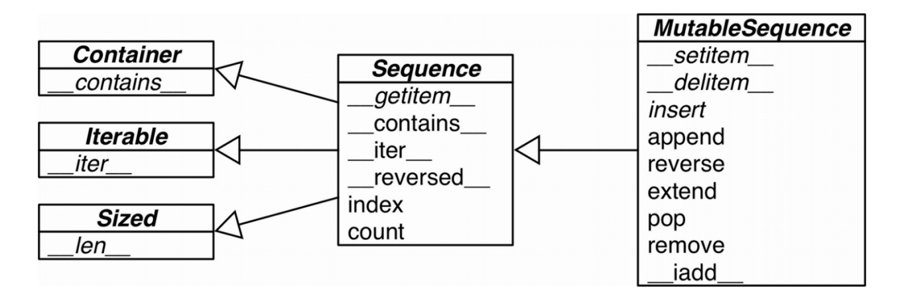
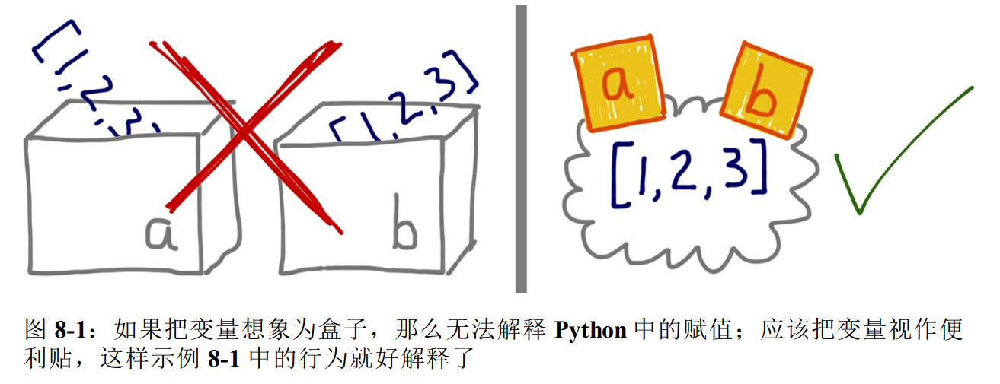
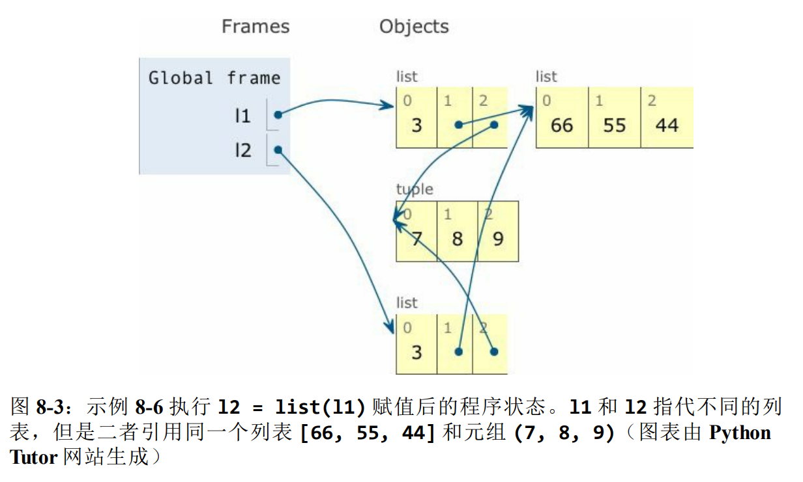
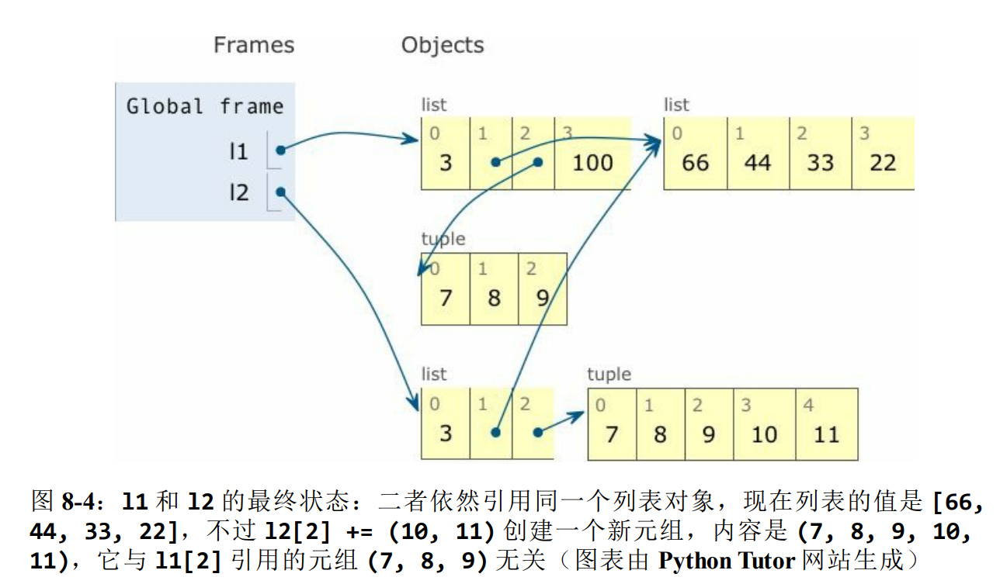
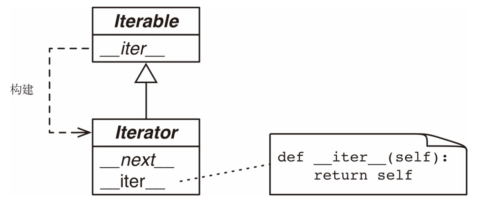

# 流畅的python

## 第一部分 序幕

### 第1章 Python数据类型

#### 1.1 一摞Python风格的纸牌

概述：

通过实现一个纸牌类来展示`__getitem__`和`__len__`这两个特殊方法

示例1-1 一摞有序的纸牌

```python
import collections

Card = collections.namedtuple('Card', ['rank', 'suit'])


class FrenchDeck:
    ranks = [str(n) for n in range(2, 11)] + list('JQKA')
    suits = 'spades diamonds clubs hearts'.split()

    def __init__(self):
        self._cards = [Card(rank, suit) for suit in self.suits
                              for rank in self.ranks]

    def __len__(self):
        return len(self._cards)

    def __getitem__(self, position):
        return self._cards[position]


deck = FrenchDeck()
```

*  `namedtuple`：

   用来构建只有少数属性但是没有方法的对象

  ```python
  beer_card = Card('7', 'diamonds')
  print(beer_card)
  ```

* `__len__`方法提供的：

  * 使用`len()`函数查看有多少张牌

    ```python
    print(len(deck))
    ```

* `__getitem__` 方法提供的：

  * 抽取指定位置的纸牌，使用下标读取某个位置的纸牌

    ```python
    print(deck[0])
    print(deck[-1])
    ```

  * 随机抽取纸牌：使用random.choice从一个序列中随机选出一个元素

    ```python
    from random import choice
    print(choice(deck))
    print(choice(deck))
    print(choice(deck))
    ```

  * `__getitem__` 方法把[]操作交给了self._cards列表 所以支持自动切片操作

    ```python
    # 查看最上面3张
    print(deck[:3])
    # 只看牌面是A的牌
    print(deck[12::13])
    ```

  * 让对象变得可迭代

    ```python
    # 迭代
    for card in deck:
        print(card)
    
    # 反向迭代
    for card in reversed(deck):
        print(card)
    ```

  * 迭代通常是隐式的，如果没有实现`__contains__`方法，那么`in`运算符就会按照顺序做一次迭代搜索

    ```python
    print(Card('Q', 'hearts') in deck)
    print(Card('7', 'bearts') in deck)
    ```

  * 排序： 2最小、A最大； 黑桃 > 红桃 > 方块 > 梅花

    ```python
    suit_values = dict(spades=3, hearts=2, diamonds=1, clubs=0)
    
    
    def spades_high(card):
        rank_value = FrenchDeck.ranks.index(card.rank)
        return rank_value * len(suit_values) + suit_values[card.suit]
    
    
    for card in sorted(deck, key=spades_high):
        print(card)
    ```


#### 1.2 如何使用特殊方法

**1. `__len__`和`len()`的区别以及调用逻辑：**

* 特殊方法的存在是为了被python解释器调用的，你自己并不需要去调用它

  也就是说没有`my_object.len()`这种写法，而应该使用`len(my_object)`。执行`len(my_object)`的时候，如果my_object是一个自定义对象，那么Python会自己去调用其中由你实现的`__len__`方法。

* 对于Python的内置类型，`CPython`会抄近路，使用跟高效的调用方法：

  对于内置类型，比如`list`、`str`、`bytearray`等，`CPython`会抄近路，`__len__`实际上会直接返回`PyVarObject`里的`obj_size`属性。`PyVarObject`是表示内存中长度可变的内置对象的C语言结构体，直接读取这个值比调用一个方法要快很多。

**2. 通过内置函数（len、iter、str等）来使用特殊方法是最好的选择**

​	这些内置函数不仅会调用特殊方法，通常还提供额外的好处，而且对于内置的类来说，它们的速度更快。（14.12节中有详细的例子）

##### 1.2.1 模拟数值类型

概述：使用一个二维向量类介绍6个特殊方法：

* `__init__`
* `__repr__`
* `__abs__`
* `__bool__`
* `__add__`
* `__mul__`

##### 1.2.2 字符串表示形式

**1. `repr`函数**

内置函数`repr`能把一个对象用字符串的形式表达出来以便辨认，它是通过`__repr__`这个特殊方法来得到一个对象的字符串表示形式的。

**2. `__repr__`和`__str__`的区别**

* `__repr__`所返回的字符串应该准确、无歧义，并且尽可能表达出如何用代码创建出这个被打印的对象
* `__str__`是在`str()`函数被使用，或是在用print函数打印一个对象的时候才会被调用的，并且它返回的字符串对终端用户更友好。
* 如果只想实现这两个特殊方法其中的一个，`__repr__`是更好的选择，因为如果一个对象没有`__str__`函数，而Python又需要调用它的时候，解释器会用`__repr__`作为替代。

##### 1.2.3 算术运算符

略

##### 1.2.4 自定义布尔值

**1. python判定一个值或对象是否为真的逻辑**

为了判定一个值x为真还是为假，Python会调用bool(x)，这个函数只能返回True或者False。默认情况下，对于自定义的类的实例总是被认为真的，除非这个类对`__bool__`或`__len__`函数有自己的实现。`bool(x)`的背后是调用`x.__bool__()`的结果；如果不存在`__bool__`方法，那么`bool(x)`会尝试调用`x.len()`，若返回0，则bool会返回False，否则返回True。

#### 1.3 特殊方法一览

见书P10

#### 1.4 为什么len不是普通方法

`len`之所以不是一个普通方法，是为了让Python自带的数据结构可以走后门，`abs`也是同理。但是多亏了它是特殊方法，我们也可以把`len`用于自定义数据类型。这种处理方式在保持内置类型的效率和保证语言一致性之间找到了一个平衡点。


## 第二部分 数据结构

### 第2章 序列构成的数组

#### 2.1 内置序列概览

**Python标准库用C实现了丰富的序列，可以分为如下两类：**

* 容器序列：这些序列能存放不同类型的数据

  list、tuple和collections.deque

* 扁平序列：这类序列只能容纳一种类型

  str、bytes、bytearray、memoryview和array.array

两者的区别：

* 容器序列存放的是它们所包含的任意类型的对象的引用，而扁平序列里放的是值而不是引用
* 扁平序列其实是一段连续的内存空间，由此可见扁平序列其实更加紧凑，但是它里面只能存放诸如字符、字节和数值这种基础类型

**序列类型还能按照是否被修改来分类：**

* 可变序列

  list、bytearray、array.array、collections.deque和memoryview

* 不可变序列

  tuple、str和bytes

**可变序列（MutableSequence）和不可变序列（Sequence）的差异**

图2-1显示了两者的差异，同时也能看出可变序列从不可变序列那里继承了一些方法。虽然内置的序列类型并不是直接从Sequence和MutableSequence这两个基类继承而来，但是了解这些基类可以帮助我们总结出那些完整的序列包含了哪些功能。




图2-1：这个UML类图列举了collections.abs中的几个类（超类在左边，箭头从子类指向超累，斜体名称代表抽象类和抽象方法）

#### 2.2 列表推导和生成器表达式

* 列表推导是构建列表（list）的快捷方式
* 生成器表达式则可以用来创建其他任何类型的序列

##### 2.2.1 列表推导和可读性

**1. 列表推导读起来更方便：**

但是要避免滥用列表推导，不要用列表推导来重复获取一个函数。

例子：把字符串变成Unicode码位

```python
symbols = '$%#@'
codes = [ord(symbol) for symbol in symbols]
```

**2. 句法提示：**

Python会忽略代码里`[]`、`{}`和`()`中的换行，因此如果你的代码里有多行的列表、列表推导、生成器表达式、字典这一类的，可以忽略不太好看的续航符`\`。

**3. 列表推导不会再有变量泄露的问题**

* 在Python2.x中，在列表推导中for关键字之后的赋值操作可能会影响到列表推导上下文中的同名变量。

  如下所示：x原本的值被取代了

  ```python
  >>> x = 'my precious'
  >>> dummy = [x for x in 'ABC']
  >>> x
  'C'
  ```

* 在Python3中都有了自己的局部作用域，表达式内部的变量和赋值只在局部起作用，表达式的上下文里的同名变量还可以被正常引用，局部变量不会影响到它们：

  如下：x的值被保留了，列表推导也创建了正确的列表

  ```python
  >>> x = 'ABC'
  >>> dummy = [x for x in 'ABC']
  >>> x
  'ABC'
  ```

  如果上文x变量没有定义，列表推导后，x也不会有定义

  ```python
  >>> dummy = [x for x in 'ABC']
  >>> x
  Traceback (most recent call last):
    File "<stdin>", line 1, in <module>
  NameError: name 'x' is not defined
  ```

##### 2.2.2 列表推导同filter和map的比较

filter和map合起来能做的事情，列表推导也可以做，而且不需要借助难以理解和阅读的lambda表达式。

示例2-3 用列表推导和map/filter组合来创建同样的表单

```python
>>> symbols = '$¢£¥€¤'
>>> beyond_ascii = [ord(s) for s in symbols if ord(s) > 127]
>>> beyond_ascii
[162, 163, 165, 8364, 164]
>>> beyond_ascii = list(filter(lambda c: c > 127, map(ord, symbols)))
>>> beyond_ascii
[162, 163, 165, 8364, 164]
```

map/filter组合的速度并没有比列表推导快。

##### 2.2.3 笛卡尔积

略

##### 2.2.4 生成器表达式

生成器表达式背后遵守了迭代器协议，可以逐个产出元素，而不是先建立一个完整的列表，作用更能够节省内存。

生成器表达式使用圆括号

示例2-5 用生成器表达式初始化元组和数值

```python
>>> symbols = '$¢£¥€¤'
>>> tuple(ord(symbol) for symbol in symbols) ➊
(36, 162, 163, 165, 8364, 164)
>>> import array
>>> array.array('I', (ord(symbol) for symbol in symbols)) ➋
array('I', [36, 162, 163, 165, 8364, 164])
```

➊ 如果生成器表达式是一个函数调用过程的唯一参数，那么不需要额外再用括号把它圆起来。

➋ array的构造方法需要两个参数，因此括号是必须的。


## 第四部分 面向对象惯用法

### 第8章 对象引用、可变性和垃圾回收

本章简介：

* 对象与对象名称之间的区别
* Python的变量
* 对象标识、值和别名
* 由元组引申的问题
  * 一个神奇特性：元组是不可变的，但是其中的值可以改变
  * 浅复制和深复制
  * 引用和函数参数：
    * 可变的参数默认值导致的问题
    * 如何安全地处理函数的调用者传入的可变参数

* 垃圾回收
* del命令
* 如何使用弱引用“记住对象”，而无需对象本身存在

#### 8.1 变量不是盒子

变量只不过是对象的标注，对象在赋值之前就创建了。

使用盒子不能形象的比喻python中的变量



#### 8.2 标识、相等性和性别

**每个变量都有标识、类型和值**

**标识:**

* `id()`函数返回对象标识的整体表示

* 对象id的正真意义在不同的实现中有所不同，在`CPython`中，`id()`返回对象的内存地址，但是在其他`Python`解释器中可能是别的值

* 对象一旦创建，它的标识绝对不会变：ID一定是唯一的数值标注，而且在对象的生命周期中绝不会变

* is运算符比较两个对象的标识

##### 8.2.1 在==和Is之间选择

==运算符比较两个对象的值（对象中保持的数据），而is比较对象的标识

**is运算符比==速度快**

* is运算符速度比较快是因为它不能重载，Python不用寻找并调用特殊的方法，直接比较两个整数ID

* `a == b`是语法糖，等同于`a.__eq__(b)`，继承自object的`__eq__`方法比较两个对象的ID，结果和is一样。但多数内置类型使用更有意义的方式覆盖了`__eq__`方法，会考虑对象属性的值。

##### 8.2.2 元组的相对不可变性

元组与多数Python集合（列表、字典、集，等等）一样，保存的是对象的引用。元组的不可变性是值tuple数据结构的物理内容（即保存的引用）不可变，与引用的对象无关。如果引用的元素是可变的，即便元组本身不可变，元素依然可变。

#### 8.3 默认做浅复制

**复制列表（或多数内置的可变集合）的方式**

* 使用内置类型构造方法
* 使用`[:]`

示例：

```python
>>> l1 = [3, [55, 44], (7, 8, 9)]
>>> l2 = list(l1)
>>> l3 = l1[:]
>>> l1 is l2
False
>>> l1 is l3
False
```

**构造方法或`[:]`做的是浅复制（即复制了最外层容器，副本中的元素是源容器中元素的引用）。**如果所有元素都是不可变的，那么这样没有问题，还能节省空间，但是，如果元素是可变元素，可能就会导致意想不到的问题。

**示例：**

为一个包含另一个列表、元组的列表做浅复制，并对其操作所带来的影响。

```python
>>> l1 = [3, [66, 55, 44], (7, 8, 9)]
>>> l2 = list(l1)
>>> l1.append(100)
>>> l1[1].remove(55)
>>> print('l1:', l1)
l1: [3, [66, 44], (7, 8, 9), 100]
>>> print('l2:', l2)
l2: [3, [66, 44], (7, 8, 9)]
>>> l2[1] += [33, 22]
>>> l2[2] += (10, 11)
>>> print('l1:', l1)
l1: [3, [66, 44, 33, 22], (7, 8, 9), 100]
>>> print('l2:', l2)
l2: [3, [66, 44, 33, 22], (7, 8, 9, 10, 11)]
```

下面是初始状态和最终状态的图：





##### 为任意对象做深复制和浅复制

深复制：即副本不共享内部对象的引用

`copy`模块提供的`deepcopy`和`copy`函数能为任意对象做深复制和浅复制

**深复制不是件简单的事**

如果对象有循环引用，那么这个朴素的算法会进入无限循环。deepcopy函数会记住已经复制的对象，因此能优雅地处理循环引用，如示例8-10所示：

```python
>>> a = [10, 20]
>>> b = [a, 30]
>>> a.append(b)
>>> a
[10, 20, [[...], 30]]
>>> from copy import deepcopy
>>> c = deepcopy(a)
>>> c
[10, 20, [[...], 30]]
```

深复制有时可能太深了，例如，对象可能会引用不该复制的外部资源或单例值。我们可以实现特殊方法`__copy__()`和`__deepcopy__()`，控制copy和deepcopy的行为。

#### 8.4 函数的参数作为引用时

<font color=red>python唯一支持的参数传递模式是共享传参（call by sharing）。</font>共享传参指函数的各个形式参数获得实参中各个引用的副本，也就是说，<font color=red>函数内部的形参是实参的别名。</font>

这种方案的结果是，<font color=red>函数可能会修改作为参数传入的可变对象，但是无法修改那些对象的标识（即不能把一个对象替换成另一个对象）。</font>

示例：函数可能会修改接收到的任何可变对象

```python
>>> def f(a, b):
...     a += b
...     return a
...
>>> x = 1
>>> y = 2
>>> f(x, y)
3
>>> x, y
(1, 2)
>>> a = [1, 2]
>>> b = [3, 4]
>>> f(a, b)
[1, 2, 3, 4]
>>> a, b
([1, 2, 3, 4], [3, 4])
>>> t = (10, 20)
>>> u = (30, 40)
>>> f(t, u)
(10, 20, 30, 40)
>>> t, u
((10, 20), (30, 40))
```

说明：

* 数字x没变
* 列表a变了
* 元组t没变

##### 8.4.1 不要使用可变类型作为参数的默认值

**避免使用可变的对象作为参数的默认值**

示例：

备受幽灵乘客折磨的校车，说明使用可变默认值的危害

```python
class HauntedBus:
    """备受幽灵乘客折磨的校车"""
    def __init__(self, passengers=[]):
        self.passengers = passengers
        
    def pick(self, name):
        self.passengers.append(name)
    
    def drop(self, name):
        self.passengers.remove(name)
        

>>> bus1 = HauntedBus(['Alice', 'Bill'])
>>> bus1.passengers
['Alice', 'Bill']
>>> bus1.pick('Charlie')
>>> bus1.drop('Alice')
>>> bus1.passengers
['Bill', 'Charlie']
>>> bus2 = HauntedBus()
>>> bus2.pick('Carrie')
>>> bus2.passengers
['Carrie']
>>> bus3 = HauntedBus()
>>> bus3.passengers
['Carrie']
>>> bus3.pick('Dave')
>>> bus2.passengers
['Carrie', 'Dave']
>>> bus2.passengers is bus3.passengers
True
>>> bus1.passengers
['Bill', 'Charlie']
```

实例化HauntedBus时，如果传入乘客，会按预期运作。但是不为`HauntedBus`指定乘客的话，奇怪的事情就发生了，这是因为`self.passengers`变成了`passengers`参数默认值的别名。<font color=red>出现这个问题的根源是，默认值在定义函数时计算（通常在加载模块时），因此默认值变成了函数对象的属性。</font>因此，如果默认值时可变对象，而且修改了它的值，那么后续的函数调用都会收到影响。

上面的示例中，可以审查`HauntedBus.__init__`对象，看看它的`__defaults__`属性中的那些幽灵学生：

```python
>>> HauntedBus.__init__.__defaults__[0]
['Carrie', 'Dave']
```

可以验证`bus2.passengers`是一个别名，它绑定到`HauntedBus.__init__.__defaults__`属性的第一个元素上

```python
>>> HauntedBus.__init__.__defaults__[0] is bus2.passengers
True
```

#### 8.4.2 防御可变参数

如果定义的函数接收可变参数，应该谨慎考虑调用方是否期望修改传入的参数

如果不想修改传入的参数，可以在类里面维护一份自己的副本

```python
class Bus:
    def __init__(self, passengers=None):
        if passengers is None:
            self.passengers = []
        else:
            self.passengers = passengers
    
    def pick(self, name):
        self.passengers.append(name)
        
    def drop(self, name):
        self.passengers.remove(name)
```

#### 8.5 del和垃圾回收

**`del`语句**

* del语句删除名称，而不是对象
* del命令可能会导致对象被当作垃圾回收，但是仅当删除的变量保存的是对象的最后一个引用或无法得到对象时（如果两个对象相互引用，当它们的引用只存在二者之间时，垃圾回收程序会判定它们都无法获取，进而把它们都销毁）
* 重新绑定也可能会导致对象的引用数量归零，导致对象被销毁

**`__del__`特殊方法**

`__del__`方法不会销毁实例，不应该在代码中调用。即将销毁实例时，Python解释器会调用`__del__`方法，给实例最后的机会，释放外部资源。自己编写的代码很少需要实现`__del__`代码，因为它很难用对。

**垃圾回收**

在CPython中，垃圾回收使用的主要算法是引用计数。当引用计数归零时，对象立即就被销毁：CPython会在对象上调用`__del__`方法（如果定义了），然后释放分配给对象的内存。CPython 2.0 增加了分代垃圾回收算法，用于检测引用循环中涉及的对象组——如果一组对象之间全是相互引用，即使再出色的引用方式也会导致组中的对象不可获取。Python的其他实现有更复杂的垃圾回收程序，二七不依赖引用计数，这意味着，对象的引用数量为临时可能不会立即调用`__del__`方法。

**实例：**

没有指向对象的引用时，监视对象生命结束时的情形

```python
>>> import weakref
>>> s1 = {1,2,3}
>>> s2 = s1
>>> def bye():
...     print('Gone with the wind...')
...
>>> ender = weakref.finalize(s1, bye)
>>> ender.alive
True
>>> del s1
>>> ender.alive
True
>>> s2 = 'spam'
Gone with the wind...
>>> ender.alive
False
```

del不会删除对象，但是指向del操作后可能会导致对象不可获取，从而被删除。

你可能会疑惑，为什么上面的例子中`{1, 2, 3}`对象被销毁了，毕竟，我们把s1引用传给finalize函数了，而为了监控对象和调用回调，必须有引用。这是因为，finalize持有`{1, 2, 3}`的弱引用。

#### 8.6 弱引用

**弱引用**不会增加对象的引用数量。引用的目标对象称为**所指对象（referenct）**。

弱引用不会妨碍所指对象被当作垃圾回收，弱引用在缓存应用中很有用，因为我们不想仅因为被缓存引用着而始终保存缓存对象。

**示例：**

弱引用是可调用的对象，返回的是被引用的对象；如果所指对象不存在了，返回None。

前提：Python会自动把`_`变量绑定到结果不为None的表达式结果上。

```python
>>> import weakref
>>> a_set = {0, 1}
>>> wref = weakref.ref(a_set)
>>> wref
<weakref at 0x0000019C1984A908; to 'set' at 0x0000019C197229E8>
>>> wref()    # 返回被引用的对象，{0, 1}。因为这是控制台会话，所以{0， 1}会被绑定给‘_’变量
{0, 1}
>>> a_set = {2, 3, 4}
>>> wref()
{0, 1}
>>> wref() is None    # ‘_’绑定到结果值False。现在{0, 1}没有强引用了
False
>>> wref() is None
True
```

**weakref的使用**

`weakref.ref`类其实是低层接口，供高级用途使用，多数程序最好使用`weakref`集合和`finalize`。也就是说，应该使用`WeakKeyDictionary`、`WeakValueDictionary`、`WeakSet`和`finalize`（在内部使用的弱引用），不要自己动手创建并处理`weakref.ref`实例。

##### 8.6.1 WeakValueDictionary简介

`WeakValueDictionary`类实现的是一种可变映射，里面的值是对象的弱引用。被引用的对象在程序中的其他地方被当作垃圾回收后，对应的键会自动从`WeakValueDictionary`中删除。因此，`WeakValueDictionary`经常被用于缓存。

**示例：**

实现一个简单的类，表示各种奶酪。

```python
class Cheese:
    def __init__(self, kind):
        self.kind = kind
    
    def __repr__(self):
        return 'Cheese(%r)' % self.kind
    
>>> import weakref
>>> stock = weakref.WeakValueDictionary()
>>> catalog = [Cheese('Red Leicester'), Cheese('Tilsit'),
...                 Cheese('Brie'), Cheese('Parmesan')]
>>> for cheese in catalog:
...     stock[cheese.kind] = cheese
...
>>> sorted(stock.keys())
['Brie', 'Parmesan', 'Red Leicester', 'Tilsit']
>>> del catalog
>>> sorted(stock.keys())    # 最后一种没删掉是因为cheese的临时变量引用着
['Parmesan']
>>> del cheese
>>> sorted(stock.keys())
[]
```

除了`WeakValueDictionary`，`weakref`模块还提供了`WeakKeyDictionary`和`WeakSet`

##### 8.6.2 弱引用的局限

并不是每个Python对象都可以作为弱引用的目标（或称所指对象），这些局限基本上是CPython的实现细节导致的，在其他Python解释器中情况可能不一样。

* 基本的list和dict实例不能作为所指对象，但是它们的子类可以。

  ```python
  class MyList(list):
      """list的子类，实例可以作为弱引用的目标"""
      
  a_list = MyList(range(10))
  
  # a_list可以作为弱引用的目标
  wref_to_a_list = weakref.ref(a_list)
  ```

* int和tunple实例不能作为弱引用的目标，甚至它们的子类也不行

* set实例和用户定义的类型没有问题

#### 8.7 Python对不可变类型施加的把戏

对元组t来说，`t[:]`和`tuple(t)`不创建副本，而是返回同一个对象的引用。

```python
>>> t1 = (1, 2, 3)
>>> t2 = tuple(t1)
>>> t1 is t2
True
>>> t3 = t1[:]
>>> t3 is t1
True
```

`str`、`bytes`、`frozenset`实例也有这种行为

```python
>>> t1 = (1, 2, 3)
>>> t3 = (1, 2, 3)
>>> t1 is t3
False
>>> s1 = 'ABC'
>>> s2 = 'ABC'
>>> s2 is s1
True
```

共享字符串字面量是一种优化措施，称为**驻留（interning）**。CPython还会在小的整数上使用这种优化措施，防止重复创建“热门”数字，如0、-1和42。注意，CPython不会驻留所有字符串和整数，驻留的条件是实现细节，而且没有说明文档，**不要依赖字符串或整数的驻留来编写代码**。


### 第9章 符合Python风格的对象

#### 9.2 再谈向量类

使用`Vector2d`类来说明**用于生成对象表现形式的众多方法**

`vector2d_v0.py`

```python
from array import array
import math


class Vector2d:
    typecode = 'd' # 类属性，在vector2d实例和字节序列之间转换时使用

    def __init__(self, x, y):
        self.x = float(x)   # 把x和y转成浮点数，尽早捕获错误，以防调用Vector2d函数时传入不当参数
        self.y = float(y)

    def __iter__(self):
        """
        把Vector2d实例变成可迭代的对象，这样才能拆包（例如，x, y = my_vector），这个方法的实现方式很简单，直接调用生成器表达式一个接一个产出分量
        """
        return (i for i in (self.x, self.y))

    def __repr__(self):
        class_name = type(self).__name__
        """
        使用{!r}获取各个分量的表示形式，然后插值，构成一个字符串；因为Vector2d实例是可迭代的对象，所以*self会把x和y分量提供给format函数
        """
        return '{}({!r}, {!r})'.format(class_name, *self)

    def __str__(self):
        """
        从可迭代的Vector2d实例中可以轻松地得到一个元组，显示一个有序对
        """
        return str(tuple(self))

    def __bytes__(self):
        """
        为了生成字节序列，我们把typecode转换成字节序列，然后迭代Vector2d实例，得到一个数组，再把数组转换成字节序列
        """
        return (bytes([ord(self.typecode)]) +
                bytes(array(self.typecode, self)))

    def __eq__(self, other):
        """
        为了快速比较所有分量，在操作数中构建元组。对Vector2d实例来说，可以这样做，不过会导致一些问题，比如Vector(3, 4) == [3, 4]结果也为True
        """
        return tuple(self) == tuple(other)

    def __abs__(self):
        """
        模是x和y分量构成的直角三角形的斜边长
        """
        return math.hypot(self.x, self.y)

    def __bool__(self):
        """
        使用abs(self)计算模，然后把结果转换成布尔值，因此，0.0是False，非零值是True
        """
        return bool(abs(self))

```

Vector2d实例具有的基本行为如下：

```python
>>> from vector2d_v0 import Vector2d                                                                            
>>> v1 = Vector2d(3, 4)                                                        
>>> print(v1.x, v1.y)                                                          
3.0 4.0                                                                        
>>> x, y = v1 # Vector2d实例可以拆包成变量元组                                                        
>>> x, y                                                                       
(3.0, 4.0)                                                                     
>>> v1  # repr函数调用Vector2d实例，得到的结果类似于构建实例的源码                                                                  
Vector2d(3.0, 4.0)                                                             
>>> v1_clone = eval(repr(v1)) # 这里使用eval函数，表明repr函数调用Vector2d实例得到的是对构造方法的准确表述                                           
>>> v1_clone                                                                   
Vector2d(3.0, 4.0)              
>>> v1 == v1_clone                                                             
True                                                                           
>>> v1 is v1_clone                                                             
False             
>>> print(v1)                                                                  
(3.0, 4.0)  
>>> octets = bytes(v1)                                                         
>>> octets                                                                     
b'd\x00\x00\x00\x00\x00\x00\x08@\x00\x00\x00\x00\x00\x00\x10@'                 
>>> abs(v1)                                                                    
5.0                                                                                                                 
>>> bool(v1), bool(Vector2d(0, 0))                                             
(True, False)                                                                  
```

#### 9.3 备选构造方法

从字节序列转换成Vector2d实例，使用`frombytes`来实现该功能

`vector2d_v1.py`的一部分：这段代码只列出了frombytes类方法，要添加到`vector2d_v0.py`中定义的Vector2d类中

```python    @classmethod
    def frombytes(cls, octets): # 不用传入self参数；相反通过cls传入类本身
        typecode = chr(octets[0])
        memv = memoryview(octets[1:0]).cast(typecode)
        return cls(*memv)
```

#### 9.4 classmethod与staticmethod

* classmethod装饰器

  * **定义操作类，而不是操作实例的方法。**classmethod改变了调用方法的方式，因此类方法的第一个参数是类本身，而不是实例。

  * classmethod最常见的用途是定义备选构造方法

* staticmethod装饰器

  * **也会改变方法的调用方式，但是第一个参数不是特殊的值**
  * 静态方法只是普通的函数，只是碰巧在类的定义体中，而不是在模块层定义

**比较classmethod和staticmethod的行为**

```python
>>> class Demo:
...     @classmethod
...     def klassmeth(*args):
...         return args #返回全部位置参数
...     @staticmethod
...     def statmeth(*args):
...         return args #返回全部位置参数
...
>>> Demo.klassmeth()
(<class '__main__.Demo'>,)
>>> Demo.klassmeth('spam') # 不管怎么调用，Demo.klassmeth的第一个参数始终是Demo类
(<class '__main__.Demo'>, 'spam')
>>> Demo.statmeth() # Demo.statmeth的行为和普通的函数相似
()
>>> Demo.statmeth('spam')
('spam',)
```


## 第五部分 流畅控制

### 第14章 可迭代的对象、迭代器和生成器

**迭代器模式：**扫描内存中放不下的数据集时，我们要找到一种惰性获取数据的方式，即按需一次获取一个数据项。

**生成器与迭代器：**

* python中使用`yield`关键字用于构造生成器
* 所有生成器都是迭代器，因为生成器完全实现了迭代器接口
* 区别：
  * 迭代器用于从集合中取出元素
  * 生成器用于“凭空”生成元素

**iter函数**

解释器需要迭代对象x时，会自动调用iter(x)

内置的iter函数的作用：

* 检查对象是否实现了`__iter__`方法，如果实现了就调用它，获取一个迭代器
* 如果没有实现`__iter__`方法，但实现了`__getitem__`方法，Python会创建一个迭代器，尝试按顺序（从索引0开始）获取迭代对象
* 如果尝试失败，python会抛`TypeError`异常，通常会提示`‘"C object is not iterable"`，其中C是目标对象所属的类

检查对象x是否可迭代：

* `abc.Iterable`类实现了`__subclasshook__`方法，可以使用它来检查对象是否可迭代，但是它没有考虑`__getitem__`

  ```python
  class Foo:
      def __iter__(self):
          pass
  issubclasss(Foo, abc.Iterable)
  f = Foo()
  isinstance(f, abc.Iterable)
  ```

* 直接使用`iter(x)`，如果对象不可迭代会抛`TypeError:'C' object is not iterable`的异常

序列可以迭代，因为它实现了`__getitem__`方法

#### 14.2 可迭代对象与迭代器的对比

**可迭代的对象和迭代器之间的关系：**

* python从可迭代的对象中获取迭代器
* 使用`iter`内置函数可以获取迭代器的对象

**标准的迭代器接口有两个方法：**

* `__next__`:

  返回下一个可用的元素，如果元素没了，抛出StopIteration异常

* `__iter__`:

  返回self，以便在应该使用可迭代对象（这里的可迭代对象应该指迭代器对象，跟可迭代的对象不是同一个东西）的地方使用迭代器，例如在for循环中

**迭代器接口的类关系：**

* 迭代器接口在`collections.abs.Iterator`抽象基类中制定

* `Iterable`和`Iterator`的关系

  

**`Iterator`源码 ：**

```python
class Iterator(Iterable):
    __slots__ = ()

    @abstractmethod
    def __next__(self):
        raise StopIteration

    @classmethod
    def __subclasshook__(cls, C):
        if cls is MyIterator:
            if (any("__next__" in B.__dict__ for B in C.__mro__) and
                any("__iter__" in B.__dict__ for B in C.__mro__)):
                return True
        return NotImplemented
```

检查对象x是否为迭代器最好的方式是调用`isinstance(x, abc.Iterator)`，得益于`Iterator.__subclasshook__`方法，即使对象x所属的类不是`Iterator`类的真是子类或虚拟子类，也能这样检查

**迭代器的定义：**

* 实现了`__next__`方法，返回序列中的下一个元素，如果没有元素了，就抛`StopIteration`异常
* python中的迭代器还实现了`__iter__`方法，因此迭代器也可以迭代


#### 14.3 Sentence类第2版：典型的迭代器

**使用迭代器模式实现Sentence类**

```python
import re
import reprlib

RE_WORD = re.compile("\w+")

class SentenceV2:
    def __init__(self, text):
        self.text = text
        self.words = RE_WORD.findall(text)

    def __repr__(self):
        return 'Sentence (%s)' % reprlib.repr(self.text)

    def __iter__(self):
        return SentenceIterator(self.words)


class SentenceIterator:

    def __init__(self, words):
        self.words = words
        self.index = 0

    def __next__(self):
        try:
            word = self.words[self.index]
        except IndexError:
            raise StopIteration()
        self.index += 1
        return word

    def __iter__(self):
        return self


def test_sentence1():
    s = SentenceV2('"The time has come," the Walrus said')
    print(s)
    for word in s:
        print(word)


def main():
    test_sentence1()


if __name__ == '__main__':
    main()
```

**构建可迭代的对象和迭代器时经常出现的错误:**

* 混淆了二者，比如想把Sentence变成迭代器

* 两者的区别：
  * 迭代器对象有个`__iter__`方法，每次都实例化一个新的迭代器
  * 迭代器要实现`__next__`方法，返回单个元素，实现`__iter__`方法，返回迭代器本身

* 在可迭代的对象加入`__next__`方法是一种糟糕的想法，这是一种常见的反模式，违反了迭代器模式的用途

**迭代器模式的用途：**

* 访问一个聚合对象的内容而无需暴露它的内部表示
* 支持对聚合对象的多种遍历
* 为遍历不同的聚合结构提供一个统一的接口（即支持多态迭代）

#### 14.4 Sentence类第3版：生成器函数

之前的版本的Sentence类中，`__iter__`方法调用`SentenceIterator`类的构造方法创建一个迭代器并将其方法，现在使用生成器来替换迭代器类，所以这里的`__iter__`方法是生成器函数

```python
import re
import reprlib

RE_WORD = re.compile("\w+")

class SentenceV3:
    def __init__(self, text):
        self.text = text
        self.words = RE_WORD.findall(text)

    def __repr__(self):
        return 'Sentence (%s)' % reprlib.repr(self.text)

    def __iter__(self):
        for word in self.words:
            yield word
        return
```

`__iter__`方法是生成器函数，调用时会构建一个实现了迭代器接口的生成器对象，因此不用再定义`SentenceIterator`类

#### 14.5 Sentence类第4版：惰性实现

之前的版本都是将words全部生成在列表中，可以利用生成器，在需要的时候才生成对应的单词数据

`re.finditer`函数是`re.findall`函数的惰性版本，利用该函数可以将Sentence修改称惰性版本

#### 14.6 Sentence类第5版：生成器表达式

简单的生成器函数可以替换成生成器表达式

如以下的生成器函数可以替换成表达式：

```python
# ======生成器函数============
def __iter__(self):
    for match in RE_WORD.finditer(self.text):
        yield match.group()
# ======生成器表达式=================
def __iter__(self):
   return (match.group() for match in RE_WORD.finditer(self.text))
```

生成器表达式：

* 可以理解为列表推导的惰性版本，不会迫切地构建列表，而是返回一个生成器，按需惰性生成元素。

* 生成器表示是语法糖，完全可以替换成生成器函数，不过有时使用生成器表达式更便利。

#### 14.7 何时使用生成器表达式

* 生成器表达式是创建生成器的简洁语法，无需先定义函数再调用
* 生成器函数可以使用多个语句实现复杂的逻辑，也可以作为协程使用

#### 14.9 标准库中的生成器函数

略

#### 14.10 Python 3.3中新出现的语句：yield from

如果生成器函数需要产出了一个生成器生成的值，传统的解决方法是使用嵌套的for循环，可以利用`yield from`语法，将循环操作依次交给接收到的各个可迭代对象处理。

例程：

* 利用嵌套for循环的传统方法

  ```python
  def chain(*iterables):
      for i in iterables:
          for i in it:
              yield i
              
  s = "ABC"
  t = tuple(range(3))
  list(chain(s, t))
  # out: ["A","B","C",0,1,2]
  ```

* 使用`yield from`语法

  ```python
  def chain(*iterables):
      for i in iterables:
          yield from i
              
  s = "ABC"
  t = tuple(range(3))
  list(chain(s, t))
  # out: ["A","B","C",0,1,2]
  ```


#### 14.12 深入分析iter函数

* 在python中迭代对象x时会调用`iter(x)`

* `iter`函数还有一个用法：传入两个参数，使用常规的函数或任何可调用的对象创建迭代器。这样使用时，第一个参数必须是可调用的对象，用于不断调用（没有参数），产生各个值；第二个是哨符，当可调用对象返回这个值时，触发迭代器抛出`StopIteration`异常

  例子：

  ```python
  def d6():
      return randint(1，6)
  
  d6_iter = iter(d6, 1)
  for roll in d6_iter:
      print(roll)
  ```


#### 14.13案例分析：在数据库转换工具

略

### 第15章 上下文管理器和else块

#### 15.1 先做这个，再做那个：if语句之外的else块

for while 语句后面的else子句

#### 15.2 上下文管理器和with块

* 上下文管理器对象存在的目的是管理with语句

* with语句的目的是简化try/finally模式
* 上下文管理器协议包含`__enter__`和`__exit__`两个方法。
  * `with`语句开始运行时，会再上下文管理器对象上调用`__enter__`方法
  * `with`语句运行结束后，会在上下文管理器对象上调用`__exit__`方法，以次扮演finally子句的角色

例程1：with的使用方法：

```python
with open("mirror.py") as fp:
    src = fp.read(60)
```

注：执行with后面的表达式得到的结果是上下文管理器对象，不过，把值绑定到目标变量上（as子句）是在上下文管理器对象上调用`__enter__`方法的结果

as子句是可选的

例程2：上下文管理器类LookingClass上下文管理器的代码

```python
class LookingClass:
    def __enter__(self):
        import sys
        self.original_write = sys.stdout.write
        self.stdout.write = self.reverse_write
        return 'JABBERWOCKY'
    
    def reverse_write(self, text):
        self.original_write(text[::-1])
        
    def __exit__(self, exc_type, exc_value, traceback):
        import sys
        sys.stdout.write = self.original_write
        if exc_type is ZeroDivisionError:
            print('Please DO NOT divide by zero!')
            return True
```


### 第16章 协程

#### 16.2 用作协程的生成器的基本行为

协程的四个状态：

* GEN_CREATED

  等待开始执行

* GEN_RUNNING

  解释器正在执行

* GEN_SUSPENDED

  在yield表达式处暂停

* GEN_CLOSED

  执行结束

可以使用`inspect.getgeneratorstate(...)`函数确定处于何种状态

使用协程前需要预激协程：

* next(my_coro)
* my_coro.send(None)

#### 16.4 预激协程的装饰器

自定义一个coroutine装饰器来预激协程


## 第六部分 元编程

### 第19章 动态属性和特性

在python中：

**属性：** 数据的属性和处理数据的方法

**特性：** 在不改变类接口的前提下，使用<font color=red>存取方法（即读值方法和设值方法）修改数据属性</font>

**控制属性的访问权限/实现动态属性的api:** 

* 特性
* `__getattr__`和`__setattr__`计算属性

#### 19.1 使用动态属性转换数据

例程：使用的同台属性处理JSON格式数据源

数据源格式如下：


<details>
  <summary>代码</summary>

```json
{
	"Schedule": {
		"conferences": [{
			"serial": 115
		}],
		"events": [{
			"serial": 34505,
			"name": "Why Schools Don´t Use Open Source to Teach Programming",
			"event_type": "40-minute conference session",
			"time_start": "2014-07-23 11:30:00",
			"time_stop": "2014-07-23 12:10:00",
			"venue_serial": 1462,
			"description": "Aside from the fact that high school programming...",
			"website_url": "http://oscon.com/oscon2014/public/schedule/detail/34505",
			"speakers": [157509],
			"categories": ["Education"]
		}],
		"speakers": [{
			"serial": 157509,
			"name": "Robert Lefkowitz",
			"photo": null,
			"url": "http://sharewave.com/",
			"position": "CTO",
			"affiliation": "Sharewave",
			"twitter": "sharewaveteam",
			"bio": "Robert ´r0ml´ Lefkowitz is the CTO at Sharewave, a startup..."
		}],
		"venues": [{
			"serial": 1462,
			"name": "F151",
			"category": "Conference Venues"
		}]
	}
}
```
</details>


##### 19.1.1 使用动态属性访问json类数据 

定义一个`FrozenJSON`类，把一个JSON数据集转换成一个嵌套这FronzeJson对象、列表和简单类型的FrozenJSON对象

<details>
  <summary>代码</summary>

```python
from collections import abc


class FrozenJSON:
    def __init__(self, mapping):
        self.__data = dict(mapping)

    def __getattr__(self, name):
        if hasattr(self.__data, name):
            return getattr(self.__data, name)
        else:
            return FrozenJSON.build(self.__data[name])

    @classmethod
    def build(cls, obj):
        if isinstance(obj, abc.Mapping):
            return cls(obj)
        elif isinstance(obj, abc.MutableSequence):
            return [cls.build(item) for item in obj]
        else:
            return obj
```

</details>

##### 19.1.2 处理无效属性名
FrozenJSON类有个缺陷：没有对名称为python关键字的属性做特殊处理

添加如下处理:
```python
def __init__(self, mapping):
    self.__data = {}
    for key, value in mapping.items():
        if keyword.iskeyword(key):
            key += '_'
        self.__data[key] = value

```
还有个缺陷: 如果JSON对象中的键不是有效的Python标识符，也会遇到类似的问题:
```
>>> x = FrozenJSON({'2be:'or not'})
>>> x.2be
  File "<stdin>", line 1
    x.2be
  SyntaxError: invalid syntax
```
把无效字符编程有效的属性名不容易，有两个简单的解决方法:
* 抛出异常
* 把无效的键换成通用名称，如`attr_0`、`attr_1`等

为了简单起见，忽略这个问题

##### 19.1.3 使用__new__方法以灵活的方式创建对象

在python中，用于构建实例的是特殊方法`__new__`

* 类方法（使用特殊方法处理，不必使用`@classmethod`装饰器）

* `__new__`返回一个实例并作为第一个参数（即self）传给`__init__`方法

* `__new__`是构造方法，`__init__`初始化方法。

* 从`__new__`方法到`__init__`方法是最常见的，但不是唯一的。`__new__`方法也可以返回其他类的实例

* 构建对象过程的伪代码：

  ```python
  def object_maker(the_class, some_arg):
      new_object = the_class.__new__(some_arg)
      if isinstance(new_object, the_class):
          the_class.__init__(new_object, some_arg)
      return new_object
  
  # 下述两个语句的作用基本等效
  x = Foo('bar')
  x = object_maker(Foo, 'bar')
  ```

##### 19.1.4 使用shelve模块调整OSCON数据源的结构


​	
