# 流畅的python

## 第一部分 序幕

### 第1章 Python数据类型

#### 1.1 一摞Python风格的纸牌

概述：

通过实现一个纸牌类来展示`__getitem__`和`__len__`这两个特殊方法

示例1-1 一摞有序的纸牌

```python
import collections

Card = collections.namedtuple('Card', ['rank', 'suit'])


class FrenchDeck:
    ranks = [str(n) for n in range(2, 11)] + list('JQKA')
    suits = 'spades diamonds clubs hearts'.split()

    def __init__(self):
        self._cards = [Card(rank, suit) for suit in self.suits
                              for rank in self.ranks]

    def __len__(self):
        return len(self._cards)

    def __getitem__(self, position):
        return self._cards[position]


deck = FrenchDeck()
```

*  `namedtuple`：

   用来构建只有少数属性但是没有方法的对象

  ```python
  beer_card = Card('7', 'diamonds')
  print(beer_card)
  ```

* `__len__`方法提供的：

  * 使用`len()`函数查看有多少张牌

    ```python
    print(len(deck))
    ```

* `__getitem__` 方法提供的：

  * 抽取指定位置的纸牌，使用下标读取某个位置的纸牌

    ```python
    print(deck[0])
    print(deck[-1])
    ```

  * 随机抽取纸牌：使用random.choice从一个序列中随机选出一个元素

    ```python
    from random import choice
    print(choice(deck))
    print(choice(deck))
    print(choice(deck))
    ```

  * `__getitem__` 方法把[]操作交给了self._cards列表 所以支持自动切片操作

    ```python
    # 查看最上面3张
    print(deck[:3])
    # 只看牌面是A的牌
    print(deck[12::13])
    ```

  * 让对象变得可迭代

    ```python
    # 迭代
    for card in deck:
        print(card)
    
    # 反向迭代
    for card in reversed(deck):
        print(card)
    ```

  * 迭代通常是隐式的，如果没有实现`__contains__`方法，那么`in`运算符就会按照顺序做一次迭代搜索

    ```python
    print(Card('Q', 'hearts') in deck)
    print(Card('7', 'bearts') in deck)
    ```

  * 排序： 2最小、A最大； 黑桃 > 红桃 > 方块 > 梅花

    ```python
    suit_values = dict(spades=3, hearts=2, diamonds=1, clubs=0)
    
    
    def spades_high(card):
        rank_value = FrenchDeck.ranks.index(card.rank)
        return rank_value * len(suit_values) + suit_values[card.suit]
    
    
    for card in sorted(deck, key=spades_high):
        print(card)
    ```


#### 1.2 如何使用特殊方法

**1. `__len__`和`len()`的区别以及调用逻辑：**

* 特殊方法的存在是为了被python解释器调用的，你自己并不需要去调用它

  也就是说没有`my_object.len()`这种写法，而应该使用`len(my_object)`。执行`len(my_object)`的时候，如果my_object是一个自定义对象，那么Python会自己去调用其中由你实现的`__len__`方法。

* 对于Python的内置类型，`CPython`会抄近路，使用跟高效的调用方法：

  对于内置类型，比如`list`、`str`、`bytearray`等，`CPython`会抄近路，`__len__`实际上会直接返回`PyVarObject`里的`obj_size`属性。`PyVarObject`是表示内存中长度可变的内置对象的C语言结构体，直接读取这个值比调用一个方法要快很多。

**2. 通过内置函数（len、iter、str等）来使用特殊方法是最好的选择**

​	这些内置函数不仅会调用特殊方法，通常还提供额外的好处，而且对于内置的类来说，它们的速度更快。（14.12节中有详细的例子）

##### 1.2.1 模拟数值类型

概述：使用一个二维向量类介绍6个特殊方法：

* `__init__`
* `__repr__`
* `__abs__`
* `__bool__`
* `__add__`
* `__mul__`

##### 1.2.2 字符串表示形式

**1. `repr`函数**

内置函数`repr`能把一个对象用字符串的形式表达出来以便辨认，它是通过`__repr__`这个特殊方法来得到一个对象的字符串表示形式的。

**2. `__repr__`和`__str__`的区别**

* `__repr__`所返回的字符串应该准确、无歧义，并且尽可能表达出如何用代码创建出这个被打印的对象
* `__str__`是在`str()`函数被使用，或是在用print函数打印一个对象的时候才会被调用的，并且它返回的字符串对终端用户更友好。
* 如果只想实现这两个特殊方法其中的一个，`__repr__`是更好的选择，因为如果一个对象没有`__str__`函数，而Python又需要调用它的时候，解释器会用`__repr__`作为替代。

##### 1.2.3 算术运算符

略

##### 1.2.4 自定义布尔值

**1. python判定一个值或对象是否为真的逻辑**

为了判定一个值x为真还是为假，Python会调用bool(x)，这个函数只能返回True或者False。默认情况下，对于自定义的类的实例总是被认为真的，除非这个类对`__bool__`或`__len__`函数有自己的实现。`bool(x)`的背后是调用`x.__bool__()`的结果；如果不存在`__bool__`方法，那么`bool(x)`会尝试调用`x.len()`，若返回0，则bool会返回False，否则返回True。

#### 1.3 特殊方法一览

见书P10

#### 1.4 为什么len不是普通方法

`len`之所以不是一个普通方法，是为了让Python自带的数据结构可以走后门，`abs`也是同理。但是多亏了它是特殊方法，我们也可以把`len`用于自定义数据类型。这种处理方式在保持内置类型的效率和保证语言一致性之间找到了一个平衡点。


## 第二部分 数据结构

### 第2章 序列构成的数组

#### 2.1 内置序列概览

**Python标准库用C实现了丰富的序列，可以分为如下两类：**

* 容器序列：这些序列能存放不同类型的数据

  list、tuple和collections.deque

* 扁平序列：这类序列只能容纳一种类型

  str、bytes、bytearray、memoryview和array.array

两者的区别：

* 容器序列存放的是它们所包含的任意类型的对象的引用，而扁平序列里放的是值而不是引用
* 扁平序列其实是一段连续的内存空间，由此可见扁平序列其实更加紧凑，但是它里面只能存放诸如字符、字节和数值这种基础类型

**序列类型还能按照是否被修改来分类：**

* 可变序列

  list、bytearray、array.array、collections.deque和memoryview

* 不可变序列

  tuple、str和bytes

**可变序列（MutableSequence）和不可变序列（Sequence）的差异**

图2-1显示了两者的差异，同时也能看出可变序列从不可变序列那里继承了一些方法。虽然内置的序列类型并不是直接从Sequence和MutableSequence这两个基类继承而来，但是了解这些基类可以帮助我们总结出那些完整的序列包含了哪些功能。


图2-1：这个UML类图列举了collections.abs中的几个类（超类在左边，箭头从子类指向超累，斜体名称代表抽象类和抽象方法）

#### 2.2 列表推导和生成器表达式

* 列表推导是构建列表（list）的快捷方式
* 生成器表达式则可以用来创建其他任何类型的序列

##### 2.2.1 列表推导和可读性

**1. 列表推导读起来更方便：**

但是要避免滥用列表推导，不要用列表推导来重复获取一个函数。

例子：把字符串变成Unicode码位

```python
symbols = '$%#@'
codes = [ord(symbol) for symbol in symbols]
```

**2. 句法提示：**

Python会忽略代码里`[]`、`{}`和`()`中的换行，因此如果你的代码里有多行的列表、列表推导、生成器表达式、字典这一类的，可以忽略不太好看的续航符`\`。

**3. 列表推导不会再有变量泄露的问题**

* 在Python2.x中，在列表推导中for关键字之后的赋值操作可能会影响到列表推导上下文中的同名变量。

  如下所示：x原本的值被取代了

  ```python
  >>> x = 'my precious'
  >>> dummy = [x for x in 'ABC']
  >>> x
  'C'
  ```

* 在Python3中都有了自己的局部作用域，表达式内部的变量和赋值只在局部起作用，表达式的上下文里的同名变量还可以被正常引用，局部变量不会影响到它们：

  如下：x的值被保留了，列表推导也创建了正确的列表

  ```python
  >>> x = 'ABC'
  >>> dummy = [x for x in 'ABC']
  >>> x
  'ABC'
  ```

  如果上文x变量没有定义，列表推导后，x也不会有定义

  ```python
  >>> dummy = [x for x in 'ABC']
  >>> x
  Traceback (most recent call last):
    File "<stdin>", line 1, in <module>
  NameError: name 'x' is not defined
  ```

##### 2.2.2 列表推导同filter和map的比较

filter和map合起来能做的事情，列表推导也可以做，而且不需要借助难以理解和阅读的lambda表达式。

示例2-3 用列表推导和map/filter组合来创建同样的表单

```python
>>> symbols = '$¢£¥€¤'
>>> beyond_ascii = [ord(s) for s in symbols if ord(s) > 127]
>>> beyond_ascii
[162, 163, 165, 8364, 164]
>>> beyond_ascii = list(filter(lambda c: c > 127, map(ord, symbols)))
>>> beyond_ascii
[162, 163, 165, 8364, 164]
```

map/filter组合的速度并没有比列表推导快。

##### 2.2.3 笛卡尔积

略

##### 2.2.4 生成器表达式

生成器表达式背后遵守了迭代器协议，可以逐个产出元素，而不是先建立一个完整的列表，作用更能够节省内存。

生成器表达式使用圆括号

示例2-5 用生成器表达式初始化元组和数值

```python
>>> symbols = '$¢£¥€¤'
>>> tuple(ord(symbol) for symbol in symbols) ➊
(36, 162, 163, 165, 8364, 164)
>>> import array
>>> array.array('I', (ord(symbol) for symbol in symbols)) ➋
array('I', [36, 162, 163, 165, 8364, 164])
```

➊ 如果生成器表达式是一个函数调用过程的唯一参数，那么不需要额外再用括号把它圆起来。

➋ array的构造方法需要两个参数，因此括号是必须的。


## 第四部分 面向对象惯用法

### 第8章 对象引用、可变性和垃圾回收

本章简介：

* 对象与对象名称之间的区别
* Python的变量
* 对象标识、值和别名
* 由元组引申的问题
  * 一个神奇特性：元组是不可变的，但是其中的值可以改变
  * 浅复制和深复制
  * 引用和函数参数：
    * 可变的参数默认值导致的问题
    * 如何安全地处理函数的调用者传入的可变参数

* 垃圾回收
* del命令
* 如何使用弱引用“记住对象”，而无需对象本身存在

#### 8.1 变量不是盒子

变量只不过是对象的标注，对象在赋值之前就创建了。

使用盒子不能形象的比喻python中的变量


#### 8.2 标识、相等性和性别

**每个变量都有标识、类型和值**

**标识:**

* `id()`函数返回对象标识的整体表示

* 对象id的正真意义在不同的实现中有所不同，在`CPython`中，`id()`返回对象的内存地址，但是在其他`Python`解释器中可能是别的值

* 对象一旦创建，它的标识绝对不会变：ID一定是唯一的数值标注，而且在对象的生命周期中绝不会变

* is运算符比较两个对象的标识

##### 8.2.1 在==和Is之间选择

==运算符比较两个对象的值（对象中保持的数据），而is比较对象的标识

**is运算符比==速度快**

* is运算符速度比较快是因为它不能重载，Python不用寻找并调用特殊的方法，直接比较两个整数ID

* `a == b`是语法糖，等同于`a.__eq__(b)`，继承自object的`__eq__`方法比较两个对象的ID，结果和is一样。但多数内置类型使用更有意义的方式覆盖了`__eq__`方法，会考虑对象属性的值。

##### 8.2.2 元组的相对不可变性

元组与多数Python集合（列表、字典、集，等等）一样，保存的是对象的引用。元组的不可变性是值tuple数据结构的物理内容（即保存的引用）不可变，与引用的对象无关。如果引用的元素是可变的，即便元组本身不可变，元素依然可变。

#### 8.3 默认做浅复制

**复制列表（或多数内置的可变集合）的方式**

* 使用内置类型构造方法
* 使用`[:]`

示例：

```python
>>> l1 = [3, [55, 44], (7, 8, 9)]
>>> l2 = list(l1)
>>> l3 = l1[:]
>>> l1 is l2
False
>>> l1 is l3
False
```

**构造方法或`[:]`做的是浅复制（即复制了最外层容器，副本中的元素是源容器中元素的引用）。**如果所有元素都是不可变的，那么这样没有问题，还能节省空间，但是，如果元素是可变元素，可能就会导致意想不到的问题。

**示例：**

为一个包含另一个列表、元组的列表做浅复制，并对其操作所带来的影响。

```python
>>> l1 = [3, [66, 55, 44], (7, 8, 9)]
>>> l2 = list(l1)
>>> l1.append(100)
>>> l1[1].remove(55)
>>> print('l1:', l1)
l1: [3, [66, 44], (7, 8, 9), 100]
>>> print('l2:', l2)
l2: [3, [66, 44], (7, 8, 9)]
>>> l2[1] += [33, 22]
>>> l2[2] += (10, 11)
>>> print('l1:', l1)
l1: [3, [66, 44, 33, 22], (7, 8, 9), 100]
>>> print('l2:', l2)
l2: [3, [66, 44, 33, 22], (7, 8, 9, 10, 11)]
```

下面是初始状态和最终状态的图：


##### 为任意对象做深复制和浅复制

深复制：即副本不共享内部对象的引用

`copy`模块提供的`deepcopy`和`copy`函数能为任意对象做深复制和浅复制

**深复制不是件简单的事**

如果对象有循环引用，那么这个朴素的算法会进入无限循环。deepcopy函数会记住已经复制的对象，因此能优雅地处理循环引用，如示例8-10所示：

```python
>>> a = [10, 20]
>>> b = [a, 30]
>>> a.append(b)
>>> a
[10, 20, [[...], 30]]
>>> from copy import deepcopy
>>> c = deepcopy(a)
>>> c
[10, 20, [[...], 30]]
```

深复制有时可能太深了，例如，对象可能会引用不该复制的外部资源或单例值。我们可以实现特殊方法`__copy__()`和`__deepcopy__()`，控制copy和deepcopy的行为。

#### 8.4 函数的参数作为引用时

<font color=red>python唯一支持的参数传递模式是共享传参（call by sharing）。</font>共享传参指函数的各个形式参数获得实参中各个引用的副本，也就是说，<font color=red>函数内部的形参是实参的别名。</font>

这种方案的结果是，<font color=red>函数可能会修改作为参数传入的可变对象，但是无法修改那些对象的标识（即不能把一个对象替换成另一个对象）。</font>

示例：函数可能会修改接收到的任何可变对象

```python
>>> def f(a, b):
...     a += b
...     return a
...
>>> x = 1
>>> y = 2
>>> f(x, y)
3
>>> x, y
(1, 2)
>>> a = [1, 2]
>>> b = [3, 4]
>>> f(a, b)
[1, 2, 3, 4]
>>> a, b
([1, 2, 3, 4], [3, 4])
>>> t = (10, 20)
>>> u = (30, 40)
>>> f(t, u)
(10, 20, 30, 40)
>>> t, u
((10, 20), (30, 40))
```

说明：

* 数字x没变
* 列表a变了
* 元组t没变

##### 8.4.1 不要使用可变类型作为参数的默认值

**避免使用可变的对象作为参数的默认值**

示例：

备受幽灵乘客折磨的校车，说明使用可变默认值的危害

```python
class HauntedBus:
    """备受幽灵乘客折磨的校车"""
    def __init__(self, passengers=[]):
        self.passengers = passengers
        
    def pick(self, name):
        self.passengers.append(name)
    
    def drop(self, name):
        self.passengers.remove(name)
        

>>> bus1 = HauntedBus(['Alice', 'Bill'])
>>> bus1.passengers
['Alice', 'Bill']
>>> bus1.pick('Charlie')
>>> bus1.drop('Alice')
>>> bus1.passengers
['Bill', 'Charlie']
>>> bus2 = HauntedBus()
>>> bus2.pick('Carrie')
>>> bus2.passengers
['Carrie']
>>> bus3 = HauntedBus()
>>> bus3.passengers
['Carrie']
>>> bus3.pick('Dave')
>>> bus2.passengers
['Carrie', 'Dave']
>>> bus2.passengers is bus3.passengers
True
>>> bus1.passengers
['Bill', 'Charlie']
```

实例化HauntedBus时，如果传入乘客，会按预期运作。但是不为`HauntedBus`指定乘客的话，奇怪的事情就发生了，这是因为`self.passengers`变成了`passengers`参数默认值的别名。<font color=red>出现这个问题的根源是，默认值在定义函数时计算（通常在加载模块时），因此默认值变成了函数对象的属性。</font>因此，如果默认值时可变对象，而且修改了它的值，那么后续的函数调用都会收到影响。

上面的示例中，可以审查`HauntedBus.__init__`对象，看看它的`__defaults__`属性中的那些幽灵学生：

```python
>>> HauntedBus.__init__.__defaults__[0]
['Carrie', 'Dave']
```

可以验证`bus2.passengers`是一个别名，它绑定到`HauntedBus.__init__.__defaults__`属性的第一个元素上

```python
>>> HauntedBus.__init__.__defaults__[0] is bus2.passengers
True
```

#### 8.4.2 防御可变参数

如果定义的函数接收可变参数，应该谨慎考虑调用方是否期望修改传入的参数

如果不想修改传入的参数，可以在类里面维护一份自己的副本

```python
class Bus:
    def __init__(self, passengers=None):
        if passengers is None:
            self.passengers = []
        else:
            self.passengers = passengers
    
    def pick(self, name):
        self.passengers.append(name)
        
    def drop(self, name):
        self.passengers.remove(name)
```

#### 8.5 del和垃圾回收

**`del`语句**

* del语句删除名称，而不是对象
* del命令可能会导致对象被当作垃圾回收，但是仅当删除的变量保存的是对象的最后一个引用或无法得到对象时（如果两个对象相互引用，当它们的引用只存在二者之间时，垃圾回收程序会判定它们都无法获取，进而把它们都销毁）
* 重新绑定也可能会导致对象的引用数量归零，导致对象被销毁

**`__del__`特殊方法**

`__del__`方法不会销毁实例，不应该在代码中调用。即将销毁实例时，Python解释器会调用`__del__`方法，给实例最后的机会，释放外部资源。自己编写的代码很少需要实现`__del__`代码，因为它很难用对。

**垃圾回收**

在CPython中，垃圾回收使用的主要算法是引用计数。当引用计数归零时，对象立即就被销毁：CPython会在对象上调用`__del__`方法（如果定义了），然后释放分配给对象的内存。CPython 2.0 增加了分代垃圾回收算法，用于检测引用循环中涉及的对象组——如果一组对象之间全是相互引用，即使再出色的引用方式也会导致组中的对象不可获取。Python的其他实现有更复杂的垃圾回收程序，二七不依赖引用计数，这意味着，对象的引用数量为临时可能不会立即调用`__del__`方法。

**实例：**

没有指向对象的引用时，监视对象生命结束时的情形

```python
>>> import weakref
>>> s1 = {1,2,3}
>>> s2 = s1
>>> def bye():
...     print('Gone with the wind...')
...
>>> ender = weakref.finalize(s1, bye)
>>> ender.alive
True
>>> del s1
>>> ender.alive
True
>>> s2 = 'spam'
Gone with the wind...
>>> ender.alive
False
```

del不会删除对象，但是指向del操作后可能会导致对象不可获取，从而被删除。

你可能会疑惑，为什么上面的例子中`{1, 2, 3}`对象被销毁了，毕竟，我们把s1引用传给finalize函数了，而为了监控对象和调用回调，必须有引用。这是因为，finalize持有`{1, 2, 3}`的弱引用。

#### 8.6 弱引用

**弱引用**不会增加对象的引用数量。引用的目标对象称为**所指对象（referenct）**。

弱引用不会妨碍所指对象被当作垃圾回收，弱引用在缓存应用中很有用，因为我们不想仅因为被缓存引用着而始终保存缓存对象。

**示例：**

弱引用是可调用的对象，返回的是被引用的对象；如果所指对象不存在了，返回None。

前提：Python会自动把`_`变量绑定到结果不为None的表达式结果上。

```python
>>> import weakref
>>> a_set = {0, 1}
>>> wref = weakref.ref(a_set)
>>> wref
<weakref at 0x0000019C1984A908; to 'set' at 0x0000019C197229E8>
>>> wref()    # 返回被引用的对象，{0, 1}。因为这是控制台会话，所以{0， 1}会被绑定给‘_’变量
{0, 1}
>>> a_set = {2, 3, 4}
>>> wref()
{0, 1}
>>> wref() is None    # ‘_’绑定到结果值False。现在{0, 1}没有强引用了
False
>>> wref() is None
True
```

**weakref的使用**

`weakref.ref`类其实是低层接口，供高级用途使用，多数程序最好使用`weakref`集合和`finalize`。也就是说，应该使用`WeakKeyDictionary`、`WeakValueDictionary`、`WeakSet`和`finalize`（在内部使用的弱引用），不要自己动手创建并处理`weakref.ref`实例。

##### 8.6.1 WeakValueDictionary简介

`WeakValueDictionary`类实现的是一种可变映射，里面的值是对象的弱引用。被引用的对象在程序中的其他地方被当作垃圾回收后，对应的键会自动从`WeakValueDictionary`中删除。因此，`WeakValueDictionary`经常被用于缓存。

**示例：**

实现一个简单的类，表示各种奶酪。

```python
class Cheese:
    def __init__(self, kind):
        self.kind = kind
    
    def __repr__(self):
        return 'Cheese(%r)' % self.kind
    
>>> import weakref
>>> stock = weakref.WeakValueDictionary()
>>> catalog = [Cheese('Red Leicester'), Cheese('Tilsit'),
...                 Cheese('Brie'), Cheese('Parmesan')]
>>> for cheese in catalog:
...     stock[cheese.kind] = cheese
...
>>> sorted(stock.keys())
['Brie', 'Parmesan', 'Red Leicester', 'Tilsit']
>>> del catalog
>>> sorted(stock.keys())    # 最后一种没删掉是因为cheese的临时变量引用着
['Parmesan']
>>> del cheese
>>> sorted(stock.keys())
[]
```

除了`WeakValueDictionary`，`weakref`模块还提供了`WeakKeyDictionary`和`WeakSet`

##### 8.6.2 弱引用的局限

并不是每个Python对象都可以作为弱引用的目标（或称所指对象），这些局限基本上是CPython的实现细节导致的，在其他Python解释器中情况可能不一样。

* 基本的list和dict实例不能作为所指对象，但是它们的子类可以。

  ```python
  class MyList(list):
      """list的子类，实例可以作为弱引用的目标"""
      
  a_list = MyList(range(10))
  
  # a_list可以作为弱引用的目标
  wref_to_a_list = weakref.ref(a_list)
  ```

* int和tunple实例不能作为弱引用的目标，甚至它们的子类也不行

* set实例和用户定义的类型没有问题

#### 8.7 Python对不可变类型施加的把戏

对元组t来说，`t[:]`和`tuple(t)`不创建副本，而是返回同一个对象的引用。

```python
>>> t1 = (1, 2, 3)
>>> t2 = tuple(t1)
>>> t1 is t2
True
>>> t3 = t1[:]
>>> t3 is t1
True
```

`str`、`bytes`、`frozenset`实例也有这种行为

```python
>>> t1 = (1, 2, 3)
>>> t3 = (1, 2, 3)
>>> t1 is t3
False
>>> s1 = 'ABC'
>>> s2 = 'ABC'
>>> s2 is s1
True
```

共享字符串字面量是一种优化措施，称为**驻留（interning）**。CPython还会在小的整数上使用这种优化措施，防止重复创建“热门”数字，如0、-1和42。注意，CPython不会驻留所有字符串和整数，驻留的条件是实现细节，而且没有说明文档，**不要依赖字符串或整数的驻留来编写代码**。


### 第9章 符合Python风格的对象

#### 9.1 对象表示形式

在Python中，获取对象的**字符串表示形式**的标准方式

* repr()
      以便于开发者理解的方式返回对象的字符串表示形式
* str()
      以便于用户理解的方式返回对象的字符串表示形式

**对象的其他表示形式：**

* `__bytes__`
      bytes()函数调用它获 取对象的字节序列表示形式
* `__format__`
      会被format()函数和str.format()方法调用，使用特殊的格式代码显示对象的字符串表示形式

在Python3中:

* `__repr__`、`__str__`和`__format__`都必须返回Unicode字符串（str类型）

* `__bytes__`方法返回字节序列（bytes类型）

#### 9.2 再谈向量类

使用`Vector2d`类来说明**用于生成对象表现形式的众多方法**

`vector2d_v0.py`

```python
from array import array
import math


class Vector2d:
    typecode = 'd' # 类属性，在vector2d实例和字节序列之间转换时使用

    def __init__(self, x, y):
        self.x = float(x)   # 把x和y转成浮点数，尽早捕获错误，以防调用Vector2d函数时传入不当参数
        self.y = float(y)

    def __iter__(self):
        """
        把Vector2d实例变成可迭代的对象，这样才能拆包（例如，x, y = my_vector），这个方法的实现方式很简单，直接调用生成器表达式一个接一个产出分量
        """
        return (i for i in (self.x, self.y))

    def __repr__(self):
        class_name = type(self).__name__
        """
        使用{!r}获取各个分量的表示形式，然后插值，构成一个字符串；因为Vector2d实例是可迭代的对象，所以*self会把x和y分量提供给format函数
        """
        return '{}({!r}, {!r})'.format(class_name, *self)

    def __str__(self):
        """
        从可迭代的Vector2d实例中可以轻松地得到一个元组，显示一个有序对
        """
        return str(tuple(self))

    def __bytes__(self):
        """
        为了生成字节序列，我们把typecode转换成字节序列，然后迭代Vector2d实例，得到一个数组，再把数组转换成字节序列
        """
        return (bytes([ord(self.typecode)]) +
                bytes(array(self.typecode, self)))

    def __eq__(self, other):
        """
        为了快速比较所有分量，在操作数中构建元组。对Vector2d实例来说，可以这样做，不过会导致一些问题，比如Vector(3, 4) == [3, 4]结果也为True
        """
        return tuple(self) == tuple(other)

    def __abs__(self):
        """
        模是x和y分量构成的直角三角形的斜边长
        """
        return math.hypot(self.x, self.y)

    def __bool__(self):
        """
        使用abs(self)计算模，然后把结果转换成布尔值，因此，0.0是False，非零值是True
        """
        return bool(abs(self))

```

Vector2d实例具有的基本行为如下：

```python
>>> from vector2d_v0 import Vector2d                                                                            
>>> v1 = Vector2d(3, 4)                                                        
>>> print(v1.x, v1.y)                                                          
3.0 4.0                                                                        
>>> x, y = v1 # Vector2d实例可以拆包成变量元组                                                        
>>> x, y                                                                       
(3.0, 4.0)                                                                     
>>> v1  # repr函数调用Vector2d实例，得到的结果类似于构建实例的源码                                                                  
Vector2d(3.0, 4.0)                                                             
>>> v1_clone = eval(repr(v1)) # 这里使用eval函数，表明repr函数调用Vector2d实例得到的是对构造方法的准确表述                                           
>>> v1_clone                                                                   
Vector2d(3.0, 4.0)              
>>> v1 == v1_clone                                                             
True                                                                           
>>> v1 is v1_clone                                                             
False             
>>> print(v1)                                                                  
(3.0, 4.0)  
>>> octets = bytes(v1)                                                         
>>> octets                                                                     
b'd\x00\x00\x00\x00\x00\x00\x08@\x00\x00\x00\x00\x00\x00\x10@'                 
>>> abs(v1)                                                                    
5.0                                                                                                                 
>>> bool(v1), bool(Vector2d(0, 0))                                             
(True, False)                                                                  
```

#### 9.3 备选构造方法

从字节序列转换成Vector2d实例，使用`frombytes`来实现该功能

`vector2d_v1.py`的一部分：这段代码只列出了frombytes类方法，要添加到`vector2d_v0.py`中定义的Vector2d类中

```python    @classmethod
    def frombytes(cls, octets): # 不用传入self参数；相反通过cls传入类本身
        typecode = chr(octets[0])
        memv = memoryview(octets[1:0]).cast(typecode)
        return cls(*memv)
```

#### 9.4 classmethod与staticmethod

* classmethod装饰器

  * **定义操作类，而不是操作实例的方法。**classmethod改变了调用方法的方式，因此类方法的第一个参数是类本身，而不是实例。

  * classmethod最常见的用途是定义备选构造方法

* staticmethod装饰器

  * **也会改变方法的调用方式，但是第一个参数不是特殊的值**
  * 静态方法只是普通的函数，只是碰巧在类的定义体中，而不是在模块层定义

**比较classmethod和staticmethod的行为**

```python
>>> class Demo:
...     @classmethod
...     def klassmeth(*args):
...         return args #返回全部位置参数
...     @staticmethod
...     def statmeth(*args):
...         return args #返回全部位置参数
...
>>> Demo.klassmeth()
(<class '__main__.Demo'>,)
>>> Demo.klassmeth('spam') # 不管怎么调用，Demo.klassmeth的第一个参数始终是Demo类
(<class '__main__.Demo'>, 'spam')
>>> Demo.statmeth() # Demo.statmeth的行为和普通的函数相似
()
>>> Demo.statmeth('spam')
('spam',)
```

#### 9.5 格式化显示

**内置`format()`函数和`str.format()`方法把各个类型的格式化方式委托给相应的`.__format__(format_spec)`方法。**

format_spec是格式说明符，它是：

* `format(my_obj, format_spec)`的第二个参数
* `str.format()`方法的格式化字符串，`{}`里代换字段中冒号后面的部分

示例：

```python
>>> brl = 1/2.43
>>> brl
0.4115226337448559
>>> format(brl, '0.4f') # 格式说明符是'0.4f'
'0.4115'
>>> '1 BRL = {rate:0.2f} USD'.format(rate=brl) # 格式说明符是'0.2f'，代换字段中的'rate'子串是字段名称，与格式说明符无关，但是它决定把.format()的哪个参数传给代换字段
'1 BRL = 0.41 USD'
```

**格式规范微语言**

格式说明符使用的表示法叫格式规范微语言

* 格式微语言为一些内置类型提供了专用的表示代码。

    比如，b和x分别表示二进制和十六进制的int类型，f表示小数形式的float类型，而%表示百分数形式
    
    ```python
    >>> format(42, 'b')
    '101010'
    >>> format(2/3, '.1%')
    '66.7%'
    ```

* 格式微语言是可扩展的，因为各个类可以自行决定如何解释`format_spac`参数

  例如：datetime模块中的类，它们的`__format__`方法使用的格式代码与`strftime()`函数一样，下面是内置的`format()`函数和`str.format()`方法的几个示例：

  ```python
  >>> from datetime import datetime
  >>> now = datetime.now()
  >>> format(now, '%H:%M:%S')
  '18:44:02'
  >>> "It's now {:%I:%M %p}".format(now)
  "It's now 06:44 PM"
  ```

**实现自己的微语言**

版本1：假设用户提供的格式说明符是用于格式化向量各个浮点数分量的，我们想达到的效果如下

```python
>>> v1 = Vector2d(3, 4)
>>> format(v1)
'(3.0, 4.0)'
>>> format(v1, '.2f')
'(3.00, 4.00)'
>>> format(v1, '.3e')
'(3.000e+00, 4.000e+00)'
```

需要实现`__format__`方法

```python
    def __format__(self, fmt_spec=''):
        components = (format(c, fmt_spec) for c in self)
        return '({}, {})'.format(*components)
```

版本2：在微语言中添加一个自定义的格式代码：如果格式说明符以'p'结尾，那么在极坐标中显示向量，即`<r, θ>`，其中r是模，θ（西塔）是弧度；其他部分（'p'之前的部分）像往常那样解释

计算模用`__abs__`方法，计算角度用`angle`方法

第二版本的代码如下：

```python
    def angle(self):
        return math.atan2(self.y, self.x)

    def __format__(self, fmt_spec=''):
        if fmt_spec.endswith('p'):
            fmt_spec = fmt_spec[:-1]
            coords = (abs(self), self.angle())
            outer_fmt = '<{}, {}>'
        else:
            coords = self
            outer_fmt = '({}, {})'
        components = (format(c, fmt_spec) for c in coords)
        return '({}, {})'.format(*components)
```

调用结果如下：

```python
>>> format(Vector2d(1, 1), 'p')
'(1.4142135623730951, 0.7853981633974483)'
>>> format(Vector2d(1, 1), '.2ep')
'(1.41e+00, 7.85e-01)'
>>> format(Vector2d(1, 1), '0.5fp')
'(1.41421, 0.78540)'
```

#### 9.6 可散列的Vector2d

为了**把Vector2d变成可散列的**，需要实现三个方面：

* 实现`__hash__`方法
* 实现`__eq__`方法
* 让向量不可变

**1. 把Vector2d的x和y分量设为只读特性**

```python
class Vector2d:
    typecode = 'd' # 类属性，在vector2d实例和字节序列之间转换时使用

    def __init__(self, x, y):
        self.__x = float(x)   # 把x和y转成浮点数，尽早捕获错误，以防调用Vector2d函数时传入不当参数
        self.__y = float(y)

    @property
    def x(self):
        return self.__x

    @property
    def y(self):
        return self.__y
    
    def __iter__(self): # 需要读取x和y分量的方法可以保存不变，通过self.x和self.y读取公开特性，而不必读取私有属性
        return (i for i in (self.x, self.y))
```

**2. 实现`__hash__`方法**

根据特殊方法`__hash__`的文档，最好使用位运算符异或（^）混合各分量的散列值，这里也是这样实现

```python
    def __hash__(self):
        return hash(self.x) ^ hash(self.y)
```

使用：

```python
>>> v1 = Vector2d(3, 4)
>>> v2 = Vector2d(3, 4)
>>> hash(v1), hash(v2)
(7, 7)
>>> id(v1), id(v2)
(2936989912032, 2936988909464)
```

#### 9.8 使用`__slots__`类节省空间

**1. Python中存储实例属性的方式**

* 默认情况下，Python在各个实例中，使用`__dict__`的字典来存储实例属性，为了使底层的散列表提升访问速度，字典会消耗大量内存。

* 如果要处理数百万个属性不多的实例，通过`__slots__`类属性，能节省大量内存，方法是让解释器在元组中存储实例属性，而不用字典
  * 继承自超类的`__slots__`属性没有效果，Python只会使用各个类中定义的`__slots__`属性

**2. 使用`__slots__`来存储实例属性**

定义`__slots__`的方式是：创建一个类属性，使用`__slots__`这个名字，并把它的值设为一个字符串构成的可迭代对象，其中各个元素表示各个实例属性。推荐使用元组，因为这样定义的`__slots__`中所包含的信息不会改变

示例：

```python
class Vector2d:
    __slots__ = ('__x', '__y')
    typecode = 'd'
    
    ....
```

**2. `__slots__`相关问题**

* `__slots__`的副作用：

  在类中定义`__slots__`属性之后，实例不能再有`__slots__`中所列名称之外的其他属性。这只是一个副作用，不是`__slots__`存在的真正原因。不要使用`__slots__`属性禁止类的用户新增实例属性。`__slots__`是用于优化，不是为了约束程序员。

* “节省的内存也可能被再次吃掉”

  如果把`__dict__`这个名称添加到`__slots__`中，实例会在元组中保存各个实例的属性，此外还支持动态创建属性，这些属性存储在常规的`__dict__`中

* 弱引用的问题

  为了让对象支持弱引用，必须有`__weakref__`属性，用户定义的类中默认就有`__weakref__`属性，可是如果类中定义了`__slots__`属性，而且想把实例作为弱引用的目标，那么需要把`__weakref__`添加到`__slots__`中

#### 9.9 覆盖类属性

**1. 类属性的作用：**

* 类属性可以为实例属性提供默认值
* 如果为不存在的实例属性赋值，会新建实例属性，同名类属性不受影响

示例：

```python
>>> class Vector2d:
...      typecode = 'd'
...
>>> v1 = Vector2d()
>>> v1.typecode
'd'
>>> v1.typecode = 'f'
>>> v1.typecode
'f'
>>> Vector2d().typecode
'd'
```

**2. 修改类属性的值**

* 在类上面直接修改，不能通过实例修改

* 更符合Python风格的修改方法：类属性时公开的，因此会被子类继承，于是可以创建一个子类，只用于定制类的数据属性

  示例：

  ```python
  >>> class ShortVector2d(Vector2d):
  ...      typecode = 'f'
  ...
  ```

### 第10章 序列的修改、散列和切片

#### 10.1 Vector类：用户定义的序列类型

我们将使用组合模式实现Vector类，而不使用继承。向量的分量存储在浮点数数组中，而且还将实现不可扁平序列所需的方法。

#### 10.2 Vector类第1版：与Vector2d类兼容

**1. `__init__`方法的参数**

我们可以让`__init__`方法接受任意参数（通过`*args`）。但是，序列类型的构造方法最好接受可迭代的对象为参数，因为所有内置的序列类型都是这样做的。

第1版Vector类的实现代码：

```python
from array import array
import reprlib
import math


class Vector:
    typecode = 'd'

    def __init__(self, components):
        """
        self._components是“受保护的”实例属性，把Vector的分量保存在一个数组中
        """
        self._components = array(self.typecode, components)

    def __iter__(self):
        """
        为了迭代，使用self._components构建一个迭代器
        """
        return iter(self._components)

    def __repr__(self):
        """
        使用reprlib.repr()函数获取self._components的有限长度表示形式（如array('d', [0.0, 1.0, 2.0, 3.0, 4.0, ...])）
        """
        components = reprlib.repr(self._components)
        components = components[components.find('['):-1]
        return 'Vector({})'.format(components)

    def __str__(self):
        return str(tuple(self))

    def __byte__(self):
        return (bytes([ord(self.typecode)]) +
                bytes(self._components))

    def __eq__(self, other):
        return tuple(self) == tuple(other)

    def __abs__(self):
        return math.sqrt(sum(x * x for x in self))

    def __bool__(self):
        return bool(abs(self))

    @classmethod
    def frombytes(cls, octets):
        typecode = chr(octets[0])
        memv = memoryview(octets[1:]).cast(typecode)
        return cls(memv)

```

#### 10.3 协议和鸭子类型

**1. 协议和序列协议的概念**

在Python中创建功能完善的序列类型无需使用继承，只需实现符合序列协议的方法。

在面向对象编程中，**协议**是非正式的接口，只在文档中定义，在代码中不定义。例如，Python的序列协议只需要实现`__len__`和`__getitem__`两个方法。任何类只要实现了这两个方法，就能用在任何期待序列的地方。

示例：

```python
import collections

Card = collections.namedtuple('Card', ['rank', 'suit'])


class FrenchDeck:
    ranks = [str(n) for n in range(2, 11)] + list('JQKA')
    suits = 'spades diamonds clubs hearts'.split()

    def __init__(self):
        self._cards = [Card(rank, suit) for suit in self.suits
                              for rank in self.ranks]

    def __len__(self):
        return len(self._cards)

    def __getitem__(self, position):
        return self._cards[position]
```

FrenchDeck类能充分利用Python的很多功能，因为它实现了序列协议。

**协议是非正式的，没有强制力**，因此如果你知道类的具体使用场景，通常只需要实现一个协议的部分。例如，为了支持迭代，只需实现`__getitem__`方法，没必要提供 `__len__`方法。

#### 10.4 Vector类第2版：可切片的序列

如上述的FrenchDeck所示，**如果能委托给对象的序列属性，支持序列协议特别简单**。

如下所示，把序列协议委托给`self._components`数组

```python
class Vector:
    # ...
    
    def __len__(self):
        return len(self._components)
    
    def __getitem__(self, index):
        return self._components[index]
```

上述的序列协议并不完美，如果Vector实例的切片也是Vector实例，而不是数组，那就比较完美了。

##### 10.4.1 切片原理

**1. 了解`__getitem__`和切片的行为**

```python
>>> class MySeq:
...     def __getitem__(self, index):
...         return index # 直接返回index的值
...
>>> s = MySeq()
>>> s[1] # 单个索引没有什么新奇的
1
>>> s[1:4] # 1:4表示法变成了slice(1, 4, None)
slice(1, 4, None)
>>> s[1:4:2]
slice(1, 4, 2) # 表示从1开始，到4结束，步幅为2
>>> s[1:4:2,9] # 如果[]中有逗号，那么__getitem__收到的是元组
(slice(1, 4, 2), 9) 
>>> s[1:4:2, 7:9] # 元组中甚至可以有多个切片对象
(slice(1, 4, 2), slice(7, 9, None))
```

**2. 查看slice类的属性**

```python
>>> slice
<class 'slice'>
>>> dir(slice)
['__class__', '__delattr__', '__dir__', '__doc__', '__eq__', '__format__', '__ge__', '__getattribute__', '__gt__', '__hash__', '__init__', '__init_subclass__', '__le__', '__lt__', '__ne__', '__new__', '__reduce__', '__reduce_ex__', '__repr__', '__setattr__', '__sizeof__', '__str__', '__subclasshook__', 'indices', 'start', 'step', 'stop']
>>>
```

* slice是内置的类型
* slice有start、stop和step数据属性，以及indices方法

**3. slice类中的indices属性**

```python
>>> help(slice.indices)
Help on method_descriptor:

indices(...)
    S.indices(len) -> (start, stop, stride)

    Assuming a sequence of length len, calculate the start and stop
    indices, and the stride length of the extended slice described by
    S. Out of bounds indices are clipped in a manner consistent with the
    handling of normal slices.
```

i**ndices方法会“整顿”元组，把start、stop和stride都变成非负数，而且都落在指定长度序列的边界内。**

示例：假设有个长度为5的序列，例如'ABCDE':

```python
>>> slice(None, 10, 2).indices(5)
(0, 5, 2)
>>> slice(-3, None, None).indices(5)
(2, 5, 1)
```

* `'ABCDE'[:10:2]`等同于`'ABCDE'[0:5:2]`
* `'ABCDE'[-3:]`等同于`'ABCDE'[2:5:1]`

在Vector类中无需使用`slice.indices()`方法，因为收到切片参数时，我们会委托`_components`数组处理。但是，**如果你没有底层序列作为依靠，那么使用这个方法能节省大量时间**。

##### 10.4.2 能处理切片的`__getitem__`方法

示例：实现能正确处理切片的`__getitem__`方法

```python
    def __len__(self):
        return len(self._components)

    def __getitem__(self, index):
        cls = type(self) # 获取实例所属的类（即Vector），供后面使用
        if isinstance(index, slice): # 如果index参数的值时slice对象，调用类的构造方法，使用_components数组的切片构建一个新的Vector实例
            return cls(self._components[index])
        elif isinstance(index, numbers.Integral): 如果index是int或其他整数类型，那就返回_components中相应的元素
            return self._components[index]
        else: # 抛出异常
            msg = '{cls.__name__} indices must be integers'
            raise TypeError(msg.format(cls=cls))
```


#### 10.5 Vector类第3版：动态存取属性

实现功能：通过x、y、z、和t访问Vector的前4个分量，操作如下所示：

```python
>>> v = Vector(range(10))
>>> v.x
0.0
>>> v.y, v.z, v.t
(1.0, 2.0, 3.0)
```

**1. 使用`__getattr`方法实现动态读取**

**`__getattr方法的调用机制`**

属性查找失败后，解释器会调用`__getattr__`方法。简单说，对`my_obj.x`表达式，Python会检查`my_obj`实例有没有名为x的属性；如果没有，到类（`my_obj.__class__`）中查找；如果还没有，顺着继承树继续查找。如果依旧找不到，调用my_obj所示类中定义的`__getattr__`方法，传入self和属性名称的字符串形式（如'x'）。

示例：`vector_V3`的部分代码

```python
    shortcut_name = 'xyzt'
    
    def __getattr__(self, name):
        cls = type(self)
        if len(name) == 1:
            pos = cls.shortcut_name.find(name)
            if 0 <= pos < len(self._components):
                return self._components[pos]
        msg = '{.__name__!r} object has no attribute {!r}'
        raise AttributeError(msg.format(cls, name))
```

调用如下所示：

```python
>>> from vector_v3 import Vector
>>> v = Vector(range(5))
>>> v
Vector([0.0, 1.0, 2.0, 3.0, 4.0])
>>> v.x
0.0
>>> v.x = 10
>>> v.x
10
>>> v
Vector([0.0, 1.0, 2.0, 3.0, 4.0])
```

* 不恰当的行为：为v.x赋值没有抛出错误，但是前后矛盾。

* v.x返回10的原因：仅当对象没有指定名称的属性时，Python才会调用`__getitem__`方法，这是一种后备机制。

为了避免这种前后矛盾的现象，需要改写Vector类中设置属性的逻辑

**2. 使用`__setattr__`方法禁止部分属性的赋值**

示例：`vector_v3.py`的部分代码：在Vector类中实现`__setattr__`方法

```python
    def __setattr__(self, name, value):
        cls = type(self)
        if len(name) == 1:
            if name in cls.shortcut_name:
                error = 'readonly attribute {attr_name!r}'
            elif name.islower():
                error = "can't set attributes 'a' to 'z' in {cls_name!r}"
            else:
                error = ''
            if error:
                msg = error.format(cls_name=cls.__name__, attr_name=name)
                raise AttributeError(msg)
        super().__setattr__(name, value)
```

多数时候，如果实现了`__getattr__`方法，那么也要定义`__setattr__`方法，以防止对象的行为不一致。


#### 10.6 Vector类第4版：散列和快速等值测试

本节实现`__hash__`方法，加上现有的`__eq__`方法，会把Vector实例变成可散列的对象。

`__hash__`需要计算各个分量的散列值，像这样：`v[0] ^ v[1] ^ v[2]...`

**1. 使用reduce函数来计算各个分量的散列值**

`functools.reduce()`的原理：它的关键实现是，把一系列值归约成单个值。reduce()函数的第一个参数是接受两个参数的函数，第二个参数是一个可迭代的对象。假如有个接受两个参数的fn函数和一个lst列表。调用reduce(fn, lst)时，fn会应用到第一个元素上，即fn(lst[0], lst[1])，生成第一个结果r1。然后，fn会应用到r1和下一个元素上，即fn(r1, lst[2])，生成第二个结果r2。接着，调用fn(r2, lst[3])，生成r3......直到最后一个元素，返回最后得到的结果rN。

示例：计算聚合异或的3种方式：一种使用for循环，两种使用reduce函数。

```python
>>> n = 0
>>> for i in range(1, 6):
...     n ^= i
...
>>> n
1
>>> functools.reduce(lambda a, b: a^b, range(6))
1
>>> functools.reduce(operator.xor, range(6))
1
```

示例：vector_v4.py的部分代码：在vector_v3.py种Vector类的基础上导入两个模块，添加`__hash__`方法：

```python
from array import array
import reprlib
import math
import functools
import operator


class Vector:
    typecode = 'd'
	...

    def __eq__(self, other):
        return tuple(self) == tuple(other)

    def __hash__(self):
        hashes = (hash(x) for x in self._components)
        return functools.reduce(operator.xor, hashes, 0)

```

说明：reduce函数最好提供第三个参数，reduce(function, iterable, initializer)，这样能避免这个异常：TypeError:reduce() of empty sequence with no initial value。如果序列为空，initializer是返回的结果；否则，在归约中使用它作为第一个参数，因此应该使用恒等值。比如，对`+`、`|`和`^`来说，initializer应该是0；而对`*`和`&`来说，应该是1。

**2. `__hash__`方法是一种映射规约计算**

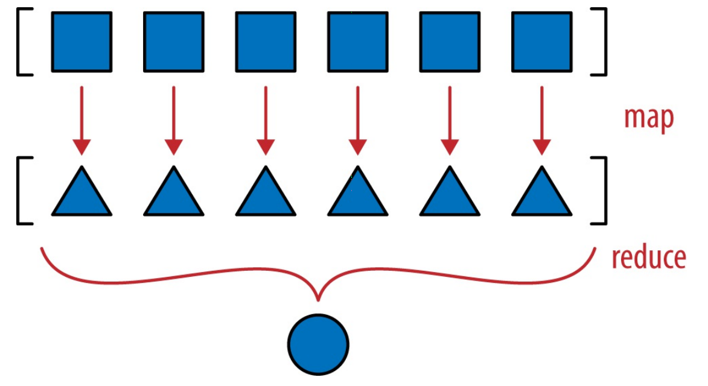

上述的`__hash__`方法是一种映射归约计算，映射归约：把函数应用到各个元素上，生成一个新序列（映射，map），然后计算聚合值（归约，reduce）

把生成器表达式替换成map方法，映射过程更加明显：

```python
    def __hash__(self):
        hashes = map(hash, self._components)
        return functools.reduce(operator.xor, hashes, 0)
```

在Python3中，map函数是惰性的，它会创建一个生成器，按需产出结果，因此能节省内存。

**3. 优化`__eq__`方法**

原方法的实现：

```python
    def __eq__(self, other):
        return tuple(self) == tuple(other)
```

存在的问题：不适合有大量分量的情况，该方法需要完整复制两个操作数，构建两个元组。

为了提高比较的效率，`Vector.__eq__`方法在for循环中使用zip函数

```python
    def __eq__(self, other):
        if len(self) != len(other):
            return False
        for a,b in zip(self, other):
            if a != b:
                return False
        return True
```

zip函数生成一个由元组构成的生成器，元组中的元素来自参数传入的各个可迭代对象。前面比较长度的测试是有必要的，因为一旦有一个输入耗尽，zip函数会立即停止生成值，而且不发出警告。

**4. 使用zip和all函数简化`Vector.__eq__`方法**

```python
    def __eq__(self, other):
        return len(self) != len(other) and all(a == b for a, b in zip(self, other))
```

#### 10.7 Vector类第5版：格式化

Vector类的`__format__`方法使用球面坐标（也叫超球面坐标），因为Vector类支持n个维度，而超过四维后，球体变成了'超球体'。因此，我们会把自定义的格式后缀由‘p’变成'h'。

例如，对四维空间（len(v) == 4）中的 Vector 对象来说，'h' 代码得到的结果是这样：`<r, Φ1, Φ2, Φ3>`其中，r 是模（abs(v)），余下三个数是角坐标 Φ1、Φ2 和 Φ3。

效果如下：

```python
>>> format(Vector([-1, -1, -1, -1]), 'h')
'<2.0, 2.0943951023931957, 2.186276035465284, 3.9269908169872414>'
>>> format(Vector([2, 2, 2, 2]), '.3eh')
'<4.000e+00, 1.047e+00, 9.553e-01, 7.854e-01>'
>>> format(Vector([0, 1, 0, 0]), '0.5fh')
'<1.00000, 1.57080, 0.00000, 0.00000>'
```

实现方法：

```python
    def angle(self, n):
        r = math.sqrt(sum(x * x for x in self[n:]))
        a = math.atan2(r, self[n-1])
        if (n == len(self) - 1) and (self[-1] < 0):
            return math.pi * 2 - a
        else:
            return a

    def angles(self):
        return (self.angle(n) for n in range(1, len(self)))

    def __format__(self, fmt_spec=''):
        if fmt_spec.endswith('h'): # 超球面坐标
            fmt_spec = fmt_spec[:-1]
            coords = itertools.chain([abs(self)],
                                        self.angles()) 
            outer_fmt = '<{}>'
        else:
            coords = self
            outer_fmt = '({})'
        components = (format(c, fmt_spec) for c in coords)
        return outer_fmt.format(', '.join(components)) 
```


### 第11章 接口：从协议到抽象基类

本章讨论的话题是**接口**，有两种类型的接口：

* 鸭子类型的代表**特征动态协议**
* 接口更明确、能验证实现是否符合规定的**抽象基类（Abstract Base Class, ABC）**

本章要介绍的内容：

* 鸭子类型的动态本性

* 抽象基类的常见用途：实现接口时作为超类使用
  * 抽象基类如何检查具体子类是否符合接口定义
  * 如何使用注册机制声明一个类实现了某个接口，而不进行子类化操作
  * 如何让抽象基类自动“识别”任何符合接口的类，而不进行子类化或注册

#### 11.1 Python文化中的接口和协议

**接口在动态类型中是怎么运作的呢？**

* Python语言没有interface关键字，而且<font color=red>除了抽象基类，每个类都有接口：类实现或继承的公开属性（方法或数据属性），包括特殊方法</font>，如`__getitem__`或`__add__`

* <font color=red>按照定义，受保护的属性和私有属性不在接口中。</font>不过这两个属性仍能在外部访问，因为“受保护的”属性只是采用命名约定实现的（单个前导下划线）；私有属性也可以轻松地访问到，不过不要违背这些约定，在外部访问这些属性。

* 另一方面，不要觉得公开数据属性放入对象的接口中不妥，因为如果需要，总能实现读值方法和设置方法，把数据属性变成特性，使用obj.attr句法的客户代码不会受到影响。

  如下所示：使用特性实现x和y的读取

  ```python
  class Vector2d:
      typecode = 'd'
      def __init__(self, x, y):
          self.__x = float(x)
          self.__y = float(y)
          
      @property
      def x(self):
          return self.__x
      
      @property
      def y(self):
          return self.__y
      
      def __iter__(self):
          return (i for i in (self.x, self.y))
  ```


接口的补充定义：

* 对象公开方法的子集，让对象在系统中扮演特定的角色。如Python文档中的“文件类对象”或“可迭代对象”，这种说法指的不是特定的类，而是指特定的角色。
* 接口是实现特定角色的方法集合，这样理解正是Smalltalk程序员所说的协议。
* 协议与继承没有关系。一个类可能会实现多个接口，从而让实例扮演多个角色。
* 协议是接口，但不是正式的（只能由文档和约定定义），因此协议不能像正式接口那样施加限制
* 对Python程序员来说，“X类对象”、“X协议”、“X接口”都是一个意思，如“字节序列对象”、“支持缓冲协议的对象”、“一个符合缓冲接口的对象”指的都是一个意思

#### 11.2 Python喜欢序列

**Python数据模型的哲学是尽量支持基本协议。**

图11-1展示了定义为抽象基类的Sequence正式接口

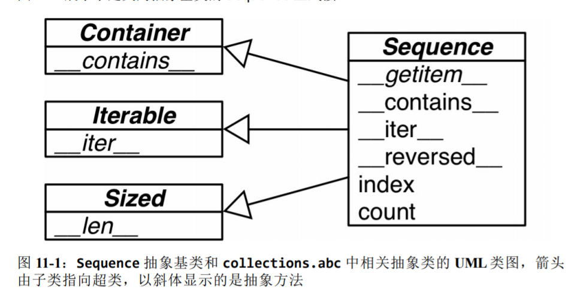

示例11-3：

Foo类没有继承`abc.Sequence`，而且只实现了序列协议的一个方法：`__getitem__`(没有实现`__len__`方法)

```python
>>> class Foo:
...     def __getitem__(self, pos):
...         return range(0, 30, 10)[pos]
...
>>> f = Foo()
>>> f[1]
10
>>> for i in f: print(i)
...
0
10
20
>>> 20 in f
True
>>> 15 in f
False
```

鉴于序列的重要性，如果没有`__iter__`和`__contains__`方法，Python会调用`__getitem__`方法，设法让迭代和in运算符可用。

**Python中的迭代是鸭子类型的一种极端形式：为了迭代对象，迭代器会尝试调用两个不同的方法。**


#### 11.3 使用猴子补丁在运行时实现协议

标准库中有个`random.shuffle`函数可以打乱序列，下面举例让原本不支持打乱的`FrenchDeck`类，使用猴子补丁来增加支持：

```python
import collections

Card = collections.namedtuple('Card', ['rank', 'suit'])
class FrenchDeck:
    ranks = [str(n) for n in range(2, 11)] + list('JQKA')
    suits = 'spades diamonds clubs hearts'.split()

    def __init__(self):
        self._cards = [Card(rank, suit) for suit in self.suits
                              for rank in self.ranks]

    def __len__(self):
        return len(self._cards)

    def __getitem__(self, position):
        return self._cards[position]
```

上述`FrenckDeck`不支持`random.shuffle`打乱，下面再控制台中为其添加`__setitem__`的猴子补丁，使其支持该操作。

```python
>>> def set_card(deck, position, card):
...     deck._cards[position] = card
...
>>> FranchDeck.__setitem__ = set_card
>>> shuffle(deck)
>>> deck[:5]
[Card(rank='3', suit='hearts'), Card(rank='4', suit='diamonds'),  Card(rank='4', suit='clubs'),  Card(rank='7', suit='hearts'),Card(rank='9', suit='spades') ]
```

这种技术叫**猴子补丁：在运行时修改类或模块，而不改动源码。**猴子补丁很强大，但是打补丁的代码与要打补丁的程序耦合十分紧密，而且往往要处理隐藏和没有文档的部分。

上述示例还**强调了协议是动态的**：`random.shuffle`函数不关心参数的类型，只要那个对象实现了部分可变序列协议即可。即便对象一开始没有所需的方法也没关系，后来再提供也行。

#### 11.4 Alex Martelli的水禽

Alex的文章说明：

* 鸭子类型应该避免使用`isinstancs`、`type(foo) is bar`的来检查对象的类型。

* 白鹅类型指，只要cls是抽象基类，即cls的元类是`abc.ABCMeta`，就可以使用`isinstance(obj, cls)`

* 继承抽象基类很简单，只需要实现所需的方法，这样也能表明开发者的意图。这一意图还能通过注册虚拟子类来实现。

* 使用`isinstance`和`issubclass`测试抽象基类更为人接受。不过，即便是抽象基类，也不能滥用`isinstance`检查，在一连串`if/elif/elif`中使用isinstance做检查，然后根据对象的类型执行不同的操作，通常是不好的做法。此时应该使用多态，即采用一定的方式定义类，让解释器把调用分派给正确的方法，而不使用`if/elif/elif`块硬编码分派逻辑。

下面示例：使用鸭子类型处理单个字符串或由字符串组成的可迭代对象（此时可能想使用isinstance来检查，但是这边推荐鸭子类型）

```python
try:
    field_names = field_names.replace(',', '').split()
except AttributeError:
    pass
field_names = tunple(field_names)
```

#### 11.5 定义抽象基类的子类

示例：把`FranchDeck2`声明为`collections.MutableSequence`的子类

```python
import collections

Card = collections.namedtuple('Card', ['rank', 'suit'])

class FrenchDeck2(collections.MutableSequence):
    ranks = [str(n) for n in range(2, 11)] + list('JQKA')
    suits = 'spades diamonds clubs hearts'.split()

    def __init__(self):
        self._cards = [Card(rank, suit) for suit in self.suits 
                                        for rank in self.ranks]

    def __len__(self):
        return len(self._cards)
    
    def __getitem__(self, position):
        return self._cards[position]
    
    def __setitem__(self, position, value):
        self._cards[position] = value
    
    def __delitem__(self, position):
        del self._cards[position]
    
    def insert(self, position, value):
        self._cards.insert(position, value)

```

导入时（加载并编译frenchdeck2.py模块时），Python不会检查抽象方法的实现，在运行时实例化FrenchDeck2类时才会正在的检查。因此，如果没有正确实现某个抽象方法，Python会抛出TypeError异常，并把错误消息设置为`"Can't instantiate abstract class FrenchDeck2 with abstract methods __delitem__, insert"`。

即便FrenckDeck2类不需要`__delitem__`和insert提供的行为，也要实现，因为MutableSequence抽象基类需要它们。

下图是MutableSequence的继承关系图

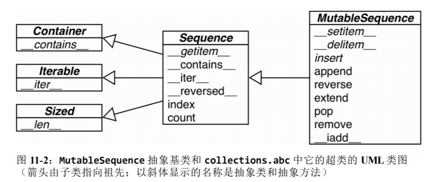


#### 11.6 标准库中的抽象基类
* 大多数抽象基类在collecttions.abs模块中定义，并且最常用
* numbers和io包中也有一些抽象基类

##### 11.6.1 collections.abs模块中的抽象基类
* 标准库中有两个名为abc的模块，这里说的是collections.abc。为了减少加载时间，python3.4在collections包之外实现这个模块，因此要与collections分开导入
* 另一个abc模块就是abc，这里定义的是abc.ABC类

python3.4在collections.abc模块中定义了16个抽象基类，简要UML类图如同11-3所示

官方介绍文档：https://docs.python.org/3/library/collections.abc.html#collections-abstract-base-classes

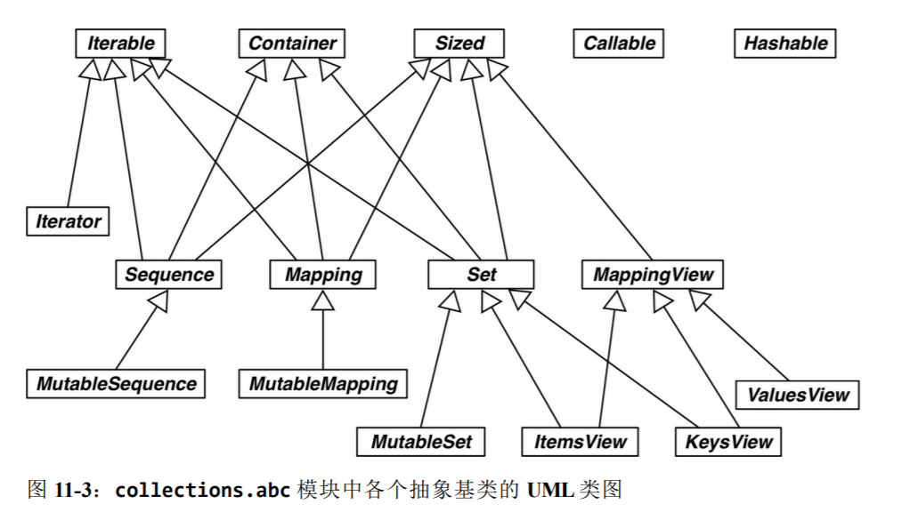

图中各类的介绍

##### 11.6.2 抽象基类的数字塔
继collections.abc之后，标准库中最有用的抽象基类包是numbers
numbers包定义的是“数字塔”（即各个抽象基类的层次结构是线性的），层次结构如下所示：

* Number
* Complex
* Real
* Rational
* Integral

因此，如果想检查一个数是不是整数，可以使用isinstance(x, numbers.Integral)，这样代码就能接受int、bool(int的子类)，或者外部库使用numbers抽象基类注册的其他类型。
为了满足检查的需要，可以把兼容的类型注册为numbers.Integal的虚拟子类

#### 11.7 定义并使用一个抽象基类

示例：

定义一个Tombola抽象基类，使其满足如下的使用场景：你要在网站或移动应用中显示随机广告，但是在整个广告清单轮转一遍之前，不重复显示广告。
Tombola抽象基类有四个方法，其中两个是抽象方法：

* `.locad(...)`：把元素放入容器
* `.pick()`：从容器中随机拿出一个元素，返回选中的元素
另外两个是具体方法：
* `.loaded()`：如果容器中至少有一个元素，返回True
* `.inspect()`：返回一个有序元组，由容器中的现有元素构成，不会修改容器的内容（内部的顺序不保留）

图11-4 展示了Tombola抽象基类和三个具体实现

示例11-9 Tombola抽象基类的定义
```python
import abc


class Tombola(abc.ABC):

    @abc.abstractclassmethod
    def load(self, iterable):
        """从可迭代对象中添加元素。"""

    @abc.abstractclassmethod
    def pick(self):
        """随机删除元素，然后将其返回。
        
        如果实例为空， 这个方法应该抛出`LookupError`。
        """

    def loaded(self):
        """如果至少有一个元素， 返回`True`， 否者返回`False`。"""
        return bool(self.inspect())
    
    def inspect(self):
        """返回一个有序组，由当前元素构成。"""
        items = []
        while True:
            try:
                items.append(self.pick())
            except LookupError:
                break
        self.load(items)
        return tuple(sorted(items))
```

* 抽象方法可以有实现代码。即便实现了，子类也必须覆盖抽象方法，但是在子类中可以使用super()函数调用抽象方法，为它添加功能，而不是从头开始实现。

* `self.pick()`抛出`LookupError`这一事实也是接口的一部分，但是在Python中没办法声明，只能在文档中说明

* 选择使用`LookupError`异常的原因：在Python的异常层次关系中，它与`IndexError`和`KeyError`有关，这两个是实现`Tombola`所用的数据结构最有可能抛出的异常。据此，实现代码空弄会抛出`LookupError`、`IndexError`和`KeyError`异常。异常的部分层次结构如示例11-10所示：

  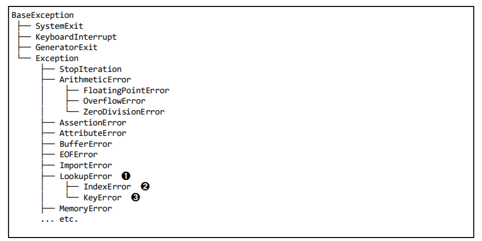

  * 我们在 `Tombola.inspect` 方法中处理的是 `LookupError` 异常。
  * `IndexError`是 `LookupError`的子类，尝试从序列中获取索引超过最后位置的元素时抛出。
  * 使用不存在的键从映射中获取元素时，抛出`KeyError`异常。

测试抽象基类对子类的检查：尝试使用一个有缺陷的实现来糊弄Tombola
```python
>>> from tombola import Tombola
>>> class Fake(Tombola):
...     def pick(self):
...         return 13
...
>>> Fake
<class '__main__.Fake'>
>>> f = Fake()
Traceback (most recent call last):
  File "<stdin>", line 1, in <module>
TypeError: Can't instantiate abstract class Fake with abstract methods load
>>>
```
实例化Fake时抛出了TypeError。

##### 11.7.1 抽象基类句法详解

**声明抽象基类的方法：**

* 声明抽象基类最简单的方式是继承`abc.ABC`或其他抽象基类。

* `abc.ABC`是Python3.4新增的类，因此如果那你使用的是旧版python，必须在class语句中使用`metaclass=`关键字，把值设为`abc.ABCMeta`（不是`abc.ABC`）。如下所示：

  ```python
  class Tombola(metaclass=abc.ABCMeta)
      # ...
  ```

* `metaclass=`关键字参数是Python3引入的，在Python2中必须使用`__metaclass__`类属性：

  ```python
  class Tombola(object):
      __metaclass__ = abc.ABCMeta
  ```

除了`@abstractmethod`之外，abc模块还定义了`@abstractclassmethod`、`@abstractstaticmethod`和`@abstractproperty`三个装饰器。然而，后三个装饰器从Python 3.3起废弃了，因为装饰器可以在`@abstractmethod`上堆叠，那三个显得多余了。例如，声明抽象类方法的推荐方式是：

```python
class MyABC(abc.ABC):
    @classmethod
    @abc.abstractmethod
    def an_abstract_classmethod(cls, ...):
        pass
```

在函数上堆叠装饰器的顺序通常很重要，与其他方法描述符一起使用时，`@abstractmethod()`应该放在最里层。

##### 11.7.2 定义Tombola抽象基类的子类

示例 11-12 `bingo.py`： `BingoCage`是`Tombola`的具体子类

```python
import random

from tombola import Tombola


class BingoCage(Tombola):

    def __init__(self, items):
        self._randomizer = random.SystemRandom()
        self._items = []
        self.load(items)

    def load(self, items):
        self._items.extend(items)
        self._randomizer.shuffle(self._items)
    
    def pick(self):
        try:
            return self._items.pop()
        except IndexError:
            raise LookupError('pick from empty BingoCage')
    
    def __call__(self):
        self.pick()
```

示例11-13是`Tombola`接口的另一实现，`LotteryBlower`打乱“数字球”后没有取出最后一个，而是取出一个随机位置上的球。

示例11-13 `lotoo.py`：`LotteryBlower`是Tombola的具体子类，覆盖了继承的inspect和loaded的方法

```python
import random

from tombola import Tombola


class LotteryBlower(Tombola):
    def __init__(self, iterable):
        self._balls = list(iterable)

    def load(self, iterable):
        self._balls.extend(iterable)
    
    def pick(self):
        try:
            position = random.randrange(len(self._balls))
        except ValueError:
            raise LookupError('pick from empty LotteryBlower')
        return self._balls.pop(position)
    
    def loaded(self):
        return bool(self._balls)

    def inspect(self):
        return tuple(sorted(self._balls))
```

##### 11.7.3 Tombola的虚拟子类

**白鹅类型的一个基本特性（也是值得用水禽来命名的原因 ）：即便不继承，也有办法把一个类注册为抽象基类的虚拟子类。**

**注册虚拟子类**

* 注册虚拟子类的方式：在抽象基类上调用register方法。
* 注册的类会变成抽象基类的虚拟子类，而且issubclass和isinstance等函数都能识别
* 虚拟子类不会继承注册的抽象基类，而且任何时候都不会检查它是否符合抽象基类的接口，即便在实例化时也不会检查。为了避免运行时错误，虚拟子类要实现所需的全部方法。
* register方法通常作为普通的函数调用，不过也可以作为装饰器使用。

示例 11-14实现一个虚拟子类`TomboList`类，这是Tombola的一个虚拟子类，如图11-5所示：

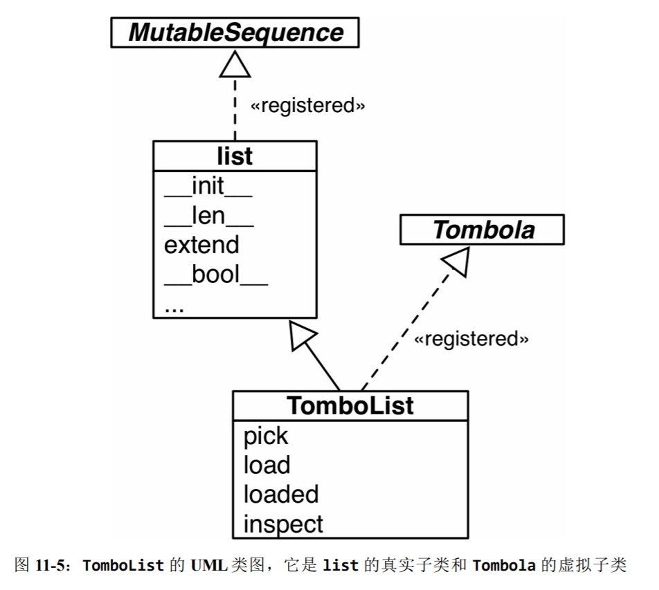

示例11-14 tombolist.py：TomboList是Tombola的虚拟子类

```python
from random import randrange

from tombola import Tombola


@Tombola.register
class Tombola(list):

    def pick(self):
        if self:
            position = randrange(len(self))
            return self.pop(position)
        else:
            raise LookupError('pop from empty TomboList')
    
    load = list.extend  # Tombolist.load与list.extend一样 

    def loaded(self): # loaded方法不能采用load方法的那种方式，因为list类型没有实现loaded方法所需的__bool__方法。而内置的bool函数不需要__bool__方法，因为它还可以使用__len__方法
        return bool(self) 
    
    def inspect(self):
        return tuple(sorted(self)):

# Tombola.register
```

注册之后，可以使用`issubclass`和`isinstance`函数判断`TomboList`是不是Tombola的子类：

```python
>>> from tombola import Tombola
>>> from tombolist import TomboList
>>> issubclass(TomboList, Tombola)
True
>>> t = TomboList(range(100))
>>> isinstance(t, Tombola)
True
```

类的继承关系在一个特殊的类属性中指定`__mro__`，即方法解析顺序（Method Resolution Order）。这个属性的作用很简单，按顺序列出类及其超类，Python会按照这个顺序搜索方法。

查看TomboList类的`__mro__`属性，你会发现它只列出了“真实的”超类，即list和object：

```python
>>> TomboList.__mro__
(<class 'tombolist.TomboList'>, <class 'list'>, <class 'object'>)
>>>
```

**`Tombolist.__mro__`中没有Tombola，因此Tombolist没有从Tombola中继承任何方法。**

#### 11.8 Tombola子类的测试方法

略

#### 11.9 Python使用register的方式

在Python3.3之前的版本不能把register当作装饰器使用，必须在定义类之后向普通函数那样调用。

把register当作函数使用更为常见，例如，在`collections.abc`模块的源码中，是这样把内置类型tuple、str、range和memoryview注册为Sequence的虚拟子类的：

```python
Sequence.register(tuple)
Sequence.register(str)
Sequence.register(range)
Sequence.register(meoryview)
```

#### 11.10 鹅的行为有可能像鸭子

**利用`__subclasshook__`方法，即便不注册，抽象基类也能把一个类识别为虚拟子类。**

```python
>>> class Struggle:
...     def __len__(self): return 23
...
>>> from collections import abc
>>> isinstance(Struggle(), abc.Sized)
True
>>> issubclass(Struggle, abc.Sized)
True
```

经`issubclass`函数确认（`isinstance`函数也会得出相同的结论），`Struggle`是`abc.Sized`的子类，这是因为`abc.Sized`实现了一个特殊的类方法，名为`__subclasshook__`。

**Size类的源码**

示例11-17 Size类的源码

```python
class Size(metaclass=ABCMeta):
    
    __slots__ = ()
    
    @abstractmethod
    def __len__(self):
        return 0
    
    @abstractmethod
    def __subclasshook__(cls, C):
        if cls is Sized:
            if any("__len__" in B.__dict__ for B in C.__mro__):
                return True
        return NotImplemented
```

`__subclasshook__`在白鹅类型中添加了一些鸭子类型的踪迹。我们可以使用抽象基类定义正式接口，可以始终使用`isinstance`检查，也可以完全使用不相关的类，只要实现特定的方法即可（或者做些事情让`__subclasshook`信服）。

### 第12章 继承的优缺点

本章探讨继承和子类化

* 子类化内置类型的缺点
* 多重继承和方法解析顺序

#### 12.1 子类化内置类型很麻烦

* 在Python 2.2之前，内置类型（如list或dict）不能子类化。在Python 2.2之后，内置类型就可以子类化了。

* 内置类型（使用C语言编写）不会调用用户定义的类覆盖的特殊方法。

  例如：dict的子类覆盖的`__getitem_()`方法不会被内置类型的`get()`方法调用

示例 12-1 内置类型dict的`__init__`和`__update__`方法会忽略我们覆盖的`__setitem__`方法

```python
>>> class DoppelDict(dict):
...     def __setitem__(self, key, value):
...         super().__setitem__(key, [value] * 2) # DoppelDict.__setitem__方法会重复存入的值（只是为了提供易于观察的效果）。它把职责委托给超类
...
>>> dd = DoppelDict(one=1) # 继承自dict的__init__方法显然忽略了我们覆盖的__setitem__方法：'one'的值没有重复
>>> dd
{'one': 1}
>>> dd['two'] = 2 # []运算符会调用我们覆盖的__setitem__方法，按预期那样工作：'two'对应的是两个重复的值，即[2, 2]。
>>> dd
{'one': 1, 'two': [2, 2]}
>>> dd.update(three=3)  # 继承自dict的update方法也不适用我们覆盖的__setitem__方法：'three'的值没有重复
>>> dd
{'one': 1, 'two': [2, 2], 'three': 3}
```

**原生类型的这种行为违背了面向对象编程的一个基本原则：始终应该从实例（self）所属的类开始搜索方法，即使在超类实现的类中调用也是如此。**

在这种糟糕的局面中，`__missing__`方法却能按预期方式工作，不过这只是特例。

不止在实例内部的调用有这个问题，**内置类型的方法调用的其他类的方法（如果被覆盖了），也不会被调用**，如实例12-2所示

示例 12-2 dict.update方法会忽略`AnswerDict.__getitem__`方法

```python
>>> class AnswerDict(dict):
...     def __getitem__(self, key): # 不管传入什么键，AnswerDict.__getitem__方法始终返回42
...         return 42
...
>>> ad = AnswerDict(a='foo') # ad是AnswerDict的实例，以('a', 'foo')键值对初始化
>>> ad['a'] # ad['a']返回42，这与预期相符
42
>>> d = {} 
>>> d.update(ad) # d是dict的实例，使用ad中的值更新d
>>> d['a'] # dict.update方法忽略了AnswerDict.__getitem__方法
'foo'
>>> d
{'a': 'foo'}
>>>
```

**直接子类化内置类型容易出错，应该继承collections模块**

直接子类化内置类型（如dict、list或str）容易出错，因为内置类型的方法通常会忽略用户覆盖的方法。不要子类化内置类型，用户自定义的类应该继承collections模块中的类，如UserDict、UserList和UserString，这些类做了特殊设计，因此易于扩展。

本节所述的问题只发生在C语言实现的内置类型内部的方法委托上，而且只影响直接继承内置类型的用户，如果子类化使用Python编写的类就不会受此影响。

#### 12.2 多重继承和方法解析顺序

“菱形问题”：任何实现多重继承的语言都要处理潜在的命名冲突，这种冲突由不相关的祖先类实现同名方法引起。这种冲突称为“菱形问题”，如图12-1和示例12-4所示：

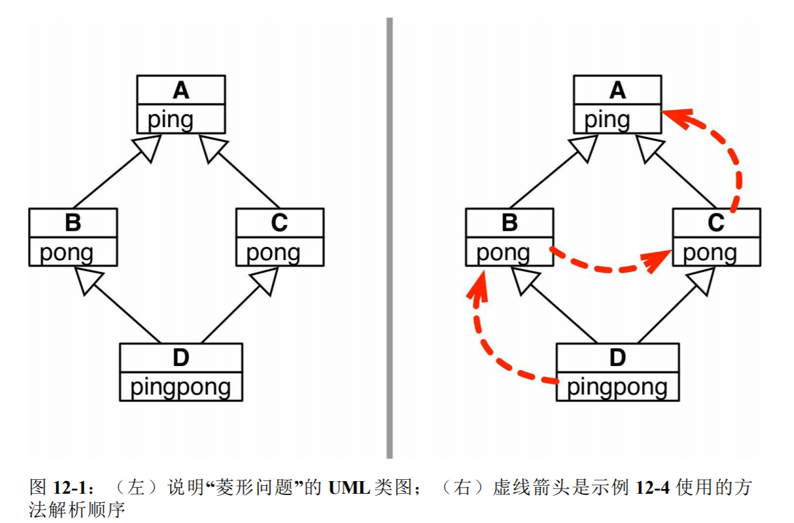

```python
class A:
    def ping(self):
        print('ping:', self)
    

class B(A):
    def pong(self):
        print('pong:', self)


class C(A):
    def pong(self):
        print('PONG:', self)


class D(B, C):
    def ping(self):
        super().ping()
        print('post-ping', self)
    
    def pingpong(self):
        self.ping()
        super().ping()
        self.pong()
        super().pong()
        C.pong(self)
```

示例 12-5 在D实例上调用pong方法的两种方式

```python
>>> from diamond import *
>>> d = D()
>>> d.pong() # 直接调用d.pong()运行的是B类中的版本
pong: <diamond.D object at 0x0000028DE25BBDA0>
>>> C.pong(d) # 超类中的方法都可以直接调用，此时要把实例作为显示参数传入
PONG: <diamond.D object at 0x0000028DE25BBDA0>
```

**方法解析顺序**

类都有一个名为`__mro__`的属性，它的值是一个元组，按照方法解析顺序列出各个超类，从当前类一直向上，直到object类。而且方法解析顺序不仅考虑继承图，还考虑子类声明中列出超类的顺序。

D类的`__mro__`属性如下：

```python
>>> D.__mro__
(<class 'diamond.D'>, <class 'diamond.B'>, <class 'diamond.C'>, <class 'diamond.A'>, <class 'object'>)
```

**调用超类的方法的方式**

* 使用内置的`super()`函数

* 也可以绕过方法解析顺序，直接调用某个类的方法

  如下所示：

  ```python
  def ping(self):
      A.ping(self) 
      print('post-ping:', self)
  ```

  直接在类上调用实例方法时，必须显示传入self参数，因为这样访问的是未绑定的方法（unbound method）。

**打印方法解析顺序的函数**

```python
>>> bool.__mro__
(<class 'bool'>, <class 'int'>, <class 'object'>)
>>> def print_mro(cls):
...     print(', '.join(c.__name__ for c in cls.__mro__))
...
>>> print_mro(bool)
bool, int, object
```

#### 12.3 多重继承的真实应用

在标准库中，GUI工具包Tkinter把多重继承用到了极致。

图12-12展示了Tkinter中Text小组件类的继承关系

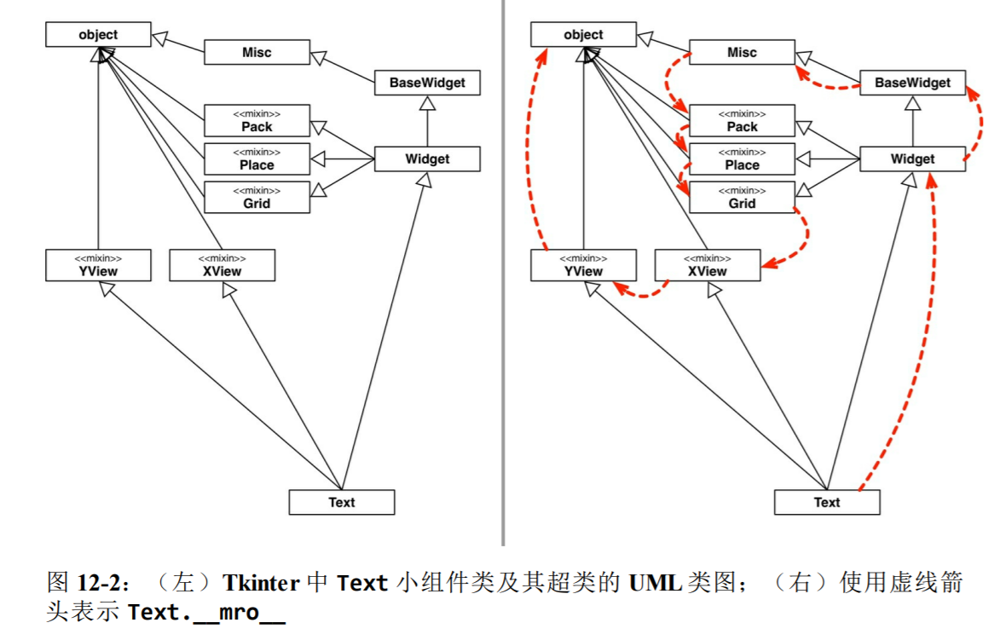

图12-3 列出了tkinter基包中的全部小组件类

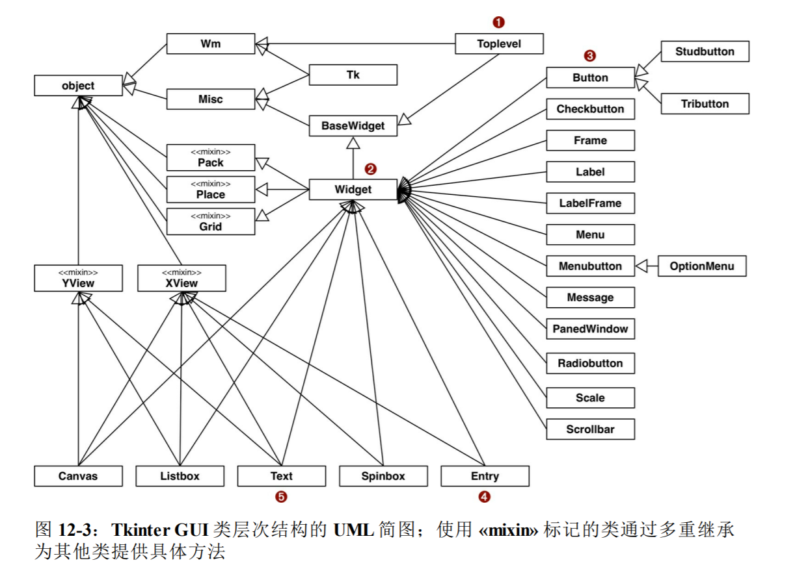


#### 12.4 处理多重继承

使用多重继承容易得出令人费解和脆弱的设计，下面是避免把类图搅乱的一些建议：

**Tkinter好的、不好的和令人厌恶的方面**

#### 12.5 一个现代示例：Django通用视图中的混入

与Tkinter相比，Django基于类的视图API是多重继承更好的示例。


### 第13章 正确重载运算符

这章重点介绍：

* Python如何处理中缀运算符中不同类型的操作数
* 使用鸭子类型或显示类型检查处理不同类型的操作数
*  中缀运算符如何表明自己无法处理操作数
*  众多比较运算符（如`>`、`<=`, '=='）的特殊行为
*  增量赋值运算符（如`+=`）的默认处理方式和重载操作

#### 13.1 运算符重载基础
运算符重载会被滥用，因此Python添加了一些限制，做好了灵活性、可用性和安全性方面的平衡：

* 不能重载内置类型的操作符
* 不能新建运算符，只能重载现有的
*  有些操作符不能重载，如is, and, or和not（但是位运算符|, &和~可以重载）

#### 13.2 一元运算符

**三个一元运算符及其特殊方法：**

* - （`__neg__`）
    一元取负运算符。如果x是-2，那么-x == 2
* （`__pos__`）
  一元取正运算符。通常，x == +x，但也有一些例外。
+ ~ （`__invert__`）
    对整数按位取反，定义~x == -(x+1)。如果x是2，那么~x == -3

在Python语言参考手册中也把内置的`abs()`函数列为一元操作符，它对应的特殊方法是`__abs__`

**把一元运算符`-`、`+`添加到Vector类中**
示例13-1 `vector_v6.py`：把一元运算符-和+添加到示例10-16中
```python
    def __abs__(self):
        return math.sqrt(sum(x * x for x in self))

	def __neg__(self):
		return Vector(-x for x in self)
	def __pos__(self):
 		return Vector(self)
```

**不实现`__invert__`方法，程序调用的错误信息**
我们不打算实现`__invert__`方法，因此如果用户在Vector实例上尝试计算~v,Python会抛出TypeError，而且输出明确的错误消息，“bad operand type for unary ~:'Vector'”

**x != +x 的特殊场景**
大多数情况下x == +x，下面例举的两个特殊场景下，x != +x
场景1：

与`decimal.Decimal`类有关。如果x是Decimal实例，在算术运算符的上下文中创建，任何在不同的上下文中计算+x，如果精度变了，那么x != +x

详细见P309的示例

场景2：

`collections.counter`类也会发生x != +x的情况，详细见P310

#### 13.3 重载向量加法运算符`+`

#### 

**1. 为Vector添加`__add__`方法以支持加法运算符`+`**

示例 13-4 `Vector.__add__`方法，第一版


**2. 添加`__radd__`方法，以支持左操作数不是Vector之外的对象的情况**

为了支持涉及不同类型的运算符，Python为中缀运算符特殊方法提供了特殊的分派机制。对表达式`a + b`来说，解释器会执行以下几步操作：

* 如果a有`__add__`方法，而且返回值不是`NotImplemented`，调用`a.__add__(b)`，然后返回结果
* 如果a没有`__add__`方法，或者调用`__add__`方法返回`NotImplemented`，检查b有没有`__radd__`方法，如果有，而且没有返回`NotImplemented`，调用`b.__radd__(a)`，然后返回结果
* 如果b没有`__radd__`方法，或者调用`__radd__`方法返回`NotImplemented`，抛出`TypeError`，并在错误消息中指明操作数类型不支持

注（`NotImplemented`和`NotImplementedError`是不一样的，前者是特殊的单例值，后者是一种异常）

下面是解释器的操作流程图：

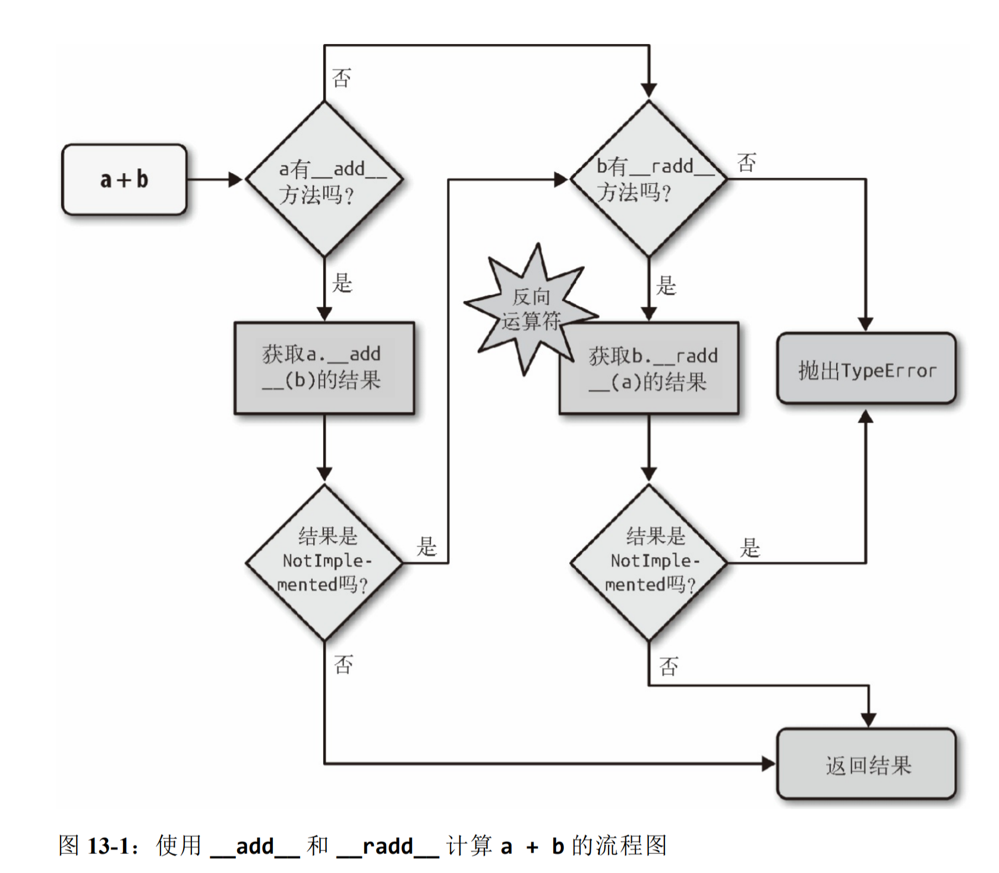

示例 13-7 `Vector.__add__`和`__radd__`方法

略

**3. 增加对不支持类型的处理**

为了遵守鸭子类型的精神，我们不能测试other操作数的类型，或者它的元素的类型。我们要捕获异常，然后返回`NotImplemented`。如果解释器还未反转操作数，那么它将尝试去做。如果反向方法返回`NotImplemented`，那么Python会抛出`TypeError`，并返回一个标准的错误消息，例如“unsupported operand type(s) for +: Vector and str”

示例 13-10 `vector_v6.py`：+运算符方法，添加到vector_v5.py（见示例10-16）中

```python
略
```

#### 13.4 重载标量乘法运算符`*`

Vector的积有两种

* 标量积
* 点积

这里实现的是标量积

**1. 实现最简单的`__mul__`和`__rmul___`方法**

```python
# 在Vector类中定义

def __mul_(self, scalar):
    return Vector(n * scalar for n in self)

def __rmul__(self, scalar):
    return self * scalar
```

上述方法在提供不兼容的操作数时会出问题。

**2. 使用白鹅类型来检查不兼容的操作数**

```python
# 在Vector类中定义

def __mul_(self, scalar):
    if isinstance(scalar, numbers.Real):
        return Vecotr(n * scalar for n in self)
    else:
    	return NotImplemented

def __rmul__(self, scalar):
    return self * scalar
```


**3. 我们讲解了编写`+`和`*`中缀运算符最常用的模式。 对表13-1中列出的所有运算符都适用**

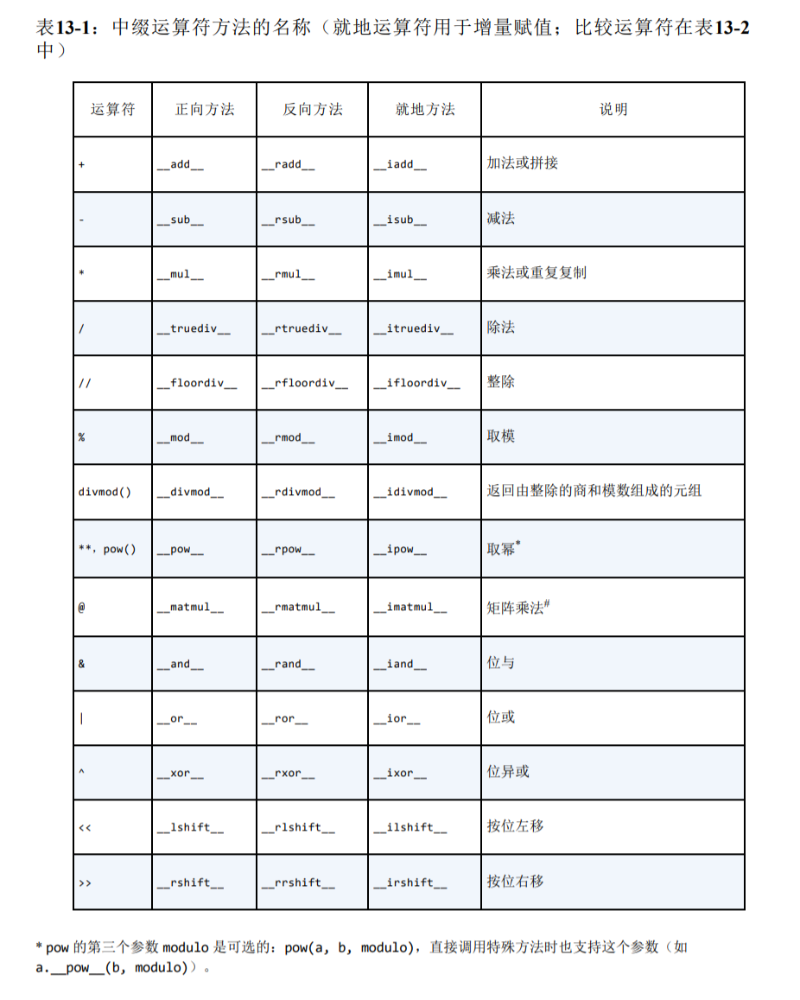

#### 13.5 众多比较运算符

**1. 众多比较运算符和前文运算符的区别**

Python解释器对众多比较运算符（==、!=、>、<、>=、<=）的处理与前文类似，不过在两个方面有重大区别：

* 正向和方向调用使用的是同一系列方法。这方面的规划如表13-2所示。例如，对==来说，正向和反向调用都是`__eq__`方法，只是把参数对调了；而正向的`__gt__`方法调用的是方向的`__lt__`方法，并把参数对调
* 对`==`和`!=`来说，如果反向调用失败，Python会比较对象的ID，而不抛出TypeError。

表13-2：众多比较运算符：正向方法返回`NotImplemented`的话，调用反向方法

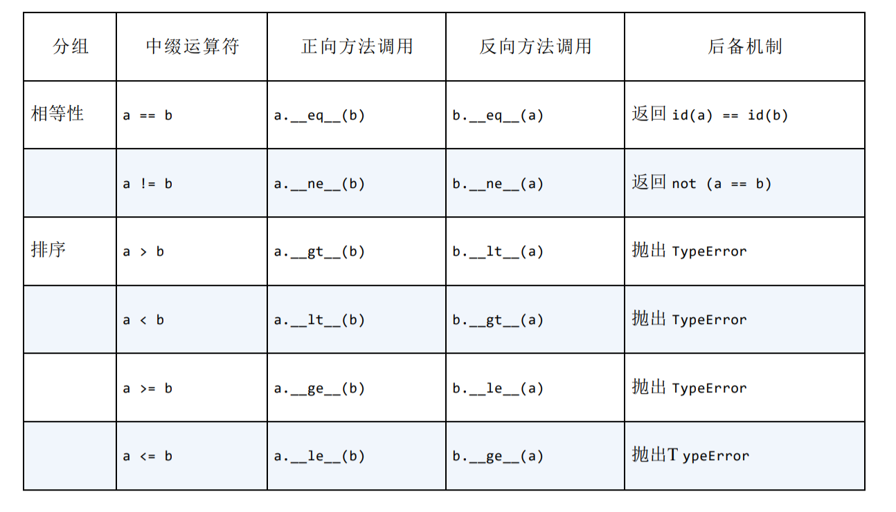

**2. 改进`vector.__eq__`方法的行为**

略

#### 13.6 增量赋值运算符

* 增量运算符不会修改不可变目标，而是新建实例，然后重新绑定
* 如果一个类没有实现表13-1列出的就地运算符，增量赋值运算符只是语法糖：a += b的作用与a = a + b完全一样。对不可变类型来说，这是预期的行为，而且，如果定义了`__add__`方法的话，不用编写额外的代码，+=就能使用。
* 如果实现了就地运算符方法，例如`__iadd__`，计算a += b的结果时会调用就地运算符方法。这种运算符的名称表明，它们会就地修改左操作数，而不会创建新对象作为结果。
* 对不可变类型来说，一定不能实现就地特殊方法。
* 对序列类型来说，`+`通常要求两个操作数属于同一类型，而`+=`的右操作数往往可以是任何可迭代对象

## 第五部分 流畅控制

### 第14章 可迭代的对象、迭代器和生成器

**迭代器模式：**扫描内存中放不下的数据集时，我们要找到一种惰性获取数据的方式，即按需一次获取一个数据项。

**生成器与迭代器：**

* python中使用`yield`关键字用于构造生成器
* 所有生成器都是迭代器，因为生成器完全实现了迭代器接口
* 区别：
  * 迭代器用于从集合中取出元素
  * 生成器用于“凭空”生成元素

#### 14.1 Sentence类第1版：单词序列 

实现一个Sentence类，以此打开探索可迭代对象的旅程。

第1版要实现序列协议，这个类的对象可以迭代，因为所有序列都可以迭代。

示例14-1 `sentence.py`：把句子划分为单词序列

```python
import re
import reprlib

RE_WORD = re.compile('\w+')


class Sentence:
    
    def __init__(self, text):
        self.text = text
        self.words = RE_WORD.findall(text)
    
    def __getitem__(self, index):
        return self.words[index]
    
    def __len__(self):
        return len(self.words)
    
    def __repr__(self):
        return 'Sentence(%s)' % reprlib.repr(self.text)
```

**序列可以迭代的原因：iter函数**

解释器需要迭代对象x时，会自动调用iter(x)

内置的iter函数的作用：

* 检查对象是否实现了`__iter__`方法，如果实现了就调用它，获取一个迭代器
* 如果没有实现`__iter__`方法，但实现了`__getitem__`方法，Python会创建一个迭代器，尝试按顺序（从索引0开始）获取迭代对象
* 如果尝试失败，python会抛`TypeError`异常，通常会提示`‘"C object is not iterable"`，其中C是目标对象所属的类

检查对象x是否可迭代：

* `abc.Iterable`类实现了`__subclasshook__`方法，可以使用它来检查对象是否可迭代，但是它没有考虑`__getitem__`

  ```python
  class Foo:
      def __iter__(self):
          pass
  issubclasss(Foo, abc.Iterable)
  f = Foo()
  isinstance(f, abc.Iterable)
  ```

* 直接使用`iter(x)`，如果对象不可迭代会抛`TypeError:'C' object is not iterable`的异常

任何Python序列可以迭代，因为它们都实现了`__getitem__`方法。（其实标准库的序列也都实现了`__iter__`方法）

#### 14.2 可迭代对象与迭代器的对比

**可迭代的对象和迭代器之间的关系：**

* python从可迭代的对象中获取迭代器
* 使用`iter`内置函数可以获取迭代器的对象

示例：

使用for循环迭代一个字符串。字符串'ABC'是可迭代的对象，背后是有迭代器的，只不过我们看不到：

```python
>>> s = 'ABC'
>>> for char in s:
...     print(char)
...
A
B
C
```

如果没有for语句，不得不使用while循环模拟：

```python
>>> s = 'ABC'
>>> it = iter(s) # 使用可迭代的对象构建迭代器it
>>> while True:
...     try:
...         print(next(it)) # 不在再迭代器上调用next函数，获取下一个字符
...     except StopIteration: # 如果没有字符了，迭代器会抛出StopIteration异常
...         del it  #释放对it的引用，即废弃迭代器对象
...         break   #退出循环
...
A
B
C
```

**标准的迭代器接口有两个方法：**

* `__next__`:

  返回下一个可用的元素，如果元素没了，抛出StopIteration异常

* `__iter__`:

  返回self，以便在应该使用可迭代对象（这里的可迭代对象应该指迭代器对象本身，跟可迭代的对象不是同一个东西）的地方使用迭代器，例如在for循环中

**迭代器接口的类关系：**

* 迭代器接口在`collections.abs.Iterator`抽象基类中制定

* `Iterable`和`Iterator`的关系

  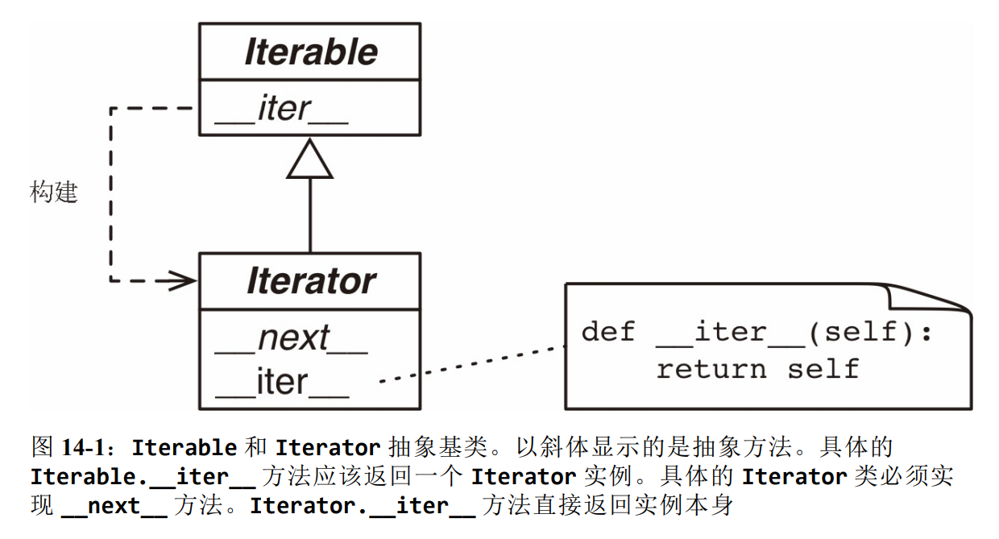

**`Iterator`源码 ：**

```python
class Iterator(Iterable):
    __slots__ = ()

    @abstractmethod
    def __next__(self):
        raise StopIteration

    @classmethod
    def __subclasshook__(cls, C):
        if cls is MyIterator:
            if (any("__next__" in B.__dict__ for B in C.__mro__) and
                any("__iter__" in B.__dict__ for B in C.__mro__)):
                return True
        return NotImplemented
```

检查对象x是否为迭代器最好的方式是调用`isinstance(x, abc.Iterator)`，得益于`Iterator.__subclasshook__`方法，即使对象x所属的类不是`Iterator`类的真实子类或虚拟子类，也能这样检查。

**迭代器的定义：**

* 实现了`__next__`方法，返回序列中的下一个元素，如果没有元素了，就抛`StopIteration`异常
* python中的迭代器还实现了`__iter__`方法，因此迭代器也可以迭代


#### 14.3 Sentence类第2版：典型的迭代器

**使用迭代器模式实现Sentence类**

```python
import re
import reprlib

RE_WORD = re.compile("\w+")

class SentenceV2:
    def __init__(self, text):
        self.text = text
        self.words = RE_WORD.findall(text)

    def __repr__(self):
        return 'Sentence (%s)' % reprlib.repr(self.text)

    def __iter__(self):
        return SentenceIterator(self.words)


class SentenceIterator:

    def __init__(self, words):
        self.words = words
        self.index = 0

    def __next__(self):
        try:
            word = self.words[self.index]
        except IndexError:
            raise StopIteration()
        self.index += 1
        return word

    def __iter__(self):
        return self


def test_sentence1():
    s = SentenceV2('"The time has come," the Walrus said')
    print(s)
    for word in s:
        print(word)


def main():
    test_sentence1()


if __name__ == '__main__':
    main()
```

**构建可迭代的对象和迭代器时经常出现的错误:**

* 混淆了二者，比如想把Sentence变成迭代器

* 两者的区别：
  * 可迭代的对象有个`__iter__`方法，每次都实例化一个新的迭代器
  * 迭代器要实现`__next__`方法，返回单个元素，还要实现`__iter__`方法，返回迭代器本身

* 在可迭代的对象加入`__next__`方法是一种糟糕的想法，这是一种常见的反模式，违反了迭代器模式的用途

**迭代器模式的用途：**

* 访问一个聚合对象的内容而无需暴露它的内部表示
* 支持对聚合对象的多种遍历
* 为遍历不同的聚合结构提供一个统一的接口（即支持多态迭代）

#### 14.4 Sentence类第3版：生成器函数

之前的版本的Sentence类中，`__iter__`方法调用`SentenceIterator`类的构造方法创建一个迭代器并将其方法，现在使用生成器来替换迭代器类，所以这里的`__iter__`方法是生成器函数

```python
import re
import reprlib

RE_WORD = re.compile("\w+")

class SentenceV3:
    def __init__(self, text):
        self.text = text
        self.words = RE_WORD.findall(text)

    def __repr__(self):
        return 'Sentence (%s)' % reprlib.repr(self.text)

    def __iter__(self):
        for word in self.words:
            yield word
        return
```

`__iter__`方法是生成器函数，调用时会构建一个实现了迭代器接口的生成器对象，因此不用再定义`SentenceIterator`类

#### 14.5 Sentence类第4版：惰性实现

之前的版本都是将words全部生成在列表中，可以利用生成器，在需要的时候才生成对应的单词数据

`re.finditer`函数是`re.findall`函数的惰性版本，利用该函数可以将Sentence修改称惰性版本

#### 14.6 Sentence类第5版：生成器表达式

简单的生成器函数可以替换成生成器表达式

如以下的生成器函数可以替换成表达式：

```python
# ======生成器函数============
def __iter__(self):
    for match in RE_WORD.finditer(self.text):
        yield match.group()
# ======生成器表达式=================
def __iter__(self):
   return (match.group() for match in RE_WORD.finditer(self.text))
```

生成器表达式：

* 可以理解为列表推导的惰性版本，不会迫切地构建列表，而是返回一个生成器，按需惰性生成元素。

* 生成器表示是语法糖，完全可以替换成生成器函数，不过有时使用生成器表达式更便利。

#### 14.7 何时使用生成器表达式

* 生成器表达式是创建生成器的简洁语法，无需先定义函数再调用
* 生成器函数可以使用多个语句实现复杂的逻辑，也可以作为协程使用

#### 14.8 另一个示例：等差数列生成器

本节用不同的方法实现：用于生成不同类型的有穷等差数列的生成器

示例 14-10 `ArithmeticProgression`类

```python
class ArithmeticProgression:
    def __init__(self, begin, step, end=None):
        self.begin = begin
        self.step = step
        self.end = end
    
    def __iter__(self):
        result = type(self.begin + self.step)(self.begin)
        forever = self.end is None
        index = 0
        while forever or result < self.end:
            yield result
            index += 1
            result = self.begin + self.step * index
```

示例 14-12 `aritprog_gen`生成器函数

```python
def aritprog_gen(begin, step, end=None):
    result = type(begin, step)(begin)
    forver = end is None
    index = 0
    while forver or result < end:
        yield result
        index += 1
        result = begin + step * index
```

示例 14-13 `aritprog_v3.py`：与前面的aritprog_gen函数作用相同

```python
import itertools


def aritprog_gen(begin, step, end=None):
    first = type(begin, step)(begin)
    ap_gen = itertools.count(first, step)
    if end is not None:
        ap_gen = itertools.takewhile(lambda n: n < end, ap_gen)
    return ap_gen
```

三个版本功能一样，不过可以对比一下如何用更简洁的方式来实现。

#### 14.9 标准库中的生成器函数

略

#### 14.10 Python 3.3中新出现的语句：yield from

如果生成器函数需要产出了一个生成器生成的值，传统的解决方法是使用嵌套的for循环，可以利用`yield from`语法，将循环操作依次交给接收到的各个可迭代对象处理。

例程：

* 利用嵌套for循环的传统方法

  ```python
  def chain(*iterables):
      for i in iterables:
          for i in it:
              yield i
              
  s = "ABC"
  t = tuple(range(3))
  list(chain(s, t))
  # out: ["A","B","C",0,1,2]
  ```

* 使用`yield from`语法

  ```python
  def chain(*iterables):
      for i in iterables:
          yield from i
              
  s = "ABC"
  t = tuple(range(3))
  list(chain(s, t))
  # out: ["A","B","C",0,1,2]
  ```

#### 14.11 可迭代的归约函数

表14-6中的函数都接受一个可迭代的对象，然后返回单个结果。

表略

#### 14.12 深入分析iter函数

* 在python中迭代对象x时会调用`iter(x)`

* `iter`函数还有一个用法：传入两个参数，使用常规的函数或任何可调用的对象创建迭代器。这样使用时，第一个参数必须是可调用的对象，用于不断调用（没有参数），产生各个值；第二个是哨符，当可调用对象返回这个值时，触发迭代器抛出`StopIteration`异常

  例子：

  ```python
  def d6():
      return randint(1，6)
  
  d6_iter = iter(d6, 1)
  for roll in d6_iter:
      print(roll)
  ```

#### 14.13案例分析：在数据库转换工具

本节介绍了一个数据库转换工具的实现方式，以此来说明如何使用生成器函数解耦读写逻辑。

#### 14.4 把生成器当作协程

Python 2.5实现了`.send()`方法

`.send()`方法的作用：

* 与`.next()`方法一样，使生成器前进到下一个yield语句
* `.send()`方法允许在客户代码和生成器之间交换数据。即：把`.send()`方法的参数，会成为生成器函数定义体中对应的yield表达式的值。

### 第15章 上下文管理器和else块

本章介绍：

* with语句和上下文管理器
* for、while和try语句的else子句

#### 15.1 先做这个，再做那个：if语句之外的else块

else 子句的行为如下：

* for

  仅当for循环运行完毕时（即for循环没有被break语句中止）才允许else块

* while

  仅当while循环因为条件为假值而退出时（即while循环没有被break语句中止）才允许else块

* try

  仅当try块中没有异常抛出时才运行else块。

#### 15.2 上下文管理器和with块

* 上下文管理器对象存在的目的是管理with语句

* with语句的目的是简化try/finally模式
* 上下文管理器协议包含`__enter__`和`__exit__`两个方法。
  * `with`语句开始运行时，会在上下文管理器对象上调用`__enter__`方法
  * `with`语句运行结束后，会在上下文管理器对象上调用`__exit__`方法，以此扮演finally子句的角色

示例 15-1 演示把文件对象当作上下文管理器使用

```python
>>> with open("mirror.py") as fp:
...    src = fp.read(60)
...
>>> len(src)
60
>>> fp
<_io.TextIOWrapper name='mirror.py' mode='r' encoding='UTF-8'>
>>> fp.closed, fp.encoding
(True, 'UTF-8')
>>> fp.read(60)
Traceback (most recent call last):
  File "<stdin>", line 1, in <module>
ValueError: I/O operation on closed file.
```

注：执行with后面的表达式得到的结果是上下文管理器对象，不过，把值绑定到目标变量上（as子句）是在上下文管理器对象上调用`__enter__`方法的结果

as子句是可选的

示例 15-3：lookingGlass.py`：LookingGlass上下文管理器类的代码

```python
class LookingGlass:
    def __enter__(self):
        import sys
        self.original_write = sys.stdout.write
        self.stdout.write = self.reverse_write
        return 'JABBERWOCKY'
    
    def reverse_write(self, text):
        self.original_write(text[::-1])
        
    def __exit__(self, exc_type, exc_value, traceback):
        import sys
        sys.stdout.write = self.original_write
        if exc_type is ZeroDivisionError:
            print('Please DO NOT divide by zero!')
            return True # # 如果有异常发生，__exit__方法True之外的值，with块中的异常会向上冒泡
```

* 解释器调用`__enter__`方法时，除了隐式的self之外，不会传入任何参数。

* 传给`__exit__`方法的三个参数：

  * exc_type

    异常类（例如ZeroDivisionError）

  * exc_value

    异常实例。有时会有参数传递给异常构造方法，例如错误消息，这些参数可以使用`exc_value.args`获取

  * traceback

    traceback对象

使用:

```python
>>> from mirror import LookingGlass
>>> with LookingGlass() as what: 
... print('Alice, Kitty and Snowdrop') 
... print(what)
...
pordwonS dna yttiK ,ecilA 
YKCOWREBBAJ
>>> what 
'JABBERWOCKY'
>>> print('Back to normal.') 
Back to normal.
```

也可以在with块之外使用LookingGlass类，手动调用`__enter__`和`__exit__`方法

```python
>>> from mirror import LookingGlass
>>> manager = LookingGlass() 
>>> manager
<mirror.LookingGlass object at 0x2a578ac>
>>> monster = manager.__enter__() 
>>> monster == 'JABBERWOCKY' 
eurT
>>> monster
'YKCOWREBBAJ'
>>> manager
>ca875a2x0 ta tcejbo ssalGgnikooL.rorrim<
>>> manager.__exit__(None, None, None) 
>>> monster
'JABBERWOCKY'
```

#### 15.3 contextlib模块中的实用工具

介绍contextlib模块中提供的一些上下文管理相关的类和函数

* closing
* suppress
* @contextmanager
* ContextDecorator
* ExitStack

#### 15.4 使用@contextmanager

**`@contextmanager`装饰器的作用**

`@contextmanager`装饰器能把包含一个yield语句的简单生成器变成上下文管理器。

在使用`@contextmanager`装饰器的生成器中，yield语句的作用时把函数定义体分成两部分：

* yield语句前面的所有代码在with块开始时（即解释器调用`__enter__`方法时）执行
* yield语句后面的代码在with块结束时（即调用`__exit__`方法时）执行

示例：

示例15-5 `mirror_gen.py`：使用生成器实现的上下文管理器

```python
import contextlib


@contextlib.contextmanager
def looking_glass():
    import sys
    original_write = sys.stdout.write

    def reverse_write(text):
        original_write(text[::-1])
    
    sys.stdout.write = reverse_write
    yield 'JABBERWOCKY' # 产出一个值，这个值会绑定with语句中as子句的目标变量上。执行with块中的代码时，这个函数会在这一点暂停。
    sys.stdout.write = original_write
```

测试`looking_glass`上下文管理器函数

```python
>>> from mirror_gen import looking_glass
>>> with looking_glass() as what:
...     print('Alic, Kitty and Snowdrop')
...     print(what)
...
pordwonS dna yttiK ,cilA
YKCOWREBBAJ
>>>
>>> with looking_glass() as what:
...     1/0
...
Traceback (most recent call last):
  File "<stdin>", line 2, in <module>
ZeroDivisionError: division by zero
>>>
>>> print('abc')
cba
```

这个类的`__enter__`方法的作用：

* 调用生成器函数，保存生成器对象（这里把它称为`gen`）
* 调用`next(gen)`，执行到yield关键字所在的位置
* 返回`next(gen)`产出的值，以便把产出的值绑定到with/as语句中的目标变量上

with块终止时，`__exit__`方法的作用：

* 检查有没有把异常传给`exc_type`；如果有，调用`gen.throw(exception)`，在生成器函数定义体中包含yield关键字的那一行抛出异常
* 否则，调用`next(gen)`，继续执行生成器函数定义体中`yield`语句之后的代码

**对示例15-5添加异常处理**

示例15-5有一个严重的错误：没有处理异常，可能会导致程序异常中止。

如果在with块中抛出了异常，Python解释器会将其捕获，然后在looking_glass函数的yield表达式里再次抛出。但是，那没有处理错误的代码，因此looking_glass函数会中止，永远无法恢复成原来的`sys.stdout.wite`方法，导致系统处于无效状态。

示例15-7 `morror_gen_exc.py`：基于生成器的上下文讨论区，而且实现了异常处理（从外部看，行为和示例15-3一样）

```python
import contextlib


@contextlib.contextmanager
def looking_glass():
    import sys
    original_write = sys.stdout.write

    def reverse_write(text):
        original_write(text[::-1])
    
    sys.stdout.write = reverse_write
    msg = ''
    try:
        yield 'JABBERWOCKY' # 产出一个值，这个值会绑定with语句中as子句的目标变量上。执行with块中的代码时，这个函数会在这一点暂停。
    except ZeroDivisionError:
        msg = 'Please DO NOT divide by zero'
    finally:
        sys.stdout.write = original_write
        if msg:
            print(msg)
```

测试:

```python
>>> from mirror_gen_exc import looking_glass
>>> with looking_glass() as what:
...     print('Alic, Kitty and Snowdrop')
...     print(what)
...
pordwonS dna yttiK ,cilA
YKCOWREBBAJ
>>> what
'JABBERWOCKY'
>>> with looking_glass() as what:
...     1/0
...
Please DO NOT divide by zero
>>> what
'JABBERWOCKY'
```

`@contextmanager`里的`__exit__`对异常的处理和普通的`__exit__`方法有所不同：

* 为了告诉解释器异常已经处理了，`__exit__`方法会返回`True`，此时解释器会压制异常。如果`__exit__`方法没有显示返回一个值，那么解释器得到的时None，然后向上冒泡异常
* 使用`@contextmanager`装饰器时，默认的行为是相反的：装饰器提供的`__exit__`方法假定发给生成器的所有异常都得到处理了，因此应该压制异常。如果不想让`@contextmanager`压制异常，必须在被装饰器的函数中显式重新抛出异常。

### 第16章 协程

#### 16.2 用作协程的生成器的基本行为

协程的四个状态：

* GEN_CREATED

  等待开始执行

* GEN_RUNNING

  解释器正在执行

* GEN_SUSPENDED

  在yield表达式处暂停

* GEN_CLOSED

  执行结束

可以使用`inspect.getgeneratorstate(...)`函数确定处于何种状态

使用协程前需要预激协程：

* next(my_coro)
* my_coro.send(None)

#### 16.4 预激协程的装饰器

自定义一个coroutine装饰器来预激协程


## 第六部分 元编程

### 第19章 动态属性和特性

在python中：

**属性：** 数据的属性和处理数据的方法

**特性：** 在不改变类接口的前提下，使用<font color=red>存取方法（即读值方法和设值方法）修改数据属性</font>

**控制属性的访问权限/实现动态属性的api:** 

* 特性
* `__getattr__`和`__setattr__`计算属性

#### 19.1 使用动态属性转换数据

例程：使用的同台属性处理JSON格式数据源

数据源格式如下：


<details>
  <summary>代码</summary>

```json
{
	"Schedule": {
		"conferences": [{
			"serial": 115
		}],
		"events": [{
			"serial": 34505,
			"name": "Why Schools Don´t Use Open Source to Teach Programming",
			"event_type": "40-minute conference session",
			"time_start": "2014-07-23 11:30:00",
			"time_stop": "2014-07-23 12:10:00",
			"venue_serial": 1462,
			"description": "Aside from the fact that high school programming...",
			"website_url": "http://oscon.com/oscon2014/public/schedule/detail/34505",
			"speakers": [157509],
			"categories": ["Education"]
		}],
		"speakers": [{
			"serial": 157509,
			"name": "Robert Lefkowitz",
			"photo": null,
			"url": "http://sharewave.com/",
			"position": "CTO",
			"affiliation": "Sharewave",
			"twitter": "sharewaveteam",
			"bio": "Robert ´r0ml´ Lefkowitz is the CTO at Sharewave, a startup..."
		}],
		"venues": [{
			"serial": 1462,
			"name": "F151",
			"category": "Conference Venues"
		}]
	}
}
```
</details>


##### 19.1.1 使用动态属性访问json类数据 

定义一个`FrozenJSON`类，把一个JSON数据集转换成一个嵌套这FronzeJson对象、列表和简单类型的FrozenJSON对象

<details>
  <summary>代码</summary>

```python
from collections import abc


class FrozenJSON:
    def __init__(self, mapping):
        self.__data = dict(mapping)

    def __getattr__(self, name):
        if hasattr(self.__data, name):
            return getattr(self.__data, name)
        else:
            return FrozenJSON.build(self.__data[name])

    @classmethod
    def build(cls, obj):
        if isinstance(obj, abc.Mapping):
            return cls(obj)
        elif isinstance(obj, abc.MutableSequence):
            return [cls.build(item) for item in obj]
        else:
            return obj
```

</details>

##### 19.1.2 处理无效属性名
FrozenJSON类有个缺陷：没有对名称为python关键字的属性做特殊处理

添加如下处理:
```python
def __init__(self, mapping):
    self.__data = {}
    for key, value in mapping.items():
        if keyword.iskeyword(key):
            key += '_'
        self.__data[key] = value

```
还有个缺陷: 如果JSON对象中的键不是有效的Python标识符，也会遇到类似的问题:
```
>>> x = FrozenJSON({'2be:'or not'})
>>> x.2be
  File "<stdin>", line 1
    x.2be
  SyntaxError: invalid syntax
```
把无效字符编程有效的属性名不容易，有两个简单的解决方法:
* 抛出异常
* 把无效的键换成通用名称，如`attr_0`、`attr_1`等

为了简单起见，忽略这个问题

##### 19.1.3 使用__new__方法以灵活的方式创建对象

在python中，用于构建实例的是特殊方法`__new__`

* 类方法（使用特殊方法处理，不必使用`@classmethod`装饰器）

* `__new__`返回一个实例并作为第一个参数（即self）传给`__init__`方法

* `__new__`是构造方法，`__init__`初始化方法。

* 从`__new__`方法到`__init__`方法是最常见的，但不是唯一的。`__new__`方法也可以返回其他类的实例

* 构建对象过程的伪代码：

  ```python
  def object_maker(the_class, some_arg):
      new_object = the_class.__new__(some_arg)
      if isinstance(new_object, the_class):
          the_class.__init__(new_object, some_arg)
      return new_object
  
  # 下述两个语句的作用基本等效
  x = Foo('bar')
  x = object_maker(Foo, 'bar')
  ```

##### 19.1.4 使用shelve模块调整OSCON数据源的结构


​	
