# opencv python版本

资料：

视频链接：`https://www.bilibili.com/video/BV1oJ411D71z?p=2`

代码及课件:`https://pan.baidu.com/s/1HmFVa5aiccBJKQT_1yjHdQ`


# opencv轻松入门（面向Python）

## 第4章 色彩空间类型转换

常见的色彩空间类型：

* `RGB`色彩空间
* `GRAY`色彩空间（灰度图像）
* `XYZ`色彩空间
* `YCrCb`色彩空间
* `HSV`色彩空间
* `HLS`色彩空间
* `CIEL*a*b*`色彩空间
* `CIEL*u*v*`色彩空间
* `Bayer`色彩空间

色彩空间类型转换是指，将图像从一个色彩空间转换到另一个色彩空间。

### 4.1 色彩空间基础

#### 4.1.1 GRAY色彩空间

#### 4.12 XYZ色彩空间

#### 4.1.3 YCrCb色彩空间

#### 4.1.4 HSV色彩空间

#### 4.1.5 HLS色彩空间

#### 4.1.6 `CIEL*a*b*`色彩空间

#### 4.1.7 `CIEL*u*v*`色彩空间

#### 4.1.8 `Bayer`色彩空间

### 4.2 类型转换函数

**opencv里面的色彩空间转换函数**

`dst = cv2.cvtColor(src, code [, dstCn])`

* `dst`表示输出图像，与原始输入图像具有同样的数据类型和深度
* `src`表示原始输入图像。可以是8位无符号图像、16位无符号图像，或者单精度浮点数等
* `code`是色彩空间转换码，表4-2展示了其枚举值。
* `dstCn`是目标图像的通道数。如果参数为默认的0，则通道数自动通过原始输入图像和code得到。

**BGR色彩空间与传统的RGB色彩空间不同**

**颜色空间的转换都用到了如下约定：**

* 8位图像值的范围是[0,255]
* 16位图像值的范围是[0, 65535]
* 浮点图像值的范围是[0.0 ~ 1.0]

对于线性转换来说，这些取值范围是无关紧要的。但是对于非线性转换来说，输入的RGB图像必须归一化到其对应的取值范围内，才能获取正确的转换结果。

例如，在8位图中，最多能表示256个状态，通常是[0, 255]之间的值。在HSV或HLS色彩空间中，色调值通常在[0, 360)范围内，在8位图中转换到上述色彩空间后，色调值要除以2，让其范围变为[0, 180),以满足存储范围，即让值的分布位于8位图能够表示的范围[0, 255]内。

## 第5章 几何变换

几何变换：指将一幅图像映射到另外一幅图像内的操作

本章将映射关系划分为：缩放、翻阅、仿射变换、透视、重映射等

### 5.1 缩放

**1. opencv中的缩放函数**

opencv使用如下函数进行缩放：

`dst = cv2.resize(src, dsize, [,fx[,fy[,interpolation]]])`

参数说明：

* dst

  代表输出的目的图像，该图像的类型与src相同，其大小为dsize（当该值非零时），或者可以通过src.size()、fx、fy计算得到

* dsize

  代表输出图像的大小

* fx

  代表水平方向的缩放比例

* fy

  代表垂直方向的缩放比例

* interpolation

  代表插值方式，具体入表5-1所示

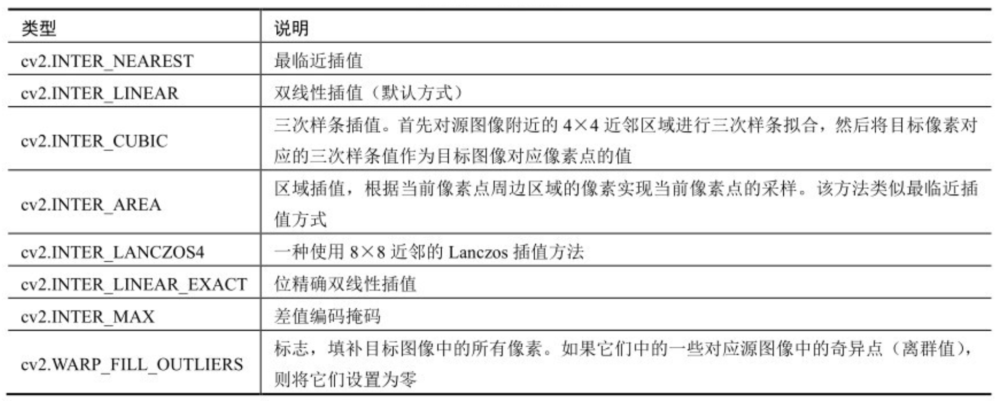

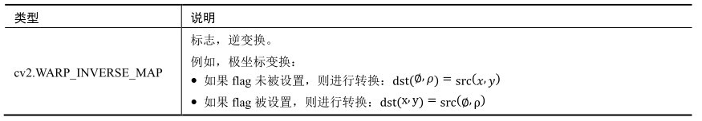


**参数使用的两种情况**

目标图像的大小可以通过"参数 dsize"和“参数fx和fy”二者之一来指定，具体情况如下：

* 情况1：通过参数dsize指定

  * 如果指定了dsize，无论fx和fy是否指定，都由dsize参数来决定图像的大小

  * dsize内第1个参数对应缩放后图像的宽度（width，即列数cols，与参与fx相关），第2个参数对应缩放后图像的高度（height，即行数rows，与参数fy相关）
  * 指定参数dsize的值时，x方向的缩放大小（参数fx）为：`(double) dsize.width/src.cols`，同时，y方向上的缩放大小（参数fy）为：`(double) dsize.height/src.rows`

* 情况2：通过参数fx和fy指定

  如果参数dsize的值是None，那么目标图像的大小通过参数fx和fy来决定。此时图像的大小为`dsize = Size(round(fx * src.cols), round(fy * src.rows))`

**插值方式**

**插值是指在对图像进行几何变换时，给无法直接通过映射得到值的像素点赋值。**例如，将图像放大为原来的2倍，必然会多出一些无法被直接映射值的像素点，对于这些像素点，插值方式决定了如何确定它们的值。除此之外，还会存在一些非整数的映射值，例如，反向映射可能会把目标图像中的像素点映射到原始图像中的非整数对应的位置上，当然原始图像内是不可能存在这样的非整数位置的，即目标图像上的该像素点不能对应到原始图像的某个具体位置上，此时也要对这些像素进行插值处理，以完成映射。

**常见情况**

* 当缩小图像时，使用区域插值方式（INTER_AREA）能够得到最好的效果

* 当放大图像时，使用三次样条插值（INTER_CUBIC）方式和双线性插值（INTER_LINEAR）方式都能取得较好的效果。

  三次样条插值方式速度较慢，双线性插值方式速度较快且效果并不逊色

**示例**

`示例 5.1` ：使用函数`cv2.resize()`对一个数组进行简单缩放

```python
def demo_5_1():
    """
    使用函数cv2.resize()对一个数组进行简单缩放
    """
    import cv2
    import numpy as np
    img = np.ones([2, 4, 3], dtype=np.uint8)
    size = img.shape[:2]
    rst = cv2.resize(img, size)
    print("img.shape=\n", img.shape)
    print("img=\n", img)
    print("rst.shape=\n", rst.shape)
    print("rst=\n", rst)
```

结果：

```python
img.shape=
 (2, 4, 3)
img=
 [[[1 1 1]
  [1 1 1]
  [1 1 1]
  [1 1 1]]

 [[1 1 1]
  [1 1 1]
  [1 1 1]
  [1 1 1]]]
rst.shape=
 (4, 2, 3)
rst=
 [[[1 1 1]
  [1 1 1]]

 [[1 1 1]
  [1 1 1]]

 [[1 1 1]
  [1 1 1]]

 [[1 1 1]
  [1 1 1]]]
```

观察结果：

* 原始图像的大小是2行4列，目标图像的大小是4行2列
* 根据结果确认：函数`cv2.resize()`内dsize参数与图像shape属性在行、列的情况上是不一致的
  * 在shape属性中，第1个值对应的是行数，第2个值对应的是列数
  * 在dsize属性中，第1个值对应的是列数，第2个值对应的是行数

`例5.2`：使用函数`cv2.resize()`完成一个简单的图像缩放

`例5.3`：控制`cv2.resize()`的fx参数、fy参数，完成图像缩放

### 5.2 翻转

opencv使用函数`cv2.flip()`来实现翻转，该函数能够实现图像在水平方向翻转、垂直方向翻转、两个方向同时翻转，其语法结构为：

`dst = cv2.flip(src, flipCode)`

* dst：代表和原始图像具有同样大小、类型的目标函数

* src：代表要处理的原始图像

* flipCode：代表旋转类型。该参数的意义入表5-2所示

  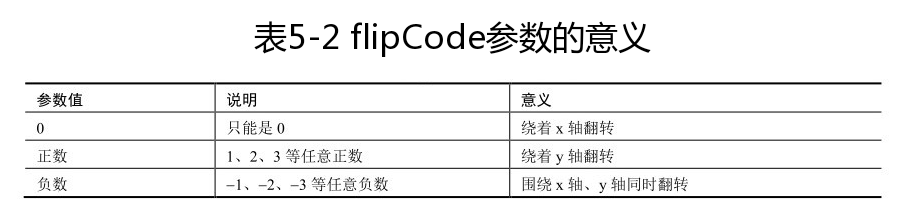

* 该函数中，目标像素点与原始像素点的关系可表达为：

  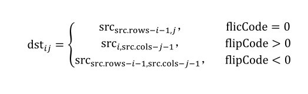

`示例5.4`：使用函数`cv2.flip()`完成图像的翻转

```python
def demo_5_4():
    """
    使用函数`cv2.flip()`完成图像的翻转
    """
    import cv2
    img = cv2.imread('lena.bmp')
    x = cv2.flip(img, 0)
    y = cv2.flip(img, 1)
    xy = cv2.flip(img, -1)
    cv2.imshow("img", img)
    cv2.imshow("x", x)
    cv2.imshow("y", y)
    cv2.imshow("xy", xy)
    cv2.waitKey()
    cv2.destroyAllWindows()
```

### 5.3 仿射

**仿射变换**是指图像可以通过一系列的几何变换来实现平移、旋转等多种操作。该变换能够保持图像的平直性和平行性。

* 平直性：图像经过仿射变换后，直线仍然是直线
* 平行性：图像在完成仿射变换后，平行线仍然是平行线

**opencv的仿射函数：**

`dst = cv2.warpAffine(src, M, dsize, [,flags[,borderMode[,borderValue]]])`

* dst：代表仿射后的输出图像，该图像的类型和原始图像的类型相同。dsize决定图像的实际大小
* src：代表要仿射的原始图像
* M：代表一个`2*3`的变换矩阵。使用不同的变换矩阵，就可以实现不同的仿射变换
* dsize：代表输出图像的尺寸大小
* flags：代表插值方法，默认为`INTER_LINEAR`。该值为`WARP_INVERSE_MAP`时，意味着M是逆变换类型，实现从目标图像dst到原始图像的src的逆变换。具体可选值参见表5-1
* borderMode：代表边类型，默认为`BORDER_CONSTANT`。当值为`BORDER_TRANSPARENT`时，意味着目标图像内的值不做改变，这些值对应原始图像内的异常值。
* borderValue：代表边界值，默认是0

**对转换矩阵M的说明：**

忽略函数`cv2.warpAffine()`的可选参数后的语法格式为：

`dst = cv2.warpAffine(src, M, dsize)`

其通过转换矩阵M将原始图像src转换为目标图像dst：

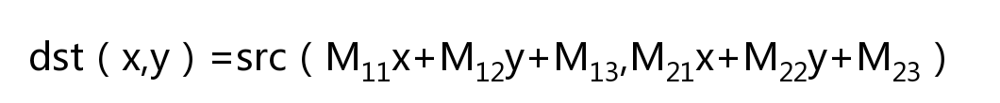

因此，进行何种形式的仿射变换完全取决于转换矩阵M。如图5-2，可以通过一个变换矩阵M，将图像O变换为仿射图像R：

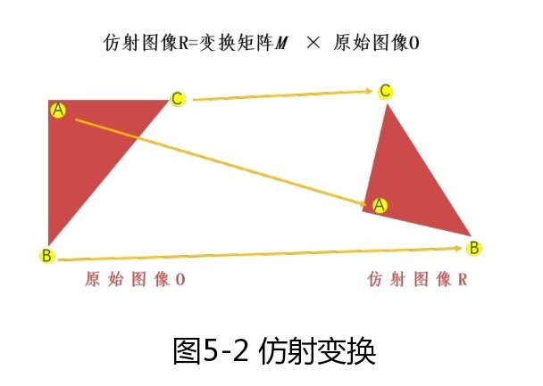

#### 5.3.1 平移

通过矩阵M将实现图像src转换为目标图像dst：

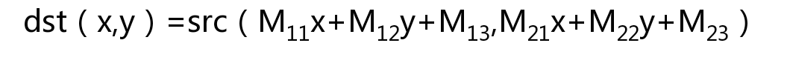

例如：将原始图像src向右移动100个像素、向下方移动200个像素，则其对应关系为：

`dst(x,y) = src(1*x + 0*y + 100, 0*x + 1*y + 200)`

根据上述表达式，可以确定对应的转换矩阵M中各个元素的值为：

* M11 = 1
* M12 = 0
* M13 = 100
* M21 = 0
* M22 = 1
* M23 = 200

将上述值代入转换矩阵M，得到：

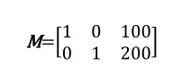

在已知矩阵M的情况下，可以直接利用转换矩阵M调用函数`cv2.warpAffine()`完成图像的平移

`示例5.5`：利用自定义的转换矩阵完成图像平移

```python
def demo_5_5():
    """
    利用自定义的转换矩阵完成图像平移
    """
    import cv2
    import numpy as np
    img = cv2.imread("lena.bmp")
    height, width = img.shape[:2]
    x = 100
    y = 200
    M = np.float32([[1, 0, x], [0, 1, y]])
    move = cv2.warpAffine(img, M, (width, height))
    cv2.imshow("original", img)
    cv2.imshow("move", move)
    cv2.waitKey()
    cv2.destroyAllWindows
```

结果：

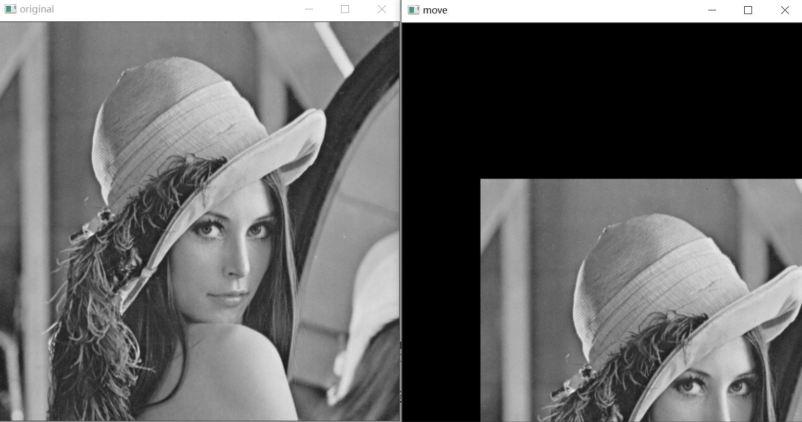

#### 5.3.2 旋转

在使用函数`cv2.warpAffine()`对图像进行旋转时，可以通过函数`cv2.getRotationMatrix2D()`获取转换矩阵。

`retval = cv2.getRotationMatrix2D(center, angle, scale)`

* center为旋转的中心点
* angle为旋转角度，正数表示逆时针旋转，负数表示顺时针旋转
* scale为变换尺度（缩放大小）

例如：以图像的中心为圆点，你是在旋转45°，并将目标图像缩小为原始图像的0.6倍，则在调用函数`cv2.getRotationMatrix2D()`生成转换矩阵M时所使用的语句为：

`M = cv2.getRotationMatrix2D((height/2, width/2), 45, 0.6)`

`示例5.6`：完成图像旋转

```python
def demo_5_6():
    """
    完成对图像的旋转
    """
    import cv2
    img = cv2.imread("lena.bmp")
    height, width = img.shape[:2]
    M = cv2.getRotationMatrix2D((width/2, height/2), 45, 0.6)
    rotate = cv2.warpAffine(img, M, (width, height))
    cv2.imshow("original", img)
    cv2.imshow("rotation", rotate)
    cv2.waitKey()
    cv2.destroyAllWindows()
```

#### 5.3.3 更复杂的仿射变换

对于更复杂的仿射变换，opencv提供了函数`cv2.getAffineTransform()`来生成转换矩阵M

`retval = cv2.getAffineTransform(src, dst)`

* src：代表输入图像的三个点坐标。分别对应平行四边形的左上角、右上角、左下角三个点。
* dst：代表输出图像的三个点坐标。分别对应平行四边形的左上角、右上角、左下角三个点。

在该函数中，其参数值src和 dst是包含三个二维数组(x, y)点的数组。上述参数通过函数`cv2.getAffineTransform()`定义了两个平行四边形。函数`cv.warpAffine()`以函数`cv2.getAffineTransform()`获取的转换矩阵M为参数，将src中的点仿射到dst中。函数`sc2.getAffineTransform()`对所指定的点完成映射后，将所有其他点的映射关系按照指定点的关系计算确定。

`示例5.7`：完成图像仿射

```python
def demo_5_7():
    """
    完成图像仿射
    """
    import cv2
    import numpy as np
    img = cv2.imread('lena.bmp')
    rows, cols, ch = img.shape
    p1 = np.float32([[0, 0], [cols-1, 0], [0, rows-1]])
    p2 = np.float32([[0, rows*0.33], [cols*0.85, rows*0.25], [cols*0.15, rows*0.7]])
    M = cv2.getAffineTransform(p1, p2)
    dst = cv2.warpAffine(img, M, (cols, rows))
    cv2.imshow("original", img)
    cv2.imshow("result", dst)
    cv2.waitKey()
    cv2.destroyAllWindows()
```

首先构造了两个三分量的点集合p1和p2，分别用来指代原始图像和目标图像内平行四边形的三个顶点（左上角、右上角、左下角）。然后使用`M = cv2.getAffineTransform(p1, p2)`获取转换矩阵M。接下来，`dst = cv2.warpAffine(img, M, (cols, rows))`完成了从原始图像到目标图像的仿射。

结果如下：

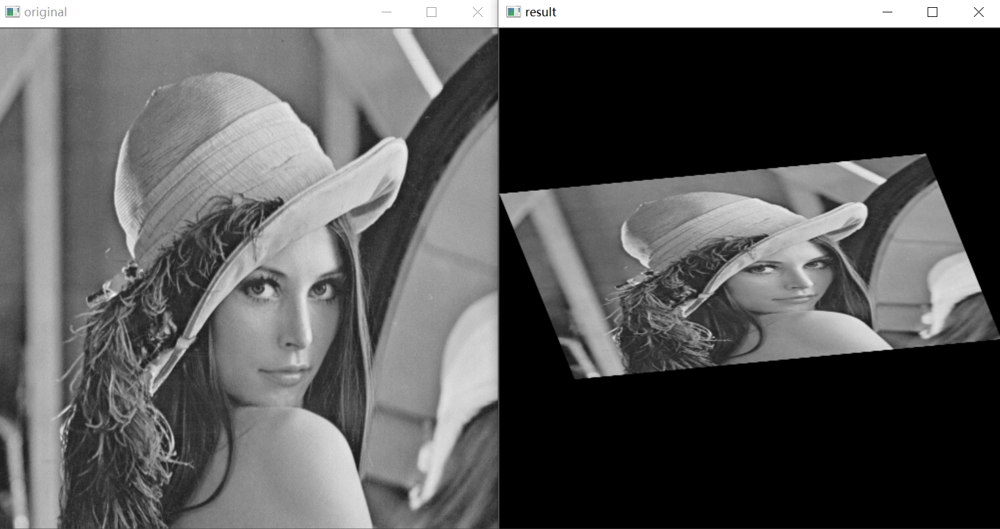

### 5.4 透视

* 仿射变换可以将矩阵映射为任意平行四边形

* 透视变换则可以将矩形映射为任意四边形

透视变换函数：

`dst = cv2.warpPerspective(src, M, dsize[,flags[,boderMode[,borderValue]]])`

* dst：代表透视处理后的输出图像，该图像和原始图像具有相同的类型。dsize决定输出图像的实际大小。
* src：代表要透视的图像
* M：代表一个3*3的变换矩阵
* dsize：代表输出图像的尺寸大小
* 代表插值方法，默认为`INTER_LINEAR`。该值为`WARP_INVERSE_MAP`时，意味着M是逆变换类型，实现从目标图像dst到原始图像的src的逆变换。具体可选值参见表5-1
* borderMode：代表边类型，默认为`BORDER_CONSTANT`。当值为`BORDER_TRANSPARENT`时，意味着目标图像内的值不做改变，这些值对应原始图像内的异常值。
* borderValue：代表边界值，默认是0。

可以使用函数`cv2.getPerspectiveTransform()`来生成所需要的转换矩阵

`retval = cv2.getPerspectiveTransform(src, dst)`

* src：代表输入图像的四个顶点的坐标
* dst：代表输出图像的四个顶点的坐标

`示例5.8`：完成图像透视

```python
def demo_5_8():
    import cv2
    import numpy as np
    img = cv2.imread('demo.bmp')
    rows, cols = img.shape[:2]
    print(rows, cols)
    pts1 = np.float32([[150, 50], [400, 50], [60, 450], [310, 450]])
    pts2 = np.float32([[50, 50], [rows-50, 50], [50, cols-50], [rows-50, cols-50]])
    M = cv2.getPerspectiveTransform(pts1, pts2)
    dst = cv2.warpPerspective(img, M, (cols, rows))
    cv2.imshow("img", img)
    cv2.imshow("dst", dst)
    cv2.waitKey()
    cv2.destroyAllWindows()
```

结果为：

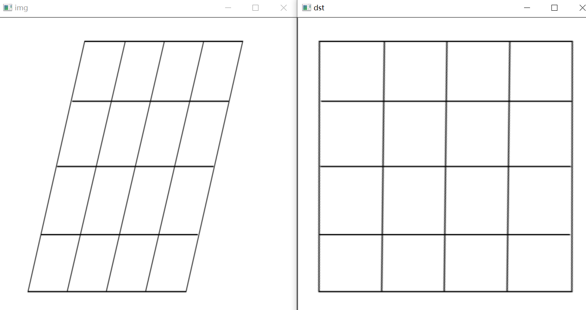

### 5.5 重映射

**重映射：**把一幅图像内的像素点放置到另一幅图像内的指定位置。opencv提供了多种重映射方式，但是我们有时希望使用自定义的方式来完成重映射。

opencv内的重映射函数`cv2.remap()`提供了更方便、更自由的原始方式。

`dst = cv2.remap(src, map1, map2, interpolation[,borderMode[,borderValue]])`

* dst：代表目标图像，它和src具有相同的大小和类型
* src：代表原始图像
* map1参数有两种可能的值：
  * 表示`(x, y)`点的一个映射
  * 表示`CV_16SC2`、`CV_62FC1`、`CV_32FC2`类型(x, y)点的x值
* map2参数同样有两种可能的值：
  * 当map1表示`(x, y)`时，该值为空
  * 当map2表示`(x, y)`点的x值时，该值是`CV_16UC1`、`CV_32FC1`类型`(x, y)`点的y值
* interpolation：代表插值方式，这里不支持`INTER_AREA`方法。具体值参见表5-1
* borderMode：代表边界模式。当该值为`BORDER_TRANSPARENT`时，表示目标图像内的对应原图像内寄异点（outliers）的像素不会被修改。
* borderValue：代表边界值，该值默认为0

#### 5.5.1 映射参数的理解

**重映射通过修改像素点的位置得到一幅新图像。**在构建新图像时，需要确定新图像中每个像素点在原始图像中的位置。因此，**映射函数的作用是查找新图像像素在原始图像内的位置。**该过程是将新图像像素映射到原始图像的过程，因此被称为**反向映射**。

`cv2.remap()`中的参数`map1`和参数`map2`用来说明反向映射，**`map1`针对的是坐标x（像素点所在位置的列号），map2针对的是坐标y（像素点所在位置的行号）**。例如，我们想将图像（映射结果图像）中某个点A映射为原始图像内处于第0行第3列上的像素点B，那么需要将A点对应的参数mpa1对应位置上的值设为3，参数map2对应位置上的值设置为0。通常情况下，将map1写为mapx、map2写为mapy，以方便理解。

`示例5.9`：使用`cv2.remap()`完成数组映射，将目标数组内的所有像素点都映射为原始图像内第0行第3列上的像素点，以此来了解map1和map2的使用情况。

```python
def demo_5_9():
    """
    使用`cv2.remap()`完成数组映射，将目标数组内的所有像素点都映射为原始图像内第0行第3列上的像素点，以此来了解map1和map2的使用情况。
    """
    import cv2
    import numpy as np
    img = np.random.randint(0, 256, size=[4, 5], dtype=np.uint8)
    rows, cols = img.shape
    mapx = np.ones(img.shape, np.float32) * 3
    mapy = np.ones(img.shape, np.float32) * 0
    rst = cv2.remap(img, mapx, mapy, cv2.INTER_LINEAR)
    print("img=\n", img)
    print("mapx=\n", mapx)
    print("mapy=\n", mapy)
    print("rst=\n", rst)
```

结果:

```python
img=
 [[169  89 166  46 238]
 [208 251 166 166 137]
 [115  80 162  29  38]
 [174   5 141 156 187]]
mapx=
 [[3. 3. 3. 3. 3.]
 [3. 3. 3. 3. 3.]
 [3. 3. 3. 3. 3.]
 [3. 3. 3. 3. 3.]]
mapy=
 [[0. 0. 0. 0. 0.]
 [0. 0. 0. 0. 0.]
 [0. 0. 0. 0. 0.]
 [0. 0. 0. 0. 0.]]
rst=
 [[46 46 46 46 46]
 [46 46 46 46 46]
 [46 46 46 46 46]
 [46 46 46 46 46]]
```

#### 5.5.2 复制

利用重映射函数`cv2.remap()`来实现图像的复制，在映射时，对参数进行如下处理：

* 将map1的值设定为对应位置上的x轴坐标值
* 将map2的值设定为对应位置上的y轴坐标值

`例5.10`：使用函数`cv2.remap()`完成数组赋值

```python
def demo_5_10():
    """
    使用函数cv2.remap()完成数组赋值
    """
    import cv2
    import numpy as np
    img = np.random.randint(0, 256, size=[4, 5], dtype=np.uint8)
    rows, cols = img.shape
    mapx = np.zeros(img.shape, np.float32)
    mapy = np.zeros(img.shape, np.float32)
    for i in range(rows):
        for j in range(cols):
            mapx.itemset((i, j), j)
            mapy.itemset((i, j), i)
    rst = cv2.remap(img, mapx, mapy, cv2.INTER_LINEAR)
    print("img=\n", img)
    print("mapx=\n", mapx)
    print("mapy=\n", mapy)
    print("rst=\n", rst)
```

结果：

```python
img=
 [[ 84 125  11 107 174]
 [245  93 140 106  73]
 [125 131 174  72  53]
 [ 62  37  41  91  76]]
mapx=
 [[0. 1. 2. 3. 4.]
 [0. 1. 2. 3. 4.]
 [0. 1. 2. 3. 4.]
 [0. 1. 2. 3. 4.]]
mapy=
 [[0. 0. 0. 0. 0.]
 [1. 1. 1. 1. 1.]
 [2. 2. 2. 2. 2.]
 [3. 3. 3. 3. 3.]]
rst=
 [[ 84 125  11 107 174]
 [245  93 140 106  73]
 [125 131 174  72  53]
 [ 62  37  41  91  76]]
```

`例5.11`：使用函数`cv2.remap()`完成图像复制

```python
def demo_5_11():
    """
    使用函数cv2.remap()完成图像复制
    """
    import cv2
    import numpy as np
    img = cv2.imread("lena.bmp")
    rows, cols = img.shape[:2]
    mapx = np.zeros(img.shape[:2], np.float32)
    mapy = np.zeros(img.shape[:2], np.float32)
    for i in range(rows):
        for j in range(cols):
            mapx.itemset((i, j), j)
            mapy.itemset((i, j), i)
    rst = cv2.remap(img, mapx, mapy, cv2.INTER_LINEAR)
    cv2.imshow("original", img)
    cv2.imshow("result", rst)
    cv2.waitKey()
    cv2.destroyAllWindows()
```

结果：

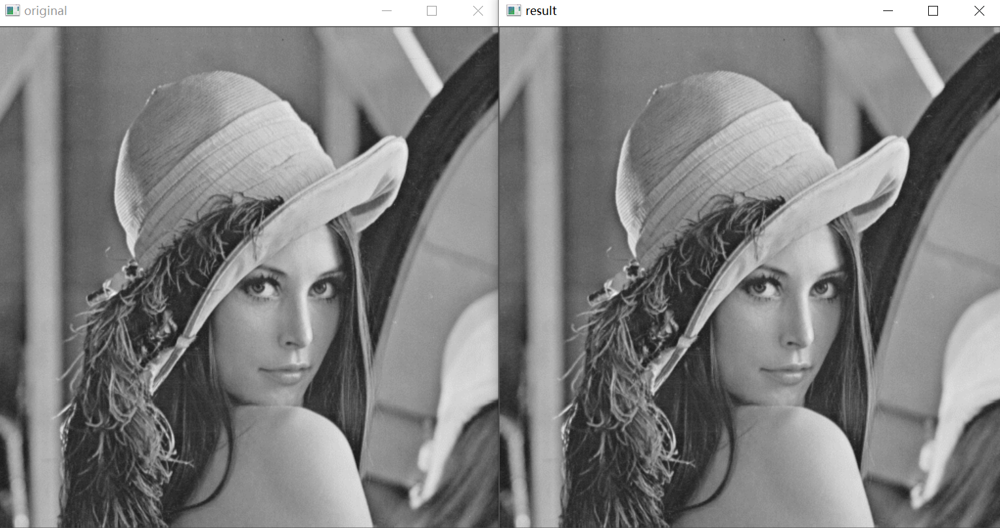


#### 5.5.3 绕x轴翻转

如果想让图像绕x轴翻转，需要做如下映射过程：

* x坐标轴的值保持不变
* y坐标轴的值以x轴为对称轴进行交换

反映在map1和map2上：

* map1的值保持不变
* map2的值调整为“总行数-1-当前行号”

`例5.12`：使用函数`cv2.remap()`实现数组绕x轴翻转

```python

```

结果：

```python

```

`例5.13`：使用函数`cv2.remap()`实现图像绕x轴的翻转

```python
def demo_5_13():
    """
    使用函数cv2.remap()实现图像绕x轴的翻转
    """
    import cv2
    import numpy as np
    img = cv2.imread("lena.bmp")
    rows, cols = img.shape[:2]
    mapx = np.zeros(img.shape[:2], np.float32)
    mapy = np.zeros(img.shape[:2], np.float32)
    for i in range(rows):
        for j in range(cols):
            mapx.itemset((i, j), j)
            mapy.itemset((i, j), rows-1-i)
    rst = cv2.remap(img, mapx, mapy, cv2.INTER_LINEAR)
    cv2.imshow("original", img)
    cv2.imshow("result", rst)
    cv2.waitKey()
    cv2.destroyAllWindows()
```

结果：

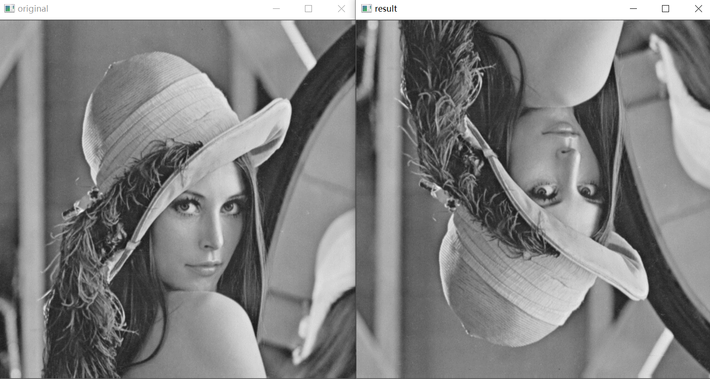

#### 5.5.4 绕y轴翻转

如果想让图像绕着y轴翻转，意味着在映射过程中：

* y坐标轴的值保持不变
* x坐标值的值以y轴为对称轴进行交换

反映在map1和map2上：

* map2的值保持不变
* map1的值调整为“总列数-1-当前列号”

`例5.14`：使用函数`cv2.remap()`实现数组绕y轴翻转

```python

```

结果：

```python

```

`例5.15`：使用函数`cv2.remap()`实现图像绕y轴翻转

```python
def demo_5_15():
    """
    使用函数cv2.remap()实现图像绕y轴的翻转
    """
    import cv2
    import numpy as np
    img = cv2.imread("lena.bmp")
    rows, cols = img.shape[:2]
    mapx = np.zeros(img.shape[:2], np.float32)
    mapy = np.zeros(img.shape[:2], np.float32)
    for i in range(rows):
        for j in range(cols):
            mapx.itemset((i, j), cols-1-j)
            mapy.itemset((i, j), i)
    rst = cv2.remap(img, mapx, mapy, cv2.INTER_LINEAR)
    cv2.imshow("original", img)
    cv2.imshow("result", rst)
    cv2.waitKey()
    cv2.destroyAllWindows()
```

结果：

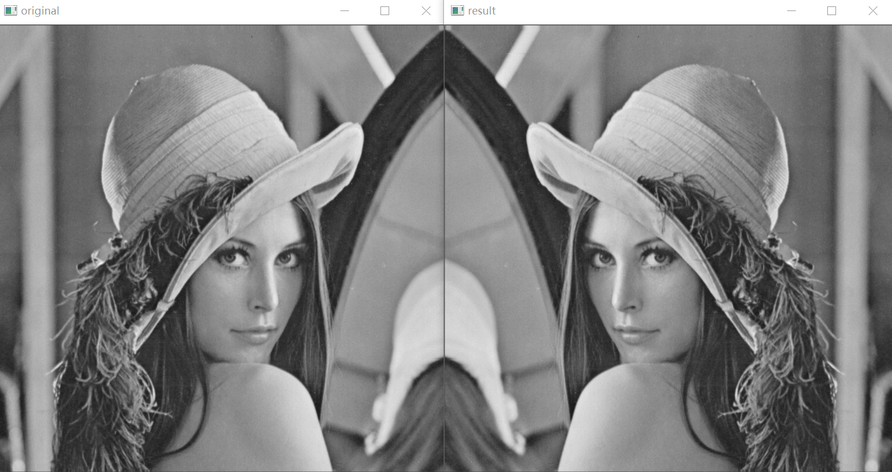

#### 5.5.5 绕x轴、y轴翻转

如果想让图像绕着x轴、y轴翻转，意味着在映射过程中：

* x坐标轴的值以y轴为对称轴进行交换
* y坐标轴的值以x轴为对称轴进行交换

反映在map1和map2上：

* map1的值调整为“总列数-1-当前列号”
* map2的值调整为“总行数-1-当前行号”

`例5。16`：使用函数`cv2.remap()`实现数组绕x轴、y轴翻转

```python

```

结果:

```python

```

`例5.17`：使用函数`cv2.remap()`实现图像绕x轴、y轴翻转

```python
def demo_5_17():
    """
    使用函数cv2.remap()实现图像绕x轴、y轴翻转
    """
    import cv2
    import numpy as np
    img = cv2.imread("lena.bmp")
    rows, cols = img.shape[:2]
    mapx = np.zeros(img.shape[:2], np.float32)
    mapy = np.zeros(img.shape[:2], np.float32)
    for i in range(rows):
        for j in range(cols):
            mapx.itemset((i, j), cols-1-j)
            mapy.itemset((i, j), rows-1-i)
    rst = cv2.remap(img, mapx, mapy, cv2.INTER_LINEAR)
    cv2.imshow("original", img)
    cv2.imshow("result", rst)
    cv2.waitKey()
    cv2.destroyAllWindows()
```

结果：

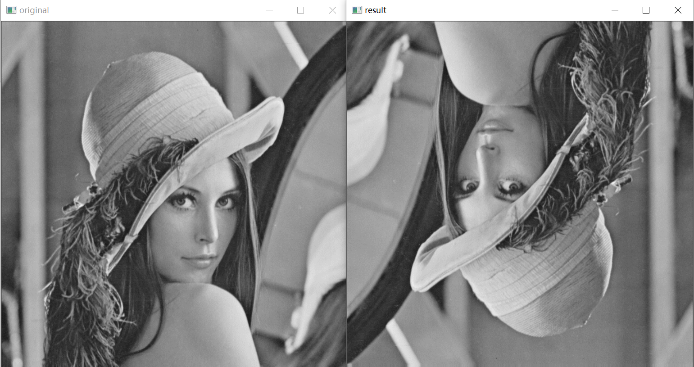

#### 5.5.6 x轴、y轴互换

如果想让图像的x轴、y轴互换：

意味着在映射过程中，对与任意一点，都需要将其x轴、y轴坐标互换。

反映在mapx和mapy上：

* mapx的值调整为所在行的行号
* mapy的值调整为所在列的列号

需要注意的是：如果行数和列数不一致，上述运行可能存在值无法映射的情况。默认情况下，无法完成映射的值会被处理为0。

`例5.18`：使用函数`cv2.remap()`实现数组的x轴、y轴互换

```python

```

结果：

```python

```

`例5.19`：使用函数`cv2.remap()`实现图像的x轴、y轴互换

```python
def demo_5_19():
    """
    使用函数cv2.remap()实现图像绕的x轴、y轴互换
    """
    import cv2
    import numpy as np
    img = cv2.imread("lena.bmp")
    rows, cols = img.shape[:2]
    mapx = np.zeros(img.shape[:2], np.float32)
    mapy = np.zeros(img.shape[:2], np.float32)
    for i in range(rows):
        for j in range(cols):
            mapx.itemset((i, j), i)
            mapy.itemset((i, j), j)
    rst = cv2.remap(img, mapx, mapy, cv2.INTER_LINEAR)
    cv2.imshow("original", img)
    cv2.imshow("result", rst)
    cv2.waitKey()
    cv2.destroyAllWindows()
```

结果：

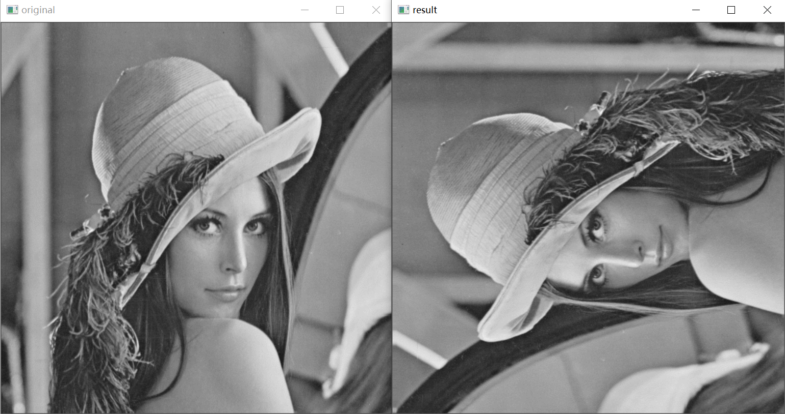

#### 5.5.7 图像缩放

`例5.20`：使用函数`cv2.remap()`缩小图像

缩小图像后，可以将图像固定在围绕其中心的某个区域。例如，将其x轴、y轴设置为：

* 在目标图像的x轴`（0.25*x轴长度, 0.75*x轴长度）`区间内生成缩小图像；x轴其余区域的点取样自x轴上任意一点的值
* 在目标图像的y轴`（0.25*y轴长度,0.75*y轴长度）`区间内生成缩小图像；y轴其余区域的点取自y轴上任意一点的值

为了处理方便，我们让不在上述区域的点都取(0,0)坐标点的值。

```python

```

结果：

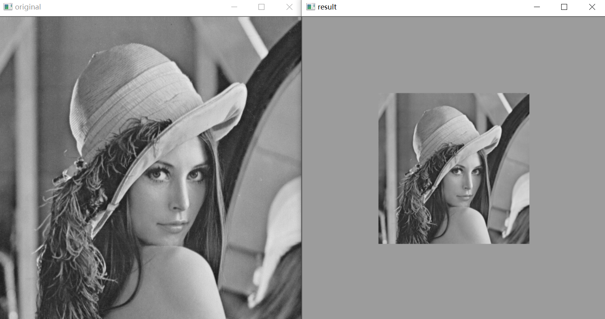

## 第6章 阈值处理


## 第12章 图像轮廓

边缘检测与图像轮廓：

* 边缘检测虽然能检测出边缘，但边缘是不连续的，检测到的边缘并不是一个整体
* 图像轮廓是指将边缘连接起来形成的一个整体，用于后续的计算

OpenCV提供了图像轮廓相关的函数：

* `cv2.findContours()`

  该函数能够查找图像内的轮廓信息

* `cv2.drawContours()`

  将轮廓绘制出来

通过对图像轮廓的操作，我们能够获取目标图像的大小、位置、方向等信息

### 12.1 查找并绘制图像轮廓

一个轮廓对应着一系列的点，这些点以某种方式表示图像中的一条曲线。

#### 12.1.1 查找图像轮廓：`findContours`函数

`image, contours, hierarchy = cv2.findContours(image, mode, method)`

返回值：

* image：

  与函数参数中的原始图像image一致。在`opencv 4.x`中，该返回值已经被取消。在`OpenCV 4.X`中，函数`cv2.findContours()`仅有两个返回值。

* contours：

  返回的轮廓。该返回值返回的是一组轮廓信息，每个轮廓都是由若干个点所构成的。

  图12-1所示为提取的轮廓示例，提取出左图的3个轮廓，每一个轮廓都是由若干个像素点构成的。

  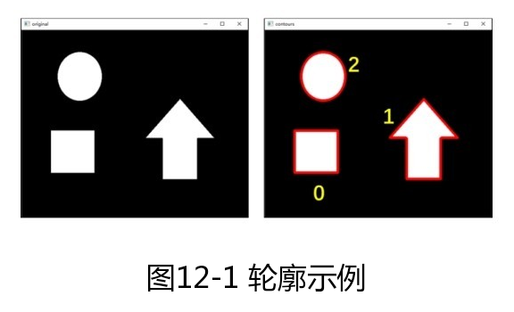

  下面说明contours的基本属性

  * type属性

    countours是一个list类型，list的每个元素都是图像的一个轮廓，用Numpy中的ndarray结构表示

    ```python
    print(type(contours))
    <class 'list'>
    print(type(contours[0]))
    <class 'numpy.ndarray'>
    ```

  * 轮廓个数

  * 每个轮廓的点数

    每个轮廓内点的个数可能不同

    ```python
    print(len(contours[0]))
    4
    print(len(contours[1]))
    60
    print(len(contours[2]))
    184
    ```

    每个轮廓内点的shape属性

    ```python
    print(contours[0].shape)
    (4, 1, 2)
    print(contours[1].shape)
    (60, 1, 2)
    print(contours[2].shape)
    (184, 1, 2)
    ```

  * 轮廓内的点

* hierarchy：图像的拓扑信息（轮廓层次）

参数：

* image：原始图像。8位单通道图像，所有非零值被处理为1，所有零值保持不变，也就是说灰度图像会被自动处理为二值图像。在实际操作时，可以根据需要，预先使用阈值处理等函数将待查找轮廓的图像处理为二值图像。
* mode：轮廓检索模式
* method：轮廓的近似值


