# RabbitMQ


## 参考:

<https://blog.csdn.net/hellozpc/article/details/81436980#RabbitMQ_14>

<https://www.zhihu.com/people/zi-ji-47-82/posts?page=2>

一些rabblitMQ的入门概念:

<https://blog.csdn.net/lyhkmm/article/details/78775369>


## 安装:

1. 安装Erlang
2. 安装RabbitMQ

## 开始:

### 1. 启动:

   1. 启动 RabbitMQ Command Prompt管理工具

   2. 执行如下命令:

      ```
      rabbitmq-plugins enable rabbitmq_management
      ```

   3. 命令:

     ```
     停止：net stop RabbitMQ
     启动：net start RabbitMQ
     ```
   4. 访问管理页面: 

      http://127.0.0.1:15672/ 默认账号: guest/ guest

#### 1.1添加用户:

1. 用户角色:

   1、超级管理员(administrator)
   可登陆管理控制台，可查看所有的信息，并且可以对用户，策略(policy)进行操作。
   2、监控者(monitoring)
   可登陆管理控制台，同时可以查看rabbitmq节点的相关信息(进程数，内存使用情况，磁盘使用情况等)
   3、策略制定者(policymaker)
   可登陆管理控制台, 同时可以对policy进行管理。但无法查看节点的相关信息(上图红框标识的部分)。
   4、普通管理者(management)
   仅可登陆管理控制台，无法看到节点信息，也无法对策略进行管理。
   5、其他
   无法登陆管理控制台，通常就是普通的生产者和消费者。

2. 添加admin用户:

   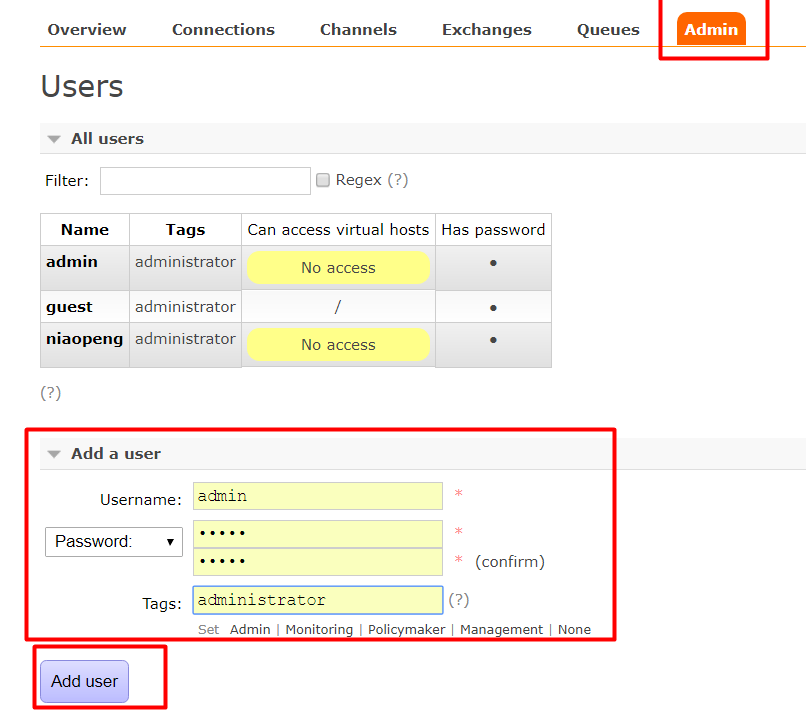

### 1.2 创建Virtual Hosts

TODO


### 1.3 管理界面中的功能

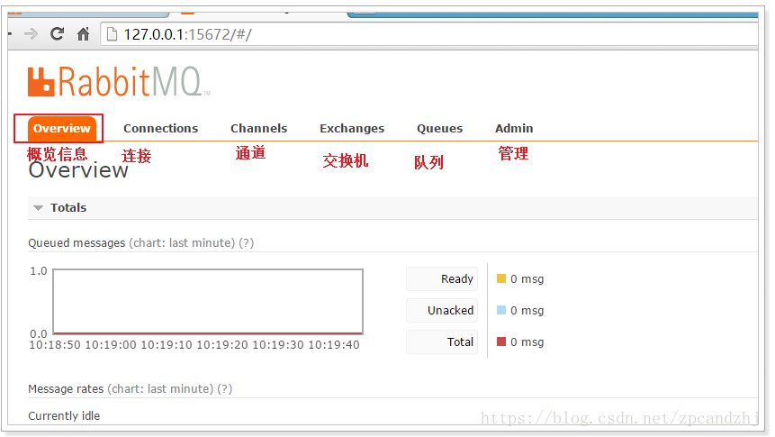

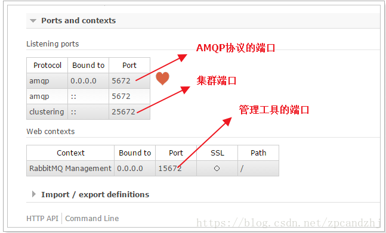


### 2. 学习五种队列

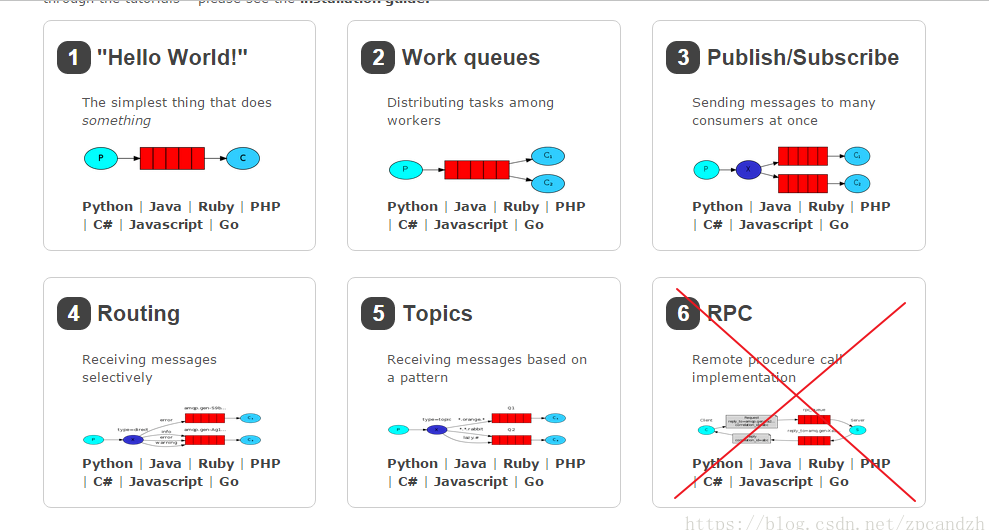


## 学习官网:

<https://www.rabbitmq.com/getstarted.html>

### 0. 简介

**rabbitMQ:** message broker（消息代理） --> 用来接收并转发消息 

概念:

* Producer：发送消息的程序
* queue：
  * 存储消息的盒子，消息流经rabbitmq和应用程序，但是只能存储在队列中。
  * 多个生产者可以发送到同一个队列，多个消费者也可以从队列中取消息
* consumer: 消息接收者

producer、consumer、broker不需要再同一台主机上面

### 1. hello world

#### 1. 使用pika python客户端

* 安装:

```python
python -m pip install pika
```

#### 2. 发送：

​	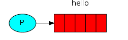

send.py: 发送一个"hello"字符串到队列中

```python
import pika

# 1. 跟rabbitMQ建立连接
connection = pika.BlockingConnection(
        pika.ConnectionParameters('localhost'))
channel = connection.channel()
# 2. 确保消息队列存在 注:如果消息队列不存在，rabbitMQ只是简单的将消息丢弃
channel.queue_declare(queue='hello')
# 3. 消息需要通过exchange才能到达队列，传递空字符串可以使用默认的exchange
channel.basic_publish(
        exchange='',
        routing_key='hello',
        body='Hello World!'
        )
print("[x] Sent 'Hello World!'")
# 4. 在退出程序之前，需要确保网络缓冲区已经刷新并且我们的消息已经投递到rabbitMQ中，这可以通过简单的关闭连接来实现
connection.close()
```

receive.py：从队列中接收消息并打印到屏幕

```python
import pika

# 1. 跟rabbitMQ建立连接
connection = pika.BlockingConnection(
        pika.ConnectionParameters('localhost'))
channel = connection.channel()
# 2. 确保消息队列存在。不管执行多少次，队列只会被创建一次
channel.queue_declare(queue='hello')

# 3. 定义回调函数
def callback(ch, method, properties, body):
    print(" [x] Received %r" % body)

channel.basic_consume(queue='hello',
                      auto_ack=True,
                      on_message_callback=callback)

print(' [*] Waiting for messages. To exit press CTRL+C')
# 开始循环等待消息的到来
channel.start_consuming()
```

查看当前的消息数:

```cmd
# linux:
$ sudo rabbitmqctl list_queues
# Windows:
$ rabbitmqctl.bat list_queues
```


### 2. work queue

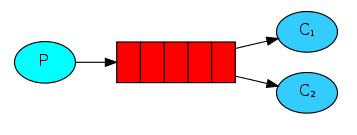

在这一部分中，我们将创建一个工作队列，该队列将用于在多个工作人员之间分配耗时的任务


工作队列（又名：任务队列）的主要思想是: 避免那些不得不等待它完成，而且需要立即执行任务的情况。解决方法：把任务安排在以后完成。 将任务封装为消息并将其发送到工作队列，在后台运行的工作进程将取出任务并执行任务。 多个工作进程会共享这些任务。

#### Round-robin dispatching（循环调度）

默认情况下，RabbitMQ将按顺序将每个消息发送给下一个使用者。 平均而言，每个消费者都会收到相同数量的消息。 这种分发消息的方式称为循环(Round-robin)。

#### Message acknowledgment(消息确认)

RabbitMQ支持消息确认，如果一个consumer挂掉（channel关闭、connection关闭、TCP连接丢失），而且没有返回确认，rabbitmq会重新任务加到工作队列中。返回确认没有超时的时间，只有在consumer挂掉的时候才会回收任务。

使用消息确认: 

- 去掉`auto_ack=True`标识

- 在消息回调中调用 ：

  `ch.basic_ack(delivery_tag = method.delivery_tag)`

注：

消息确认必须通过同一个channel返回，不然会引起channel-level protocol的异常

**忘记返回消息确认:**

忘记返回消息确认会导致在consumer退出的时候，回收未确认的任务。而且未确认的任务越多，会导致rabbitmq占据的内存越多。

可以通过打印未确认的消息来排查有没有这个bug：

```cmd
rabbitmqctl.bat list_queues name messages_ready messages_unacknowledged
```


#### Message durability( 消息持久)

<font color=red>消息持久化:</font>可以确保在RabbitMQ退出或者崩溃的时候不会丢失消息。

消息持久化需要两个步骤:

* 标记队列为持久化

  ```python
  channel.queue_declare(queue='task_queue', durable=True)
  ```

* 标记消息为持久化

  ```python
  channel.basic_publish(exchange='',
                        routing_key="task_queue",
                        body=message,
                        properties=pika.BasicProperties(
                           delivery_mode = 2, # make message persistent
                        ))
  ```

<font color=red>rabbitmq不允许重新修改已经存在的队列的参数，如果你标记一个已经存在的队列为持久化会不起作用。</font>

`注：消息持久化还是不能确保消息百分之百不会丢失，存在一个时间窗口会导致消息丢失：rabbitmq已经接收消息但是还没有保存的硬盘上，如果你需要更强大的保证数据不会丢失可以使用publisher confirms <https://www.rabbitmq.com/confirms.html>`

#### Fail dispatch(公平派遣)

rabbitmq默认的分配方式会导致一个问题：如果有些任务很耗时，另一些任务很快能完成，就会导致有些worker需要等待其他worker完成任务才能接收到下一个任务。因为rabbitmq任务分配时轮询分配的，它只是盲目地将每第n条消息发送给第n个使用者。

可以使用`prefetch_count=1`的设置，让rabbitmq在worker处理完任务并且返回确认消息的时候才分配新的任务。

<font color=red>queue的大小：</font>

有一点你需要注意，如果所有的worker都在忙，你的队列就满了。也许可以通过增加队列或者message TTL<https://www.rabbitmq.com/ttl.html>来解决。

#### 代码:

new_task.py

```python
import pika
import sys


connection = pika.BlockingConnection(
        pika.ConnectionParameters('localhost'))
channel = connection.channel()

# durable: 声明队列为持久化队列
channel.queue_declare(queue='task_queue', durable=True)

message = ' '.join(sys.argv[1:]) or "Hello World"
channel.basic_publish(
        exchange='',
        routing_key='task_queue',
        body=message,
        # delivery_mode=2: 将消息设置为持久化消息
        properties=pika.BasicProperties(
            delivery_mode=2,)  # make message persistent
        )
print("[x] Sent 'Hello World!'")
connection.close()

```

worker.py

```python
#!/usr/bin/env python
import pika
import time

connection = pika.BlockingConnection(
    pika.ConnectionParameters(host='localhost'))
channel = connection.channel()

channel.queue_declare(queue='task_queue', durable=True)
print(' [*] Waiting for messages. To exit press CTRL+C')


def callback(ch, method, properties, body):
    print(" [x] Received %r" % body)
    time.sleep(body.count(b'.'))
    print(" [x] Done")
    ch.basic_ack(delivery_tag=method.delivery_tag)


channel.basic_qos(prefetch_count=1)
channel.basic_consume(queue='task_queue', on_message_callback=callback)

channel.start_consuming()
```


### 3. Publish/Subscribe

**简介:**声明一个exchange, 生产者将消息推送到exchange，由exchange将消息推送到对应的queue中。

**功能:** 一条消息发送给多个消费者。发布/订阅模式

**演示例子:** 建立一个简单的日志系统，日志发送程序和日志接收程序

#### Exchanges

前面的教程出现三个主要的角色: producer queue consumer

RabbitMQ消息传递模型中的核心思想是生产者从不将任何消息直接发送到队列。 实际上，生产者经常甚至根本不知道是否将消息传递到任何队列。

实际上，producer只能将消息发送给exchange，exchange再将消息推送给queue。

exchange需要知道当接收到一个消息时，如何处理这个消息。可以通过exchange type来定义规则，exchange type有四种类型值: direct、topic、headers、fanout

本例程用的是fanout类型：将接收到的消息简单的广播给所有他知道的队列。

命令:

* 列出所有的exchanges

  ```bash
  rabbitmqctl list_exchanges
  ```

* 默认的exchange

  exchage赋值空字符串，会自动使用默认的exchange

* 可以用如下命令列出目前使用的绑定关系

  ```bash
  rabbitmqctl list_bindings
  ```

  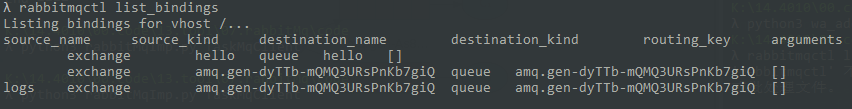

#### Temporary queues（临时队列）

前面的例程我们都有给一个队列指定一个名称。当我们想要在producers和consumers之间共享queue的时候，指定一个队列名称是必要的

但是命名一个queue不适合我们的日志系统。现在我们想监听所有的日志消息而不是其中一部分，而且只对现在产生的日志感兴趣，而对旧的日志并不感兴趣。为了解决这个问题，需要做两件事：

1. 无论何时连接到Rabbit，我们都需要一个全新的空队列。为此，我们可以让服务器服务器帮我们创建一个随机的队列，我们可以给队列名称赋值空字符串来达到这一点

   ```python
   result = channel.queue_declare(queue='')
   ```

   此时，result.method.queue包含一个队列的名称

2. 一旦consumer连接关闭，队列应该被删除，可以通过设置独占标志（exclusive ）为True来指定：

   ```python
   result = channel.queue_declare(queue='', exclusive=True)
   ```

#### Bindings(绑定)

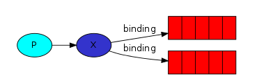

现在我们已经创建了一个fanout类型的exhange和一个队列，需要通过绑定告诉exchange将消息发送到我们的队列中:

```python
channel.queue_bind(exchange='logs',
                   queue=result.method.queue)
```

可以用如下命令列出目前使用的绑定关系

```bash
rabbitmqctl list_bindings
```


#### Putting it all together 将队列放在一起

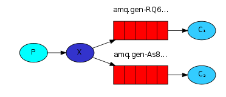

现在producer直接将消息推送到logs exchange，而不是无名的exchange。通常发送的时候需要指定一个routing_key，但是它的值会在exchanges中被忽略。


程序:

emit_log.py

```python
#!/usr/bin/env python
import pika
import sys

connection = pika.BlockingConnection(
    pika.ConnectionParameters(host='localhost'))
channel = connection.channel()

channel.exchange_declare(exchange='logs', exchange_type='fanout')

message = ' '.join(sys.argv[1:]) or "info: Hello World!"
channel.basic_publish(exchange='logs', routing_key='', body=message)
print(" [x] Sent %r" % message)
connection.close()
```

在建立连接之后，我们声明了一个exchange，这步是必须的，推送给一个不存在的exchange是被禁止的行为。

<font color=red>如果没有队列绑定到exchange中，消息将会被丢弃。</font>不过对于我们这个例程来说，这种情况是被接受的。

recieve_log.py

```python
import pika

connection = pika.BlockingConnection(
    pika.ConnectionParameters(host='localhost'))
channel = connection.channel()

# 创建一个类型为fanout的exchange,名字叫做"logs"
channel.exchange_declare(exchange='logs', exchange_type='fanout')

# 让服务器帮我们创建一个随机名称的队列;设置exclusive独占标志，当连接断开时，队列会被删除
result = channel.queue_declare(queue='', exclusive=True)
queue_name = result.method.queue

# 绑定exchange和queue，让exchange接收到消息时可以发送给队列
channel.queue_bind(exchange='logs', queue=queue_name)

print(' [*] Waiting for logs. To exit press CTRL+C')

def callback(ch, method, properties, body):
    print(" [x] %r" % body)

channel.basic_consume(
    queue=queue_name, on_message_callback=callback, auto_ack=True)

channel.start_consuming()
```


### 4. routing

**简介：**声明一个direct类型的exchange，绑定exhange和queue的关系，并用routing_key参数来指明对queue对来自exchange哪一类型的数据感兴趣。

上一个例程是把所有的日志消息都发送给每个队列，本例程添加一个特性：只接收特定的日志消息，如：只把critical error的日志记录的日志文件，而把所有的日志打印到控制台

#### Bindings绑定

前面创建过绑定关系:

```python
channel.queue_bind(exchange=exchange_name, queue=queue_name)
```

绑定指定了exchange和queue之间的关系，简单的理解为:队列对来自exchange的消息感兴趣。

可以通过routing_key来指定队列对来自exchange某一类型的消息感兴趣。routing_key的作用取决于exchange type。如果是fanout类型的exchanges，则忽略routing_key的值。

```python
channel.queue_bind(exchange=exchange_name,
                   queue=queue_name,
                   routing_key='black')
```

为了和basic_publish的参数做区分，下文的routing_key暂时称为binding_key

#### Direct exchange

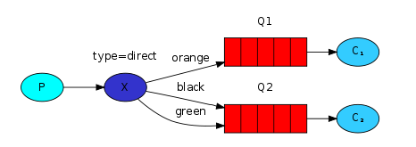

使用fanout exchange没有太多的灵活性，它只能进行无意识的广播。

为了实现筛选感兴趣的消息，可以使用direct类型来替代fanout类型的exchange。direct exchange的路由逻辑就是：消息推送到binding_key和routing_key完全匹配的队列中。

如上图：direct类型的exchange X绑定了两个队列，Q1的binding key 是orange，Q2的binding key是black和green。对应key的消息会发送给对应的队列，其他的消息会被丢弃。

#### Multiple bindings

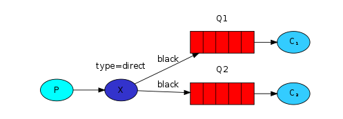

多个队列绑定到同一个key时，exchange会把消息推送到每个匹配到key的队列中

#### 代码:

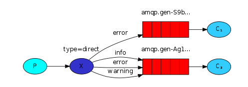

emit_log_direct.py

```python
#!/usr/bin/env python
import pika
import sys

connection = pika.BlockingConnection(
    pika.ConnectionParameters(host='localhost'))
channel = connection.channel()

# 声明一个direct类型的exchange
channel.exchange_declare(exchange='direct_logs', exchange_type='direct')

severity = sys.argv[1] if len(sys.argv) > 1 else 'info'
message = ' '.join(sys.argv[2:]) or 'Hello World!'
# 发送指定routing_key的消息
channel.basic_publish(
    exchange='direct_logs', routing_key=severity, body=message)
print(" [x] Sent %r:%r" % (severity, message))
connection.close()
```

receive_logs_direct.py

```python
#!/usr/bin/env python
import pika
import sys

connection = pika.BlockingConnection(
    pika.ConnectionParameters(host='localhost'))
channel = connection.channel()

# 声明一个direct类型的exchang
channel.exchange_declare(exchange='direct_logs', exchange_type='direct')

# 声明一个队列
result = channel.queue_declare(queue='', exclusive=True)
queue_name = result.method.queue

severities = sys.argv[1:]
if not severities:
    sys.stderr.write("Usage: %s [info] [warning] [error]\n" % sys.argv[0])
    sys.exit(1)

# 将queue绑定到感兴趣的routing_key
for severity in severities:
    channel.queue_bind(
        exchange='direct_logs', queue=queue_name, routing_key=severity)

print(' [*] Waiting for logs. To exit press CTRL+C')


def callback(ch, method, properties, body):
    print(" [x] %r:%r" % (method.routing_key, body))


channel.basic_consume(
    queue=queue_name, on_message_callback=callback, auto_ack=True)

channel.start_consuming()
```


### 5. Topics

在我们的日志系统中，不仅要根据日志的验证等级来订阅日志，也要根据日志的来源来订阅日志。这个时候就需要使用到topic类型的exchange


#### Topic exchange

发送到topic exchange的routing_key不能是任意类型的格式--它必须是单词列表，以点区分。例如:"nyse.vmw", "quick.orange.rabbit"。长度不能超过255个字节。

binding_key必须也是相同的格式，和direct类型的exchange一样，会将消息发送到routing_key和binding_key匹配的日志，binding_key的规则:

* \* 可以代替一个单词
* \# 可以代替0个或多个单词

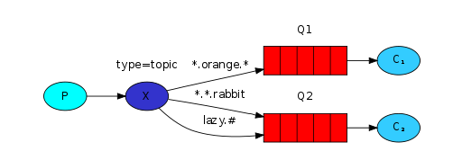

### 6. RPC

希望实现调用远程服务器的一个函数并且返回结果。这个特性通常称为远程调用(Remote Procedure Call or RPC)。

本章例程:使用RabbitMQ建立一个RPC系统:客户端调用RPC服务的函数返回一个斐波那契数。

#### Client interface 客户端接口

实现一个简单的客户端类，暴露出一个接口用来发送RPC请求并且阻塞直到接收到返回。

```python
fibonacci_rpc = FibonacciRpcClient()
result = fibonacci_rpc.call(4)
print("fib(4) is %r" % result)
```

#### Callback queue 回调队列

通常使用RabbitMQ实现一个RPC比较简单。客户端发送请求消息，服务端返回对应的消息。为了接收服务端的返回消息，客户端需要将'callback'队列的地址当做一个请求发送给服务端。


### 问题

1. topic 如果客户端（接收消息的程序）不存在，发送的消息会被简单的丢弃，发送端怎么确认消息是否被发送


## MQ消息中间件 RabbitMQ 入门到进阶（牧马人/老王 视频学习）

### 课程大纲

1. 消息队列解决了什么问题:
   * 异步处理
   * 应用解耦
   * 流浪削锋
   * 日志处理
2. rabbitmq安装与配置
3. JAVA操作rabbitmq
   1. simple 简单队列
   2. work queue 工作队列 公平分发 轮询方法
   3. publish/subscribe 发布订阅
   4. routing 路由选择 通配符模式
   5. Topics 主题
   6. 手动和自动确认消息
   7. 队列的持久化和非持久化
   8. rabbitmq的延迟队列
4. Spring AMQP Spring-Rabbit
5. 场景demo MQ实现搜索引擎DIH增量
6. 场景demo 未支付订单30分钟取消
7. 大数据应用 类似百度统计 cnzz架构 消息队列


## pika -- 库的使用

### 主要的核心类

* connection adapter

  用来连接RabbitMQ和管理连接

  * BlockingConnection

  * Select Connection Adapter

    尝试对平台pika使用最佳轮询方法

  * Tornado Connection Adapter

  * Twisted Connection Adapter

* connection parameters

  用来指示connection对象如何连接到RabbitMQ

* authentication credentials

  用来封装ConnectionParameters类的所有验证消息

* channel

  通过AMQP RPC方法与RabbitMQ对象进行通信

* exceptions

  异常

## 获取队列的数量

需要获取队列的数量，控制生成者是否进行生产

参考:`https://stackoverflow.com/questions/16691161/getting-number-of-messages-in-a-rabbitmq-queue`


## 代理

### haproxy和keeplived

<https://zhuanlan.zhihu.com/p/125084805>


## 遇到的问题

### 1. `Virtual host 奔溃`

**1. 遇到的问题**

管理界面报`Virtual host im_xxx experienced an error on node rabbit@iZj6c4uljxtos9wjnwczp2Z and may be inaccessible`的错误


**2. 排查原因**

* 可能超过连接的限制：

  前一天有修改消费端的连接参数，将heartbeat改成0（rabbitmq服务器会根据心跳来判断是否断开失效的连接，如果设置成0应该会导致连接不会被服务器主动断开）

  ```python
          return pika.ConnectionParameters(host=self.config.xx_host,
                                           port=self.config.xx_port,
                                           virtual_host=self.config.xx_db,
                                           credentials=credentials,
                                           blocked_connection_timeout=60,
                                           socket_timeout=60,
                                           stack_timeout=60,
                                           heartbeat=0
                                           )
  ```

  参考：https://stackoverflow.com/questions/52271432/rabbitmq-virtual-host-error-when-starting-service

  解决方法：可以设置virtual_host的连接限制

* 磁盘空间不足，超过限制，查看rabbitmq的日志，发现有如下的日志：

  ```text
  2020-11-25 22:03:29.746 [info] <0.382.0> Free disk space is insufficient. Free bytes: 36388864. Limit: 50000000
  2020-11-25 22:03:29.746 [warning] <0.375.0> disk resource limit alarm set on node rabbit@iZj6c4uljxtos9wjnwczp2Z.
  
  **********************************************************
  *** Publishers will be blocked until this alarm clears ***
  **********************************************************
  ```

## 集群的配置

### RabbitMQ实战指南中的配置

假设有三台物理主机，均已正确安装了RabbitMQ，且主机名分别为node1、node2和node3。

* 第一步：配置各个节点的hosts文件，让各个节点都能互相识别对方的存在。

  ```txt
  vim /etc/hosts
  
  添加IP地址与节点名称的映射关系：
  192.168.0.2 node1
  192.168.0.3 node2
  192.168.0.4 node3
  ```

* 第二步：编辑RabbitMQ的cookie文件，以确保各个节点的cookie文件使用同一个值。

  ```txt
  可以读取node1节点的cookie值，然后将其复制到node2和node3节点中
  
  cookie文件默认路径为
  /var/lib/rabbitmq/.erlang.cookie
  或
  $HOME/.erlang.cookie
  ```

* 第三步：配置集群。配置集群有三种方式：

  * 通过`rabbitmqctl`工具配置（这里主要讲解该方式，也是最常用的方式）
  * 通过`rabbitmq.config`配置文件配置
  * 通过`rabbitmq-autocluster`插件配置

  步骤：

  * 首先启动node1、node2和node3这3个节点的RabbitMQ服务

    ```bash
    [root@nodel ~]# rabbitmq-server -detached
    [root@node2 ~]# rabbitmq-server -detached
    [root@node3 ~]# rabbitmq-server -detached 
    ```

    这样，这3个节点目前都是以独立节点存在的单个集群。通过`rabbitmqctl cluster_status`命令来查看各个节点的状态：

    ```bash
    [root@node l ~]# rabbitmqctl cluster_status
    Cluster status of node rabbit@nodel
    [{nodes, [{disc , [rabbit@nodel] }] },
    {running_nodes, [rabbit@nodel] },
    {cluster name , < ” rabbit@nodel”>},
    {partitions, []} ,
    {alarms, [{rabbit@nodel , [] }] }]
    
    [root@node2 ~]# rabbitmqctl cluster_status
    Cluster status of node rabbit@node2 
    [{nodes, [{disc , [rabbit@node2]}]} ,
    {running nodes , [rabbit@node2] },
    {cluster name , < ” rabbit@node2 ”>},
    {partitions, []} ,
    {alarms, [ { rabbit@node2 , [] } ] } ]
    
    [root@node3 ~]# rabbitmqctl cluster status
    Cluster status of node rabb t@node3
    [{nodes, [{disc , [rabbit@node3]}]} ,
    {runn ng nodes , [rabb t@node3] },
    {cluster ame rabbit@node3 》｝
    {partitions, []} ,
    {alarms, [{rabbit@node3 , [] }] }]
    ```

  * 将3个节点组成一个集群

    需要以node1节点为基准，将node2和node3节点加入node1节点的集群中。（这3个节点是平等的，如果想调换彼此的加入顺序也可以）

    * 首先将node2节点加入node1节点的集群中，需要执行如下4个命令步骤：

      ```bash
      [root@node2 ~]# rabbitmqctl stop_app
      Stopping rabbit application on node rabbit@node2
      [root@node2 ~]# rabbitmqctl reset
      Resetting node rabb t@node2
      [root@node2 ~]# rabbitmqctl join_cluster rabbit@nodel
      Clustering node rabbit@node2 with rabbit@nodel
      [root@node2 ~ J # rabbitmqctl start_app
      Starting node rabbit@node2 
      ```

      此时，node1节点和node2节点便处于同一个集群中，在两个节点上执行`rabbitmqctl cluster_status`命令可以看到同样的输出：

      ```bash
      [{nodes, [ {d sc [rabbit@nodel rabbit@node2]} J l ,
      {runn ng nodes , [rabb t@nodel rabbit@node2]}
      {cluster name, <<"rabbit@node1">>},
      {partit ons []} ,
      {alarms, [ { rabbit@nodel , [] } , {rabbi t@node2 , [] } ] } ] 
      ```

    * 最后将node3节点也降入到node1节点所在的集群中，这3个节点便组成了一个完整的集群。可以在任意一个节点中查看集群的状态

      ```bash
      [{nodes , [{disc , [rabbit@node1 rabbit@node2 rabbit@node3] l l} ,
      {running nodes, [rabbit@node1 , rabbit@node2 , rabbit@node3] },
      {cluster name , <<rabbit@node1>>},
      {partitions, []} ,
      {alarms, [ { rabbit@node1, [] } , {rabbit@node2 , [ J } , {rabbit@node3, [] } ] } ] 
      ```

* 可以在节点上执行`rabbitmqctl stop_app`命令来关闭节点

  例如关闭node2节点，可以看到如下信息

  ```bash
  [{nodes, [{disc , [rabbit@node1,rabbit@node2 , rabbit@node3] }] },
  {running_nodes, [rabbit@node1 ,rabbit@node3] },
  {cluster name , << ” rabbit@node 1 ”>>},
  {partitions, []),
  {alarms, [{rabbit@node1, []) , {rabbit@node3 , [] )] )]
  ```

* 如果关闭了集群中的所有节点，则需要确保在启动的时候，最后关闭的那个节点是第一个启动的。如果第一个启动的不是最后关闭的节点，那么这个节点会等待最后关闭的节点启动。新版的RabbitMQ有重试机制，默认重试10次30秒以等待最后关闭的节点启动。


### 视频（编程不良人）的搭建方法

配置集群

```bash
# 0.集群规划
	node1: 10.15.0.3 mq1 master 主节点
	node1: 10.15.0.4 mq2 repl1  副本节点
	node1: 10.15.0.5 mq3 repl2  副本节点
# 1. 克隆三台己取主机名和ip映射
	vim /etc/hosts加入:
		10.15.0.3 mq1
		10.15.0.4 mq2
		10.15.0.5 mq3
# 2. 三个机器安装rabbimtq,并同步cookie文件：
	/var/lib/rabbitmq/.erlang.cookie
# 3. 查看cookie是否一致
	cat /var/lib/rabbitmq/.erlang.cookie
# 4. 后台启动rabbitmq所有节点执行如下命令：
	rabbitmq-server -detached
# 5. 在node2和node3执行加入集群命令：
	1. 关闭		rabbitmqctl stop_app
	2. 加入集群	   rabbitmqctl join_cluster rabbit@mq1
	3. 启动服务	   rabbitmqctl start_app
# 6. 查看集群状态，在任意节点执行：
	1. rabbitmqctl cluster_status
# 7. 集群搭建成功的日志 
	
```

配置镜像队列：

```bash
# 0. 策略说明
	rabbitmqctl set_policy [-p <vhost>] [--priority <priority>] [--apply-to <apply-to>] <name> <pattern> <definition>
	-p vhost: 可选参数，针对指定vhost下的queue进行设置
	Name: policy的名称
	Pattern: queue的匹配模式（正则表达式）
	Definition: 镜像定义，包括三个部分ha-mode, ha-params, ha-sync-mode
				ha-mode: 指明镜像队列的模式，有效值为 all/exactly/nodes
						 all: 表示在集群中所有的节点上进行镜像
						 exactly: 表示在指定个数的节点上进行镜像，节点的个数由ha-params指定
						 nodes: 表示在指定的节点上进行镜像，节点名称通过ha-params指定
				ha-params: ha-mode模式需要用到的参数
				ha-sync-mode: 队列中进行消息的同步方式，有效值为automatic和manual
				priority: 可选参数，policy的优先级
# 1. 查看当前策略
	rabbitmqctl list_policies
# 2. 添加策略
	rabbitmqctl set_policy ha-all '^hello' '{"ha-mode":"all", "ha-sync-mode":"automatic"}'
	说明：策略正则表达式为"^" 表示所有匹配所有队列名称 ^hello:匹配hello开头队列

# 3. 删除策略
	rabbitmqctl clear_policy ha-all '^hello' '{"ha-mode":"all", "ha-sync-mode":"automatic"}'
```

### 总结

* 非镜像队列：

  * 在哪个节点上创建的队列，队列就属于该节点。
  * 消费者可以通过其他节点访问队列上的数据，生产者也可以通过其他节点生产消息到该队列。
  * 但是如果队列所属节点挂掉，该队列便不可使用

* 镜像队列：

  * 在某个节点上创建一个镜像队列，即使节点挂掉，在其他节点正常的情况下，该队列还是能正常使用。

  


