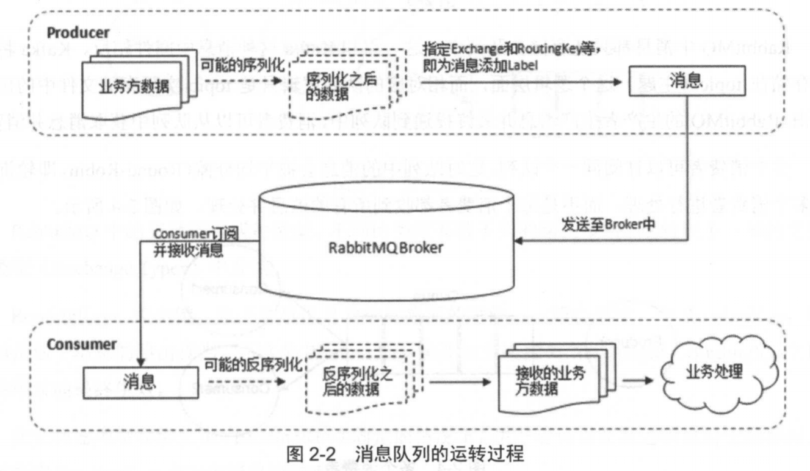

# RabbitMQ实战指南

## 第1章 RabbitMQ简介

## 第2章 RabbitMQ入门

* RabbitMQ的模型架构是什么？
* AMQP协议又是什么？
* 两者之间有什么关系？
* 消息从生产者发出到消费者这已过程中要经历什么？

### 2.1 相关概念介绍

RabbitMQ整体上是一个生产者和消费者模型，主要负责接收、存储和转发消息。

RabbitMQ的模型架构如图所示：


#### 2.1.1 生产者和消费者

**Producer(生产者)：**投递消息的一方

**Consumer(消费者)：**接收消息的一方

**Broker(消息中间件的服务节点)：**负责消息的传递

图2-2展示了消息的传递过程




#### 2.1.2 队列

RabbitMQ中消息都只能存储在队列中，生产者生成消息并最终投递到队列中，消费者可以从队列中获取消息并消费。

多个消费者可以订阅同一个队列，这时队列中的消息会被平均分摊（Round-Robin，即轮询）给多个消费者进行处理，而不是每个消费者都收到所有的消息并处理。<font color=red>RabbitMQ不支持队列层面的广播消费，如果需要广播消费，需要在其上进行二次开发，处理逻辑会变得异常复杂，同时也不建议这么做</font>


#### 2.1.3 交换器、路由键、绑定


**Exchange(交换器)：**

生产者不直接将消息发送到队列，而是将消息发送到Exchange（交换器），由交换器将消息路由到一个或多个队列中，如果路由不到，可能将消息返回给生产者或者直接丢弃。

RabbitMQ中的交换器由四种不同的类型，对应着不同的路由策略。

**Binding(绑定)与BindingKey(绑定键)：**


RabbitMQ中通过绑定将路由器与队列关联起来，在绑定的时候一般会指定一个绑定键，这样RabbitMQ就知道如何正确地将消息路由到队列了。

**RountingKey(路由键)：**

生产者将消息发送给交换器的时候，一般会指定一个RoutingKey，用来指定这个消息的路由规则，而这个RoutingKey需要与交换器类型和绑定键(BindingKey)联合使用才能最终生效。

生产者将消息发送到交换器时，需要一个RoutingKey，当BindingKey和RoutingKey相匹配时，消息会被路由到对应的队列中。在绑定多个队列到同一个交换器的时候，这些绑定允许使用相同的BindingKey。BindingKey并不是在所有的情况下都生效，它依赖于交换器类型，比如fanout类型的交换器就会无视BindingKey，而是将消息路由到所有绑定到该交换器的队列中。

#### 2.1.4 交换器类型

交换器类型由fanout、direct、topic、headers四种。

**fanout**

它会把所有发送到该交换器的消息路由到所有与该交换器绑定的队列中。

**direct**

它会把消息路由到那些BindingKey和RoutingKey完全匹配的队列中。

示例：


如图2-7，交换器的类型未direct，如果我们发送一条消息，并在发送消息的时候设置路由键为"warning"，则消息会路由到Queue1和Queue2，如果路由键为"info"或"debug"，则只会把消息路由到Queue2中。

**topic**

topic类型的交换器在匹配规则上进行了扩展，它与direct类型的交换器相似，也是叫消息路由到BindingKey和RoutingKey相匹配的队列中，但匹配规则有些不同，它约定：

* RoutingKey为一个点号"."分割的字符串（被点号"."分隔开的每一段独立的字符串称为一个单词），如"com.rabbitmq.client"、"java.util.concurrent"、"com.hidden.client"
* BindingKey和RoutingKey一样也是点号"."分隔的字符串
* BindingKey中可以存在两种特殊字符串"\*"和"#"，用于做模糊匹配，其中"\*"用于匹配一个单词，"#"用于匹配多规格单词（可以是零个）

示例：


* 路由键为"com.rabbitmq.client"的消息会同时路由到Queue1和Queue2中
* 路由键为"com.hidden.client"的消息会只会路由到Queue2中
* 路由键为"com.hidden.demo"的消息会只会路由到Queue2中
* 路由键为"java.rabbitmq.demo"的消息会只会路由到Queue1中
* 路由键为"java.util.concurrent"的消息会被丢弃或者返回给生产者（需要设置mandatory参数），因为它没有匹配到任何路由键

**headers**

headers 类型的交换器不依赖于路由键的匹配规则来路由消息，而是根据发送的消息内容中headers 属性进行匹配。在绑定队列和交换器时制定一组键值对，当发送消息到交换器时，RabbitMQ 会获取到该消息的 headers （也是一个键值对的形式〉，对比其中的键值对是否完全匹配队列和交换器绑定时指定的键值对，如果完全匹配则消息会路由到该队列，否则不会路由到该队列。headers 类型的交换器性能会很差，而且也不实用，基本上不会看到它的存在。

#### 2.1.5 RabbitMQ运转流程

生产者和消费者的流程 略，详见书本P23-P25

### 2.2 AMQP协议介绍

RabbitMQ是遵从AMQP协议实现的，不过RabbitMQ还支出STOMP2、MQTT3等协议。

AMQP协议本书包括三层：

* `Module Layer`：位于协议最高层，主要定义了一些客户端调用的命令，客户端可以利用这些命令实现直接的业务逻辑。例如，客户端可以使用Queue.Declare命令实现一个队列或者使用Basic.Consume订阅一个队列中的消息。
* `Session Layer`：位于中间层，主要负责将客户端的命令发送给服务器，再将服务端的应答返回给客户端，主要为客户端与服务器之间的通信提供可靠性同步机制和错误处理。
* `Transport Layer`：位于最底层，主要传输二进制数据流，提供帧的处理、信道复用、错误检测和数据表示等。

AMQP说到底还是一个通信协议，可以看作一系列结构化命令的集合，这里的命令代表一种操作，类似于HTTP中的方法（GET、POST、PUT、DELETE等）

#### 2.2.1 AMQP生产者流转过程


详细说明见书P27页

#### 2.2.2 AMQP消费者流转过程


详细说明见书P29页

#### 2.2.3 AMQP命令概览

AMQP的主要命令，详细见书P30页的表2-1

## 第3章 客户端开发向导

### 3.1 连接RabbitMQ


## 第4章 RabbitMQ进阶

### 4.1 消息何去何从

* `mandatory`和`immediate`是`channel.basicPublish`方法中的两个参数，它们都有当消息传递过程中不可达目的地时将消息返回给生产者的功能
* `RabbitMQ`提供的备份交换器（`Alternate Exchange`）可以将未能被交换器路由的消息（没有绑定队列或者没有匹配的绑定）存储起来，而不用返回给客户端

#### 4.1.1 mandatory参数

`mandatory`参数:

* 为`true`时，交换器无法根据自身的类型和路由器键找到一个符合条件的队列，那么RabbitMQ会调用`Basic.Return`命令将消息返回给生产者
* 为`false`时，出现上诉情形，则消息直接被丢弃

**生产者如何获取到没有被正确路由到合适队列的消息呢？**

通过调用`channel.addReturnListener`来添加`ReturnListener`监听器实现

代码如下所示：

```java
channel.basicPublish(EXCHANGE_NAME, "", true,
                    MessageProperties.PERSISTENT_TEXT_PLAIN,
                    "mandatory test".getBytes());
channel.addReturnListener(new ReturnListener() {
	public void handleReturn(int replyCode , String replyText ,
							String exchange, String routingKey,
							AMQP.BasicProperties basicProperties,
							byte[] body) throws IOException {
				String message = new String(body);
				System.out.println("Basic.Return 返回的结果是："＋message)
});
```

上面的代码中生产者没有成功地将消息路由到队列，此时RabbitMQ会通过`Basic.Return`返回"mandatory test"这条消息，之后生产者客户端通过`ReturnListener`监听到了这个事件，最后打印出"mandatory test"

对应的流转过程如图所示：


#### 4.1.2 immediate参数

当immediate参数设为true时，如果交换器在将消息路由到队列时发现队列上并不存在任何消费者，那么这条消息将不会存入队列中。当与路由键匹配的所有队列都没有消费者时，该消息会通过`Basic.Return`返回至生产者。

RabbitMQ 3.0版本已经去掉了对immediate参数的支持，因为它会影响镜像队列的性能，建议采用`TTL`和`DLX`的方法替代。

#### 4.1.3 备份交换器（Alternate Exchange）

如果不想使用`mandatory`参数，使生产者的代码变得复杂（需添加`ReturnListener`的编程逻辑），又不想消息丢失，那么可以使用备份交换器，将未被路由的消息存储在RabbitMQ中，再在需要的时候去处理这些消息。

**如何使用备份交换器**

两种方式：

* 通过在声明交换器（调用`channel.exchangeDeclare`）的时候添加参数`alternate-exchange`参数来实现
* 通过策略（Policy，详细参考6.3节）的方式实现

如果两者同时使用，则前者的优先级更高，会覆盖掉Policy的设置

示例：使用参数设置的代码如下所示

```java
Map<String, Object> args = new HashMap<String, Object>();
args.put("alternate-exchange", "myAe")
channel.exchangeDeclare("normalExchange", "direct", true, false, args);
channel.exchangeDeclare ("myAe", "fanout", true, false, null);
channel.queueDeclare("normalQueue", true, false, false, null);
channel.queueBind("normalQueue", "normalExchange"，"normalKey");
channel.queueDeclare("unroutedQueue", true, false , false, null);
channel.queueBind("unroutedQueue", "myAe", "");
```

上面的代码中声明了两个交换器`normalExchange`和`myAe`，分别绑定了`normalQueue`和`unroutedQueue`者两个队列，同时将`myAe`设置未`normalExchange`的备份交换器。注意`myAe`的交换器类型为`fanout`。

如果采用Policy的方式来设置备份交换器，可以参考如下:

```bash
rabbitmqctl set_policy AE "^normalExchange$" `{"alternate-exchange":"myAE"}`
```


参考图4-2，如果此时发送一条消息到`normalExchange`上，，当路由键等于"normalKey "的时候，消息能正确路由到`normalQueue`这个队列中。如果路由键设为其他值，比如"errorKey"即消息不能被正确地路由到与`normalExchange` 绑定的任何队列上，此时就会发送给`myAe`，进而发送到`unroutedQueue`这个队列。

**关于备份交换器的类型**

为了方便使用，建议设置为`fanout`类型（它会忽略生产者和交换器的路由键是否匹配），如果设置为`direct`或`topic`的类型也可以，需要注意的是，消息被重新发送到备份交换器时的路由键和从生产者发出的路由键需要匹配才能被投递到队列中。如：备份交换器的类型时`direct`，并且又一个与其绑定的队列，假定绑定的路由键是`key1`，当某条携带路由键为`key2`的消息被转发到这个备份交换器的时候，备份交换器没有匹配到合适的队列，则消息丢失。如果消息携带的路由键为key1，则可以存储到队列中。

**对于备份交换器，总结了一下几种特殊情形**

* 如果设置的备份交换器不存在，客户端和RabbitMQ服务端都不会有异常出现，此时消息会丢失
* 如果备份交换器没有绑定任何队列，客户端和`RabbitMQ`服务端都不会有异常出现，此时消息会丢失
* 如果备份交换器没有任何匹配的队列，客户端和RabbitMQ服务端都不会有异常出现，此时消息会被丢弃
* 如果备份交换器和mandatory参数一起使用，那么mandatory参数无效

### 4.2 过期时间（TTL）

TTL, Time to Live的简称，即过期时间。RabbitMQ可以对消息和队列设置TTL。

#### 4.2.1 设置消息的TTL

两种设置消息TTL的方法：

* 通过队列属性设置，队列中所有消息都有相同的过期时间
* 对消息本书进行单独设置，每条消息的TTL可以不同

待续。。。

#### 4.2.2 设置队列的TTL

通过`channel.queueDeclare`方法中的`x-expires`参数可以控制队列被自动删除前处于未使用状态的时间。未使用的意思是队列上没有任何的消费者，队列也没有被重新声明，并且在过期时间段内也未调用过`Basic.Get`命令。


## 目录

```txt
第1章 RabbitMQ简介
1.1 什么是消息中间件
1.2 消息中间件的作用
1.3 RabbitMQ的起源
1.4 RabbitMQ的安装及简单使用
1.4.1 安装Erlang
1.4.2 RabbitMQ的安装
1.4.3 RabbitMQ的运行
1.4.4 生产和消费消息
1.5 小结
第2章 RabbitMQ入门
2.1 相关概念介绍
2.1.1 生产者和消费者
2.1.2 队列
2.1.3 交换器、路由键、绑定
2.1.4 交换器类型
2.1.5 RabbitMQ运转流程
2.2 AMQP协议介绍
2.2.1 AMQP生产者流转过程
2.2.2 AMQP消费者流转过程
2.2.3 AMQP命令概览
2.3 小结
第3章 客户端开发向导
3.1 连接RabbitMQ
3.2 使用交换器和队列
3.2.1 exchangeDeclare方法详解
3.2.2 queueDeclare方法详解
3.2.3 queueBind方法详解
3.2.4 exchangeBind方法详解
3.2.5 何时创建
3.3 发送消息
3.4 消费消息
3.4.1 推模式
3.4.2 拉模式
3.5 消费端的确认与拒绝
3.6 关闭连接
3.7 小结
第4章 RabbitMQ进阶
4.1 消息何去何从
4.1.1 mandatory参数
4.1.2 immediate参数
4.1.3 备份交换器
4.2 过期时间（TTL）
4.2.1 设置消息的TTL
4.2.2 设置队列的TTL
4.3 死信队列
4.4 延迟队列
4.5 优先级队列
4.6 RPC实现
4.7 持久化
4.8 生产者确认
4.8.1 事务机制
4.8.2 发送方确认机制
4.9 消费端要点介绍
4.9.1 消息分发
4.9.2 消息顺序性
4.9.3 弃用QueueingConsumer
4.10 消息传输保障
4.11 小结
第5章 RabbitMQ管理
5.1 多租户与权限
5.2 用户管理
5.3 Web端管理
5.4 应用与集群管理
5.4.1 应用管理
5.4.2 集群管理
5.5 服务端状态
5.6 HTTP API接口管理
5.7 小结
第6章 RabbitMQ配置
6.1 环境变量
6.2 配置文件
6.2.1 配置项
6.2.2 配置加密
6.2.3 优化网络配置
6.3 参数及策略
6.4 小结
第7章 RabbitMQ运维
7.1 集群搭建
7.1.1 多机多节点配置
7.1.2 集群节点类型
7.1.3 剔除单个节点
7.1.4 集群节点的升级
7.1.5 单机多节点配置
7.2 查看服务日志
7.3 单节点故障恢复
7.4 集群迁移
7.4.1 元数据重建
7.4.2 数据迁移和客户端连接的切换
7.4.3 自动化迁移
7.5 集群监控
7.5.1 通过HTTP API接口提供监控数据
7.5.2 通过客户端提供监控数据
7.5.3 检测RabbitMQ服务是否健康
7.5.4 元数据管理与监控
7.6 小结
第8章 跨越集群的界限
8.1 Federation
8.1.1 联邦交换器
8.1.2 联邦队列
8.1.3 Federation的使用
8.2 Shovel
8.2.1 Shovel的原理
8.2.2 Shovel的使用
8.2.3 案例：消息堆积的治理
8.3 小结
第9章 RabbitMQ高阶
9.1 存储机制
9.1.1 队列的结构
9.1.2 惰性队列
9.2 内存及磁盘告警
9.2.1 内存告警
9.2.2 磁盘告警
9.3 流控
9.3.1 流控的原理
9.3.2 案例：打破队列的瓶颈
9.4 镜像队列
9.5 小结
第10章 网络分区
10.1 网络分区的意义
10.2 网络分区的判定
10.3 网络分区的模拟
10.4 网络分区的影响
10.4.1 未配置镜像
10.4.2 已配置镜像
10.5 手动处理网络分区
10.6 自动处理网络分区
10.6.1 pause-minority模式
10.6.2 pause-if-all-down模式
10.6.3 autoheal模式
10.6.4 挑选哪种模式
10.7 案例：多分区情形
10.8 小结
第11章 RabbitMQ扩展
11.1 消息追踪
11.1.1 Firehose
11.1.2 rabbitmq_tracing插件
11.1.3 案例：可靠性检测
11.2 负载均衡
11.2.1 客户端内部实现负载均衡
11.2.2 使用HAProxy实现负载均衡
11.2.3 使用Keepalived实现高可靠负载均衡
11.2.4 使用Keepalived+LVS实现负载均衡
11.3 小结
附录A 集群元数据信息示例
附录B /api/nodes接口详细内容
附录C 网络分区图谱
```


