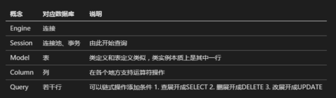

# sqlAlchemy

## 中文手册阅读

#### 创建会话

ORM通过Session与数据库建立连接

## sqlAlchemy入门与进阶

参考：https://zhuanlan.zhihu.com/p/27400862

官方文档：<https://www.sqlalchemy.org/>

## 相关文档:

中文手册

<https://usyiyi.github.io/sqlalchemy-docs-zh/orm/tutorial.html>

sqlAlchemy入门与进阶:

<https://zhuanlan.zhihu.com/p/27400862>